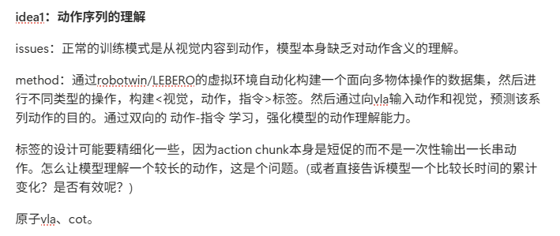

# Idea1 小白详解：让机器人读懂自己做过的动作

> 副标题：从“视觉和指令 → 动作”的 VLA，走向“已执行动作 → 目标状态与功能性意图”的 A2FI<br>
> 整理日期：2026-07-27<br>
> 适合读者：默认没有机器人、机器学习或论文阅读基础<br>
> 当前状态：**研究方案，不是已经完成的系统或实验结果**

---

## 0. 先说清楚：这份文档依据什么写成

这份文档不是把昨天 Vault 里的压缩总结再扩写一遍。整理时重新核对了公开仓库
[T1doo/T1doo-Research](https://github.com/T1doo/T1doo-Research)
在提交
[`d3523c5`](https://github.com/T1doo/T1doo-Research/tree/d3523c5cf109dcd960c3297ed582043ea999a366)
下的原始材料，重点包括：

1. 师哥给出的权威主干：`前置论文/论文参考.md` 和其中嵌入的原型图；
2. 公开仓库保存的 9 篇论文 PDF：π0、π0.5、VLA-JEPA、RoboTwin 2.0、LIBERO、Motus、LingBot-VA、Fast-WAM，以及 CoT-VLA；
3. 为判断创新性而补读的 3 篇直接近邻：LACY、ProprioCaption、Anchor-Align；
4. 公开仓库中的逐篇精读笔记和 2026-07-21 重新评估报告，用于检查容易忽略的实现细节；
5. 论文官网、arXiv 页面和官方代码仓库，用于核对论文与开源实现不一致之处，以及 π0.6、π0.7 等后续更新。

为了不把不同可信度的内容混在一起，下面会区分三类表述：

- **论文事实**：论文作者实际提出、实现或报告的内容；
- **本项目判断**：我们根据论文得到的研究推论，可能需要实验验证；
- **本地事实**：已经在当前工作区实际检查或跑通过的内容。

最重要的范围说明：

- Idea 的主干仍以师哥的原型和 `论文参考.md` 为准；
- 公开仓库里的长报告和逐篇笔记是围绕主干产生的分析，不冒充师哥原话；
- 截至 2026-07-27，A2FI 的数据管线、模型和正式实验**都还没有实现**；
- RoboTwin 2 的基础环境已另行配置并通过小规模采集验证，但这只代表后期平台可用，不代表 Idea 已被验证。

### 0.1 怎么读这份长文档

- 完全零基础：按“第一部分 → 第二部分 → 第三部分 → 第四部分”顺序读；
- 只想先懂 Idea：读第 1、6–10、25 节；
- 准备和师哥讨论论文：读第 11–25、41 节；
- 准备开始做实验：从第 26 节读到第 39 节；
- 遇到术语忘了：直接查第 42–47 节。

---

## 1. 三十秒看懂这个 Idea

现在常见的机器人模型做的是：

```text
看到什么 + 人让它做什么
          ↓
      预测下一段动作
```

例如：

```text
输入：桌上有一个杯子；指令是“把杯子放进柜子”
输出：机械臂向杯子移动、闭合夹爪、抬起……
```

师哥的 Idea 想补上反方向：

```text
机器人刚才看到了什么 + 它实际做过的一串动作
                    ↓
       判断这些动作达成了什么、是为了什么
```

例如：

```text
输入：夹爪靠近杯子 → 闭合 → 杯子跟着抬起

低层回答：夹爪向前移动并闭合
子目标回答：杯子已经被抓起
功能性意图回答：抓起杯子，是为了给后续“把杯子放进柜子”创造条件
```

我们把这条主线暂时称为：

- **A2G**：Action-to-Goal，动作 → 目标状态；
- **A2Subgoal**：动作 → 已达成子目标；
- **A2FI**：Action-to-Functional-Intent，动作 → 功能性意图。

真正值得研究的不是“让模型给动作配一句好听的说明”，而是回答两个可被证伪的问题：

1. 屏蔽原始任务指令和未来信息后，动作本身是否真的提供了额外的目标信息？
2. 如果让控制模型共同学习这种目标级理解，它是否会比只学低层动作描述，更好地完成未见组合或长时程任务？

如果第一问答案是否定的，就不能声称模型“理解了动作”；如果第二问答案是否定的，也要诚实接受“能解释动作不一定能改善控制”。

---

# 第一部分：从零开始补背景

## 2. 机器人操作任务到底是什么

### 2.1 一个最简单的操作任务

假设桌上有一个杯子和一个柜子，任务是“把杯子放进柜子”。机器人需要循环做三件事：

1. **观察**：摄像头看到什么，机械臂当前在哪里，夹爪开还是关；
2. **决策**：下一小段应该怎么动；
3. **执行并重新观察**：真实执行动作，再看环境发生了什么变化。

这叫作**闭环控制**。之所以叫“闭环”，是因为模型不是一口气盲做到底，而是不断根据新的真实观察修正动作。

### 2.2 Observation：观察

Observation，常写作 \(o_t\)，表示时间 \(t\) 时机器人能拿到的信息，可能包括：

- RGB 图像：普通彩色相机画面；
- 深度图：每个像素离相机有多远；
- 机器人状态：关节角、夹爪开合、末端位置；
- 多相机视角：正面、侧面、腕部相机等。

“观察”不等于“世界的全部真相”。相机可能看不到柜子内部，也可能被机械臂挡住。

### 2.3 Proprioception：本体感觉

人闭着眼也大致知道手臂弯了多少，这种对自身身体状态的感知叫本体感觉。机器人的本体状态常包含：

- 每个关节的角度；
- 关节速度；
- 机械臂末端的位置和朝向；
- 夹爪张开程度。

后文写的 `state` 或 \(s_t\)，很多时候就包括这些信息。

### 2.4 Action：动作

Action，常写作 \(a_t\)，不是一句“抓杯子”，而通常是一组数。例如：

```text
[末端 x 方向移动量,
 末端 y 方向移动量,
 末端 z 方向移动量,
 三个旋转量,
 夹爪开合量]
```

在双臂机器人中，左右臂各有一组数。数字的具体含义取决于控制器，不能看到“7 维动作”就自行猜测。

### 2.5 Action chunk：动作块

策略通常一次预测未来若干步动作，而不是只预测一步。这一小串连续动作叫 **action chunk**。

把它类比成打字：

- 单步动作像只预测下一个字母；
- action chunk 像一次预测接下来的一个短词；
- 完整任务则像写完一整段文章。

师哥原型中的一个难点正来自这里：一个 action chunk 很短，但“把杯子放进柜子”需要许多 chunk。不能因为模型每次只输出短 chunk，就认为它无法研究更长时间的意图；正确做法是另外维护**已经真实执行过的动作历史**。

### 2.6 Trajectory、episode 和 demonstration

- **轨迹（trajectory）**：按时间排列的观察和动作，
  \((o_0,a_0,o_1,a_1,\ldots,o_T)\)；
- **回合（episode）**：从任务开始到成功、失败或超时的一次完整尝试；
- **示范（demonstration，demo）**：由人或专家程序完成的一条较好轨迹。

模仿学习的数据，本质上就是许多“当时看见什么、专家随后怎么做”的配对。

---

## 3. 机器学习里最常出现的词

### 3.1 模型、参数和训练

可以把模型想成一个非常复杂的函数：

```text
输入  ──模型──>  输出
```

模型内部有大量可调数字，叫**参数**。训练就是：

1. 给模型一个输入；
2. 看它预测得对不对；
3. 用一个叫**损失函数**的分数表示错了多少；
4. 调整参数，让下次错误更小。

### 3.2 Loss：损失函数

损失越小通常表示预测越接近目标。例如：

- 动作损失：预测动作和专家动作差多少；
- 分类损失：把“抓住杯子”错认成“打开抽屉”要受罚；
- 对比损失：正确动作和正确意图应靠近，错误配对应远离。

损失只是训练信号，不等于最终研究指标。训练损失下降，不保证机器人真的更会做任务。

### 3.3 Gradient：梯度

梯度告诉模型：“每个参数往哪个方向改一点，损失会下降”。<br>
“A2FI 的梯度是否进入策略共享层”是本项目的关键问题：

- 如果 A2FI 只训练一个独立小分类器，原策略完全没被改变；
- 如果 A2FI 的梯度进入共享表示层，才有可能改变策略的理解和控制。

### 3.4 Backbone、encoder 和 head

把模型类比为工厂：

- **backbone（骨干）**：负责大部分通用信息处理的主厂房；
- **encoder（编码器）**：把图像、文字或动作变成模型能处理的内部向量；
- **head（输出头）**：把内部向量转换成某类具体输出，如动作或意图类别。

本项目想用 π0.5 作为 backbone，并考虑新增：

```text
已执行动作 → observed-action encoder → 共享表示
                                      ├→ 动作 head
                                      └→ A2FI head
```

### 3.5 Representation 和 latent

模型不会把“杯子被抓住”存成一句中文，而会用一串内部数字表示。这个内部表示叫：

- representation：表征；
- latent representation：潜在表征；
- latent space：这些表征所在的抽象空间。

“模型是否理解”不能仅凭一个漂亮的内部可视化下结论；要看它在受控任务中能否稳定区分正确目标，并排除捷径。

### 3.6 Token

Transformer 通常把输入切成 token：

- 文本 token：词或词片段；
- 图像 token：图像小块或视觉特征；
- 动作 token：离散化后的动作片段；
- 连续动作也可以先编码成 token 式的内部向量。

Token 不是一个完整概念，只是模型处理序列的基本单位。

### 3.7 Transformer 和 attention

Transformer 是处理序列的一类神经网络。它的核心机制 attention 可以粗略理解为：

> 在处理当前 token 时，决定应该参考前面哪些 token、参考多少。

注意力图可以帮助检查模型关注了什么，但“关注杯子”不等于“理解为何抓杯子”。它只能作为辅助分析，不能当作主要证据。

### 3.8 Attention mask：可见性规则

Mask 决定一个 token 能不能看见另一个 token。例如：

```text
当前观察：可以看
已执行动作：可以看
原始任务指令：A2FI 严格诊断时不许看
窗口之后的未来动作：绝对不许看
目标标签：只能作为答案，不能作为输入
```

如果答案信息不小心被放进输入，模型看起来会非常准，但研究已经失效，这叫**信息泄漏**。

### 3.9 Fine-tuning 和 LoRA

- **预训练**：先用大规模数据学通用能力；
- **微调**：再用目标任务数据调整模型；
- **LoRA**：不改全部参数，只增加并训练少量低秩参数，节省显存和计算。

LoRA 不是“免费升级”。它能降低训练成本，但仍要验证：

- 哪些层被训练；
- A2FI 梯度是否真的进入共享层；
- 语义能力是否被行为克隆训练破坏。

---

## 4. VLM、VLA 和行为克隆

### 4.1 VLM：视觉语言模型

VLM 是 Vision-Language Model，即视觉语言模型。它能同时处理图像和文字，例如回答“图中哪个杯子是红色的”。

VLM 往往有丰富的互联网视觉和语言知识，但它通常没学过机器人底层控制数字。

### 4.2 VLA：视觉语言动作模型

VLA 是 Vision-Language-Action Model。它在 VLM 基础上增加动作能力：

```text
图像 + 文字指令 + 机器人状态 → 连续动作
```

它既要知道“红色杯子”指哪个物体，又要输出机械臂真正能执行的数字。

### 4.3 Behavior cloning：行为克隆

行为克隆（BC）就是让模型模仿示范：

```text
专家在这个观察下做了动作 A
                 ↓
模型也学习在相似观察下输出 A
```

它简单有效，但有两个问题：

1. 模型可能只背下视觉模式，不理解动作为什么服务于任务；
2. 微调可能覆盖 VLM 原来学到的语义知识，这叫表示漂移或灾难性遗忘。

### 4.4 “会做”为什么不一定等于“理解”

想象学生刷了大量固定题型：

- 换个数字仍会做，可能说明掌握了规律；
- 只要题目排版一换就错，可能只是记住模板。

机器人也一样。它抓对了杯子，可能是因为：

- 真正理解“杯子”和任务目标；
- 背景颜色泄漏了任务 ID；
- 指令直接把答案说出来；
- 终态画面已经显示杯子在哪里；
- 数据中这个场景永远只有一种动作。

因此，本项目不能只报告任务成功率，还要做反事实和消融实验，证明动作输入有独立贡献。

---

## 5. 世界模型、动力学和 CoT

### 5.1 什么是世界模型

世界模型试图学习“世界会怎么变化”。最常见的问题是：

```text
当前画面 + 动作 → 接下来可能出现的画面或状态
```

它像在脑中预演：“如果我向前推，杯子会不会倒？”

### 5.2 前向动力学与逆向动力学

- **前向动力学**：已知当前状态和动作，预测下一状态；
- **逆向动力学**：已知当前状态和下一状态，反推动作。

本 Idea 又是另一种“逆问题”：

```text
已知观察和已经执行的动作
→ 推断动作达成的目标以及在整项任务中的功能
```

它不是传统逆动力学，因为输出不是底层动作，而是语义目标。

### 5.3 Diffusion 和 flow matching

扩散模型可以粗略理解为：

1. 从随机噪声开始；
2. 多步去噪；
3. 逐渐得到合理图像、视频或动作。

Flow matching 也是从简单分布连续变成目标分布的一种生成方法。π0/π0.5 的动作专家使用这类思想生成连续动作。对本项目而言，现在只需记住：

- 它适合生成连续、平滑、多种可能的动作；
- 它解决“动作怎么生成”，不自动解决“动作是什么意思”。

### 5.4 什么是 CoT

CoT 是 Chain of Thought，常译为思维链。语言模型中的经典形式是：

```text
问题 → 中间推理步骤 → 最终答案
```

在机器人领域，中间步骤可以是：

- 语言计划：“先开柜门，再抓杯子”；
- 视觉子目标：生成一张“杯子已经在柜门前”的未来图；
- 潜在计划：模型内部不可直接读懂的中间向量。

本 Idea 与常见 VLA-CoT 的方向不同：

```text
常见 CoT：当前任务 → 中间计划/子目标 → 未来动作
A2FI：已经执行的动作 → 已达成目标/动作的功能
```

另外，模型能生成一段中间文字，不代表这段文字就是其真实、忠实的内部推理过程。最终仍要靠受控实验。

---

## 6. 目标、子目标、谓词和功能性意图

### 6.1 Predicate：谓词

谓词是一种可以判真假的结构化描述。例如：

```text
Grasped(robot, cup)       机器人抓住杯子
Open(cabinet)             柜门打开
Inside(cup, cabinet)      杯子在柜子里
On(cup, table)            杯子在桌上
```

它比自由文本“好像把杯子弄好了”更容易自动检查。

### 6.2 最终目标和子目标

任务“把杯子放进柜子”的最终目标可能是：

```text
Inside(cup, cabinet) = True
```

执行途中可能出现：

```text
柜门打开
杯子被抓住
杯子移动到柜子附近
杯子进入柜子
夹爪释放杯子
```

这些是中间状态或子目标。注意：并不是每个短暂成立的谓词都值得叫子目标。例如杯子移动途中短暂经过桌子上方，不等于“把杯子放在桌上”这个子目标已经完成。

### 6.3 PDDL 和 BDDL

- **PDDL**：用符号描述规划问题的语言；
- **BDDL**：LIBERO 使用的一类行为领域描述格式。

BDDL 文件可以提供初始条件和最终目标谓词，但通常不会直接给出唯一、按时间排序的中间计划。要得到子目标，需要回放轨迹，检查每个谓词何时成立、持续多久、后来是否失效。

### 6.4 五层语义阶梯

用“把杯子放进柜子”统一说明：

| 层级 | 它回答什么 | 示例 |
|---|---|---|
| L0 连续动作 | 电机/末端具体怎么动 | `dx=0.02, dz=-0.01, gripper=-1` |
| L1 动作描述 | 表面上正在做什么 | “夹爪向杯子移动并闭合” |
| L2 目标/子目标 | 什么状态已经达成 | “杯子被抓住” |
| L3 功能性意图 | 这个子目标在当前任务中起什么作用 | “抓杯子，以便接下来把它放进柜子” |
| L4 整体任务 | 最终要完成什么 | “把杯子放进柜子” |

本项目不能只做 L1，因为 LACY、Anchor-Align 等工作已经覆盖动作说明或低层语言对齐。第一阶段可以先做可自动验证的 L2，真正想挑战的是 L3。

### 6.5 什么叫“功能性”

同一个表面动作，在不同任务里的功能可能不同：

```text
动作：抓起杯子

任务 A：把杯子放进柜子
功能：为 Inside(cup, cabinet) 创造前提

任务 B：把杯子放到托盘
功能：为 On(cup, tray) 创造前提
```

所以功能性意图不仅描述“发生了什么”，还要说明新状态与剩余任务目标之间的关系。

一个可操作的结构化定义是：

\[
I_{t_0:t_1}
=
\bigl(
\text{窗口结束时新稳定成立的状态},
\text{该状态对剩余任务目标的作用}
\bigr)
\]

例如：

```yaml
achieved_predicate: Grasped(cup)
role_in_task: enables Inside(cup, cabinet)
```

---

# 第二部分：这个 Idea 究竟要研究什么

## 7. 从师哥原型到现在的研究问题

### 7.1 师哥最初提出的问题



普通 VLA 主要沿着这个方向学习：

```text
视觉内容 → 动作
```

师哥担心模型能输出动作，却未必理解动作含义。因此提出：

1. 在 RoboTwin / LIBERO 中自动构造数据；
2. 建立 `<视觉，动作，指令>` 配对；
3. 给 VLA 输入视觉和动作，让它预测这一串动作的目的；
4. 用动作与语言的双向学习强化动作理解；
5. 处理 action chunk 太短、长动作如何聚合的问题。

这个出发点仍然成立，但 2025–2026 年已经出现多篇“动作→语言”或“语言—动作联合训练”工作，所以今天不能再把贡献写成“第一个会反向解释动作的 VLA”。

### 7.2 当前收紧后的核心问题

> 在屏蔽任务指令和未来信息的因果条件下，让 VLA 从一段**已执行动作窗口**中识别结构化的目标状态或功能性意图，显式处理共享前缀的不可识别性，并检验目标级理解是否比低层动作描述、视觉捷径和普通辅助任务更能改善 OOD/长时程控制。

拆开看，里面有四个不可缺少的条件：

1. **输入真的包含已执行动作**，而不只是历史画面；
2. **输出是结构化目标/功能层级**，而不只是“向左移动”；
3. **允许暂时无法判断**，不强迫模型在歧义前缀上瞎猜；
4. **用反捷径实验检验因果贡献**，而不只是多加一个 loss 后看总分。

### 7.3 三个递进任务

#### A2G：动作到目标状态

```text
观察 + 已执行动作 → 新达成了哪个目标谓词
```

优点是标签最容易从仿真器自动验证，适合第一阶段。

#### A2Subgoal：动作到子目标

```text
观察 + 已执行动作 → 当前完成了哪个可复用的任务步骤
```

它需要把短暂状态变化过滤成稳定、有任务意义的事件。

#### A2FI：动作到功能性意图

```text
观察 + 已执行动作 → 这一步达成了什么，以及它为哪个后续目标服务
```

这是最有研究价值、也最难的一层。

### 7.4 两个核心假设

#### H2：动作本身提供额外语义信息

比较：

\[
f(V,S,A)
\quad\text{和}\quad
f(V,S)
\]

其中：

- \(V\)：视觉；
- \(S\)：状态；
- \(A\)：已执行动作。

定义动作条件增益：

\[
\Delta_A
=
\operatorname{Score}(V,S,A)
-
\operatorname{Score}(V,S)
\]

如果加上真实动作并没有变好，或把动作打乱也不变差，就不能声称模型在理解动作。

#### H1：目标级理解训练能帮助控制

至少要比较：

```text
只训练控制
低层动作语言对齐
只训练一个独立 A2FI probe
让 A2FI 梯度进入共享层
等参数、但没有语义的辅助任务
```

只有“共享 A2FI”稳定优于这些对照，才支持“理解训练改变并改善了控制策略”。

---

## 8. 这个 Idea 最难也最有意思的地方：歧义

### 8.1 共享动作前缀

看下面两条任务：

```text
任务 A：抓起杯子 → 放进柜子
任务 B：抓起杯子 → 放到托盘
```

在“靠近杯子、闭合夹爪、抬起杯子”这一段，两条轨迹完全可能相同。只看到这段动作时，未来目的还不能唯一确定。

如果数据强行把前缀标成唯一答案：

- 对任务 A 标“为了放进柜子”；
- 对任务 B 标“为了放到托盘”；

那么相同输入被赋予互相冲突的标签。模型不是没学会，而是问题本身不可识别。

### 8.2 正确的标签方式

可采用三种层次：

1. 证据不足时只标已经确认的子目标：`Grasped(cup)`；
2. 标候选意图集合：
   `{Inside(cup,cabinet), On(cup,tray)}`；
3. 输出候选概率，而不是强行输出唯一类别。

### 8.3 意图显现时刻 \(t^\*\)

可以定义：

> 从哪个时刻开始，已观察到的动作证据足以把真实意图与其他候选区分开？

例如：

```text
抓起杯子                  仍然歧义
开始向柜子方向移动          可能性开始分化
绕开托盘并靠近柜门          基本可确定
杯子进入柜子                完全确定
```

模型预测的显现时刻 \(\hat t^\*\) 与人工/规则标注的 \(t^\*\) 之差，可以成为一个新指标：

\[
\left|\hat t^\* - t^\*\right|
\]

这个指标比单纯整条轨迹分类更能体现模型是否在合适的证据出现后才下结论。

---

## 9. 这个 Idea 不是什么

为了防止后面越做越偏，先列出六个“不是”：

1. **不是给动作生成一句自然语言就结束。**<br>
   自由 caption 可能流畅但不可验证，核心应是结构化目标和功能角色。

2. **不是普通前向规划。**<br>
   CoT-VLA 是“任务 → 视觉子目标 → 动作”；A2FI 是“已执行动作 → 其目标/功能”。

3. **不是简单把 action chunk 拉长。**<br>
   控制仍可短 chunk 重规划，理解分支另外聚合已执行历史。

4. **不是把累计位移当作意图。**<br>
   相同终点位移可能来自不同顺序、接触和任务；累计 delta 只能做辅助输入或消融。

5. **不是多加一个辅助损失、成功率涨一点就算成功。**<br>
   必须有乱动作、乱标签、等参数、视觉-only 等对照。

6. **不是声称首次实现动作—语言双向学习。**<br>
   LACY 已明确做 L2A+A2L；Anchor-Align 已做同一观察上的语言—动作对齐。

---

## 10. 用一个完整例子串起来

任务：

```text
打开柜门，把杯子放进去，再关上柜门。
```

### 10.1 原始轨迹

```text
阶段 1：机械臂靠近柜门把手
阶段 2：抓住把手并拉开柜门
阶段 3：靠近杯子、闭合夹爪、抬起杯子
阶段 4：把杯子移动到柜内
阶段 5：释放杯子
阶段 6：推动柜门关闭
```

### 10.2 不同层级的标签

| 动作窗口 | L1 表面动作 | L2 子目标 | L3 功能性意图 |
|---|---|---|---|
| 1–2 | 拉动把手 | `Open(cabinet)` | 打开容器，为杯子进入柜内建立可达路径 |
| 3 | 闭合夹爪并抬升 | `Grasped(cup)` | 获得对杯子的控制，以便完成放置 |
| 4–5 | 移动并释放 | `Inside(cup,cabinet)` | 完成物体放置这一核心目标 |
| 6 | 推动柜门 | `Closed(cabinet)` | 恢复柜门关闭状态，完成剩余约束 |

### 10.3 严格诊断输入

为了检验动作贡献，A2FI 分支可看：

```text
窗口开始时/过程中的视觉
机器人本体状态
窗口内已经执行的动作
```

不许看：

```text
原始任务指令
窗口之后的动作
完整轨迹最终帧
直接写着答案的 task_id
目标谓词标签
```

### 10.4 模型应该输出什么

第一版不必直接生成长句，可以输出：

```yaml
achieved:
  predicate: Grasped
  object: cup
functional_role:
  type: enables
  downstream_goal: Inside(cup, cabinet)
identifiability:
  status: ambiguous
  candidates:
    - Inside(cup, cabinet)
    - On(cup, tray)
```

等证据足够时再把 `ambiguous` 改成 `identifiable`。

---

# 第三部分：师哥给的每篇论文到底在讲什么

## 11. 先看整张论文地图

这些论文不是都在解决同一个问题。把它们放错位置，很容易得到“每篇好像都相关，但不知道该学什么”的感觉。

| 材料 | 在本项目中的角色 | 最值得拿走的东西 | 它没有解决什么 |
|---|---|---|---|
| π0 | π0.5 的技术祖先 | VLM + 连续动作专家、flow matching | 没有动作→语义理解 |
| π0.5 | 师哥指定的主要 backbone | 语义协同训练、分层条件、高层数据可帮助控制 | 开源版没有完整放出论文中的高层/FAST 训练路径 |
| VLA-JEPA | 方法与写作模板 | 无未来泄漏的目标设计、latent state prediction | 预测物理未来，不输出功能性意图 |
| LIBERO | 第一阶段数据和考场 | 结构化 BDDL 目标、Goal/Long 任务 | 不直接提供有序子目标 |
| RoboTwin 2.0 | 后期扩展平台 | 双臂、多任务、强域随机化、自动专家数据 | 不是现成的 A2FI 标签库 |
| Motus | 大型统一世界模型参考 | 理解/视频/动作专家统一、多种条件模式 | 成本很高，未做动作→语义意图 |
| LingBot-VA | 因果历史与部署参考 | 视频—动作因果序列、历史记忆、异步执行 | 主要理解视觉动力学，不是显式功能语义 |
| Fast-WAM | 最关键的训练范式启发 | 训练时辅助任务可有用，测试时可移除 | “任何辅助目标都有效”并不成立 |
| CoT-VLA / CoT | 方向划界与前向规划参考 | 显式中间子目标、规划与延迟权衡 | 方向与 A2FI 相反 |
| LACY | 直接近邻 | L2A+A2L+循环一致性 | 主要是短时 pick-place 和低层空间说明 |
| ProprioCaption | 直接近邻 | 本体状态帮助轨迹 caption 和切分 | 规模小、无策略训练和结构化真值 |
| Anchor-Align | 最大直接威胁/最佳基线 | 同观察语言—动作对齐、冻结语义 teacher | 重点仍是低层运动方向，不是长窗口功能意图 |

建议的阅读顺序不是按发表日期，而是：

```text
π0 → π0.5
   ↓
LIBERO → RoboTwin 2.0
   ↓
VLA-JEPA → Fast-WAM
   ↓
Motus → LingBot-VA
   ↓
CoT-VLA
   ↓
LACY → ProprioCaption → Anchor-Align
```

前两行告诉你“系统和数据是什么”，中间告诉你“怎样引入世界/语义辅助训练”，最后三篇告诉你“创新性最低线已经被抬到了哪里”。

---

## 12. π0：为什么一个 VLM 能开始控制机器人

论文：
[$\pi_0$: A Vision-Language-Action Flow Model for General Robot Control](https://arxiv.org/abs/2410.24164)

### 12.1 它想解决什么

普通 VLM 能看图说话，却不能直接输出机械臂动作。纯机器人策略能输出动作，却常常缺少大模型从互联网学到的视觉和语言知识。

π0 的问题是：

> 能否把一个预训练 VLM 的语义知识，与一个擅长连续机器人动作的专家组合起来，训练成通用 VLA？

### 12.2 一句话核心思想

> 用 VLM 理解图像和语言，再接一个约 3 亿参数量级的动作专家，通过 flow matching 生成平滑的连续 action chunk。

### 12.3 它怎样工作

可以把 π0 看成两个相互通信的专家：

```text
图像 + 指令 + 本体状态
          ↓
    VLM 语义骨干
          ↕ 共享注意力
    动作专家
          ↓
  一小段连续动作
```

关键点有三个：

1. **继承 VLM 先验**：模型不是从零学“杯子、衣服、箱子”；
2. **连续动作生成**：使用 flow matching，而不是把每个动作数字当普通单词；
3. **跨本体数据**：利用单臂、双臂、移动操作平台的多样机器人数据。

### 12.4 小白容易误解的地方

π0 能根据语言输出动作，不代表它能反向解释自己刚才的动作。它主要学的是：

\[
(\text{视觉},\text{语言},\text{状态})
\rightarrow
\text{动作}
\]

而不是：

\[
(\text{视觉},\text{已执行动作})
\rightarrow
\text{意图}
\]

### 12.5 和我们的 Idea 有什么关系

**可以借用：**

- VLM 与连续动作专家的整体结构；
- action chunk 和闭环重规划的基本机制；
- 理解“动作专家在哪里接入、注意力怎么流动”的技术底图。

**不能直接当成证据：**

- π0 的成功不能证明它理解了已执行动作；
- 它也没有提供 A2FI 标签或歧义评测。

**对后续工作的具体要求：**

- 在动 π0.5 以前，先读懂 π0 的输入、动作归一化、attention mask 和 flow loss；
- 新增动作历史编码器时，不能破坏原控制路径的输入格式。

---

## 13. π0.5：师哥为什么把它指定为 backbone

论文：
[$\pi_{0.5}$: a Vision-Language-Action Model with Open-World Generalization](https://arxiv.org/abs/2504.16054)<br>
官方实现：
[Physical-Intelligence/openpi](https://github.com/Physical-Intelligence/openpi)

### 13.1 它想解决什么

实验室里的机器人经常只在固定桌面、固定物体和固定光照下工作。π0.5 关注更困难的问题：

> 模型能否去一个从没见过的真实家庭，理解新的厨房/卧室布局，并完成较长、较灵巧的任务？

### 13.2 一句话核心思想

> 不只用机器人动作数据训练，而是把网页图文、物体检测、高层子任务、不同机器人数据和低层动作混在一个协同训练体系中，让语义知识迁移到控制。

### 13.3 两阶段训练，通俗版

论文中的训练可以粗略理解成：

#### 第一阶段：广泛学习

模型同时接触：

- 图像和自然语言；
- 机器人示范；
- 物体检测；
- 高层子任务描述；
- 离散化的动作表示；
- 来自不同机器人和非机器人数据的样本。

目的不是只把一项任务练熟，而是建立更广的知识联系。

#### 第二阶段：把动作做得又快又准

再用连续 flow action expert 做后训练，使模型能实时输出平滑动作。

论文用一种分层关系来描述高层语义与低层动作：

\[
p(a,h\mid o,l)
=
p(a\mid o,h)\,p(h\mid o,l)
\]

其中：

- \(o\)：观察；
- \(l\)：语言任务；
- \(h\)：高层子任务；
- \(a\)：低层动作。

读成中文就是：

1. 根据观察和总任务判断当前高层步骤；
2. 再根据高层步骤生成低层动作。

### 13.4 为什么它特别支持本项目动机

π0.5 的实验表明，高层语义数据即使不一定在测试时显式生成，也能通过协同训练改善控制。对本项目最重要的启发是：

> 一个语义辅助任务的价值可能主要发生在训练时：它改变共享表示；部署时未必需要每一步都慢慢生成解释。

这正好支持“训练时学习 A2FI、控制时可以移除或关闭意图输出头”的方向。

### 13.5 论文版与开源版的关键差别

这是必须写进实施计划的工程事实。

截至 2026-07-27，官方 openpi README 明确说明：

- 提供 π0、π0-FAST 和 π0.5；
- π0.5 的公开训练和推理目前只支持 **flow matching head**；
- 不能把论文里离散 FAST/高层语义的完整第一阶段，想象成开源仓库里已经有一个开关可以直接启用。

因此，原来“改一下 mask 就做 A2FI”的设想过于乐观。实际可能需要：

```text
新增 observed-action encoder
新增 A2G/A2FI 输出头
设计它与 VLM/LoRA 共享梯度的位置
自己实现训练批次和可见性规则
```

### 13.6 和我们的 Idea 有什么关系

**它是 backbone，而不是竞争方法。**

可以借用：

- 视觉、语言、状态到连续动作的成熟控制骨干；
- 语义协同训练可帮助泛化的动机；
- 训练时语义、测试时只保留快速控制的思路；
- 官方 LIBERO checkpoint 作为起点和基线。

需要新增：

- “已经执行的动作历史”这一输入通道；
- A2G/A2FI 标签和输出；
- 防泄漏 mask；
- shared 与 probe-only 的梯度对照。

需要警惕：

- 论文能力与开源代码能力不能混写；
- π0.5 很大，不能一上来就用完整模型调试所有标签问题；
- 先用小模型验证数据中确实有动作信息，再付出大模型训练成本。

---

## 14. VLA-JEPA：怎样学习“有用的未来”，又不偷看未来

论文：
[VLA-JEPA: Enhancing Vision-Language-Action Model with Latent World Model](https://arxiv.org/abs/2602.10098)

师哥把它列为写作模板；技术上，它还是本项目设计“因果、无泄漏辅助目标”的重要参考。

### 14.1 它看到现有方法的四个问题

很多 latent-action 或视频预训练方法会：

1. 追逐像素细节，学到衣服颜色、背景晃动，而不是动作相关变化；
2. 被真实视频里的相机运动、路人或噪声干扰；
3. 把未来帧放进学生输入，导致信息泄漏；
4. 使用多个互相依赖的训练阶段，工程复杂且不稳定。

### 14.2 一句话核心思想

> 学生只看当前观察，预测未来画面的**潜在状态表征**；未来画面只进入冻结的目标编码器，作为答案，不给学生偷看。

结构可以简化为：

```text
学生路径：当前画面 ─────────→ 预测未来 latent
                                  ↑ 对齐损失
教师路径：未来画面 → 冻结编码器 → 真实未来 latent
```

### 14.3 为什么预测 latent 而不是像素

生成每个像素会浪费精力解释：

- 光照闪烁；
- 背景纹理；
- 相机轻微抖动。

预测高层 latent，可以更关注：

- 物体位置是否改变；
- 接触关系是否改变；
- 哪些变化与动作有关。

### 14.4 论文自己也暴露了什么边界

论文的真机案例显示，模型可以产生较稳定的物理轨迹，但细粒度语言 grounding 仍可能出错，例如抓错语言指定的物体。

这说明：

> 物理动力学理解和语义任务理解有关联，但不是同一件事。

### 14.5 和我们的 Idea 有什么关系

**直接借鉴：**

- 未来信息只能作监督目标，不能进入学生输入；
- 先写清可见性矩阵，再写模型；
- 把“外观变化”和“任务相关状态变化”区分开；
- 写作上先列失败模式，再让每个设计对应一个失败模式。

**关键差异：**

```text
VLA-JEPA：当前观察 → 未来物理 latent
A2FI：观察 + 已执行动作 → 结构化语义目标/功能
```

**不能照搬的结论：**

- latent 预测变好不等于功能性意图变好；
- 注意力落在动作物体上也不能作为理解的主证据。

---

## 15. LIBERO：为什么它适合作为第一块试验田

论文：
[LIBERO: Benchmarking Knowledge Transfer for Lifelong Robot Learning](https://arxiv.org/abs/2306.03310)<br>
项目页：
[LIBERO](https://libero-project.github.io/main.html)

### 15.1 它原本研究什么

LIBERO 最初不是为 A2FI 设计的。它研究**终身机器人学习**：

> 一个机器人顺序学习多个任务时，如何迁移旧知识、吸收新知识，又不过度遗忘？

论文强调两类知识：

- **陈述性知识**：物体、位置、概念是什么；
- **程序性知识**：动作和行为应该怎么做。

### 15.2 一句话核心思想

> 用可程序化生成的机器人任务、结构化任务描述和人类示范，建立一个研究知识迁移的标准基准。

### 15.3 任务套件

原论文共给出 130 个任务：

- LIBERO-Spatial：主要改变空间关系；
- LIBERO-Object：主要改变操作物体；
- LIBERO-Goal：相似场景下改变目标；
- LIBERO-100：100 个更广的任务。

现代 VLA 评测中常把四个 10-task 套件写成 Spatial、Object、Goal、Long；“Long”通常对应较长多步骤任务。读论文和跑代码时要看具体仓库版本，不要只凭名称猜任务集合。

### 15.4 为什么 Goal 特别适合本项目

LIBERO-Goal 可以构造：

```text
视觉场景相近
物体组合相近
最终目标不同
```

这能减少“只看背景就猜任务”的捷径。<br>
例如，场景里都有碗、盘子和柜子，但任务分别要求：

- 把碗放到盘子上；
- 把碗放进柜子；
- 把盘子放到桌子左侧。

### 15.5 BDDL 能给我们什么

BDDL 中的 `(:goal ...)` 能提供可自动检查的最终目标状态。例如：

```text
Inside(bowl, cabinet)
```

这非常适合从 A2G 开始，因为标签不是大模型随口生成的。

### 15.6 BDDL 不能直接给什么

它通常不能直接给：

- 唯一的步骤顺序；
- 每个动作窗口对应哪个子目标；
- 同一目标的所有合法路径；
- 谓词只是短暂成立还是稳定达成。

所以需要 replay：

```text
加载示范 → 逐帧重放 → 读取仿真真值
       → 计算谓词轨迹 → 检测稳定变化 → 形成窗口标签
```

### 15.7 论文给我们的另一个提醒

原 LIBERO 研究中，语言嵌入有时表现得和 Task-ID 很接近；注意力图也未必与最终成功率一致。这提醒我们：

- 模型可能只把语言当任务编号；
- 注意力可视化不是理解证据；
- 必须用组合拆分、反事实对和无指令诊断。

### 15.8 和我们的 Idea 有什么关系

**第一阶段优先选择 LIBERO，而不是直接上 RoboTwin：**

- 单臂、任务较小，工程更可控；
- 有官方示范；
- 最终目标结构化；
- Goal 适合目标不同的受控比较；
- Long 适合后续检验长窗口。

**但要自己补齐：**

- predicate evaluator；
- 稳定状态变化检测；
- 事件分段；
- 共享前缀和多路径标签；
- 严格的 train/test 组合拆分。

---

## 16. RoboTwin 2.0：它是数据工厂，不是现成答案表

论文：
[RoboTwin 2.0](https://arxiv.org/abs/2506.18088)<br>
项目页：
[RoboTwin 2.0 Platform](https://robotwin-platform.github.io/)

### 16.1 它想解决什么

真实双臂机器人数据昂贵，普通仿真又常常太干净、太简单。RoboTwin 2.0 想提供：

> 能自动生成大量专家轨迹、覆盖多种双臂任务，并通过强域随机化提高鲁棒性的仿真数据平台。

### 16.2 一句话核心思想

> 用多模态大模型写任务专家代码，再让仿真反馈帮助修正代码；同时随机化环境，并针对不同机器人形态调整抓取。

### 16.3 三个主要部件

#### 自动专家代码生成

多模态模型根据任务和仿真观察生成执行程序；如果运行失败，观察器分析错误，再修改程序。它像一个“写代码—运行—看错误—再改”的闭环。

#### 强域随机化

论文在五个维度变化环境：

- 杂物；
- 光照；
- 背景；
- 桌面高度；
- 语言表达。

目的是避免模型只适应一个干净仿真场景。

#### 本体适配

同一个抓取点不一定适合所有双臂机器人。平台根据不同机器人形态做抓取调整。

### 16.4 规模

论文/项目页报告：

- 731 个物体实例；
- 147 个类别；
- 50 个双臂任务；
- 5 种机器人本体；
- 大规模合成轨迹和统一评测。

这些规模说明它很适合后期研究多任务、双臂协作、环境扰动和跨本体泛化。

### 16.5 一个必须纠正的标签误区

论文的专家代码示例中会出现类似 `save_observation(step_name=...)` 的原子步骤名。很容易据此推断：

> 公开采集的每帧 HDF5 一定保存了 `step_name`，所以 A2FI 标签现成。

本地实际采集验证否定了这个推断。当前 RoboTwin 2 采集文件中：

- HDF5 有多相机图像、相机参数、`joint_action`、`endpose`；
- 另有 instruction JSON 和 `_traj_data` 规划轨迹片段；
- **没有** `step_name` 或逐帧语义标签。

所以可以使用：

- `_traj_data` 的规划段作为粗边界；
- 夹爪开合、接触、物体状态变化作为事件；
- 必要时在明确获批后给采集代码增加语义 instrumentation。

但不能把不存在的字段写进实验方案。

### 16.6 和我们的 Idea 有什么关系

**后期优势：**

- 双臂协作有更多历史依赖；
- 强随机化更能检验视觉捷径；
- 自动专家程序可能提供候选任务图；
- 可生成 matched scene / different goal 对照。

**为什么不作为第一阶段：**

- 双臂动作和标签更复杂；
- 数据生成成功率和调试成本更高；
- 当前数据没有现成逐帧语义；
- 若 LIBERO 上连动作条件增益都不存在，先上 RoboTwin 只会放大成本。

---

## 17. Motus：把理解、想象和动作放进一个大系统

论文：
[Motus: A Unified Latent Action World Model](https://arxiv.org/abs/2512.13030)

### 17.1 它想解决什么

很多机器人系统分成几个互不相通的模型：

- 一个模型看图说话；
- 一个模型生成未来视频；
- 一个模型输出动作。

Motus 认为这种割裂妨碍共享数据和统一学习。

### 17.2 一句话核心思想

> 用 Mixture-of-Transformers 把“理解专家、视频专家、动作专家”接到一起，再用不同扩散时间设置，让同一网络切换多种任务模式。

### 17.3 MoT 是什么

MoT 可以简单理解成：

```text
同一套大系统里有多个擅长不同模态的 Transformer 专家
它们保留各自参数，同时在联合注意力中交换信息
```

这样不必硬把视频和动作塞进完全相同的参数空间。

### 17.4 它能切换哪些模式

通过指定哪些变量已知、哪些变量要生成，Motus 可以近似执行：

- VLA：图像和语言 → 动作；
- 世界模型：图像和动作 → 未来视频；
- 逆动力学：前后画面 → 动作；
- 视频目标生成；
- 视频和动作联合生成。

它还从光流中压缩出 latent action，用大量没有机器人控制信号的视频学习运动。

### 17.5 和我们的 Idea 有什么关系

**它提供的是架构上限参考：**

- 多种输入输出方向可以在同一体系共存；
- 理解、视频和动作不一定要三套完全独立模型；
- 异构数据需要不同时间尺度和对齐方式。

**它没有做的事情：**

- 没有把已执行动作解码成结构化功能性意图；
- 语言大多仍是条件，不是动作反推出来的任务功能；
- 没有共享前缀不可识别性评测。

**为什么不直接复现：**

- 模型和训练数据规模远超轻量 PoC；
- 我们需要先验证科学问题，不需要先造一个统一巨型世界模型。

---

## 18. LingBot-VA：把视频和动作写成一条因果历史

论文：
[Causal World Modeling for Robot Control](https://arxiv.org/abs/2601.21998)<br>
代码：
[Robbyant/lingbot-va](https://github.com/robbyant/lingbot-va)

### 18.1 它想解决什么

“先生成完整未来视频、再决定动作”很慢，而且真实机器人每执行一点就会获得新观察。LingBot-VA 想要：

> 在一个因果序列中同时学习未来画面和动作，并在真实执行中不断用新观察纠正。

### 18.2 一句话核心思想

> 把视频块和动作块按时间交错建模：较早的真实历史可以影响未来预测，未来不能反过来泄漏给过去；再用异步推理让模型计算和机器人执行并行。

### 18.3 因果自回归，通俗版

可以想成一本只允许从左往右写的日志。LingBot-VA 在一个部署块中先根据真实历史预测未来视觉块，再用逆动力学从“当前/历史 + 预测未来”解码动作；动作执行后，把新得到的真实观察继续追加进历史：

```text
真实观察历史
   → 预测下一视觉块
   → 逆动力学解码动作块
   → 实际执行
   → 收到新的真实观察
   → 进入下一块
```

训练时，视频 token 与动作 token 被放在统一的交错因果序列中。后面的 token 可以参考前面，前面的预测不能偷看后面；同一个视频块内部可以并行生成，块与块之间保持因果顺序。

### 18.4 历史记忆为什么重要

长任务中，当前画面可能看不出刚才发生了什么。例如：

- 柜门曾经被打开又被机械臂遮住；
- 一个物体已经交接给另一只手；
- 某个步骤失败后刚刚重试。

保存历史 token 和 KV cache 能帮助模型利用此前变化。

### 18.5 和我们的 Idea 有什么关系

**可以借用：**

- 以实际执行历史为中心，而不是只看单帧；
- 时间块之间使用因果 mask；
- 局部动作编码 + 更长历史聚合；
- 部署时理解计算与控制异步的思路。

**关键差异：**

LingBot-VA 的“理解”主要是动作与视觉未来之间的物理因果；A2FI 要输出可检查的语义目标和任务作用。

**风险提醒：**

- 视觉历史本身可能已经暴露答案；
- “有记忆”不等于“理解功能意图”；
- 必须用 visual/state-only baseline 测量动作的条件贡献。

---

## 19. Fast-WAM：测试时不想象未来，也可能吃到训练红利

论文：
[Fast-WAM: Do World Action Models Need Test-time Future Imagination?](https://arxiv.org/abs/2603.16666)

### 19.1 它问了一个非常干净的问题

世界动作模型表现好，究竟因为：

1. 训练时学习了视频未来，获得更好的世界表征；还是
2. 测试时真的生成未来视频，才知道怎么行动？

很多旧方法把两件事绑在一起，无法区分。

### 19.2 一句话核心思想

> 训练时同时学未来视频和动作，测试时删掉未来视频生成分支，只根据当前观察一次前向输出动作。

### 19.3 为什么结构化 mask 很关键

如果动作分支能在训练时直接读取真实未来视频，就相当于考试时偷看答案。Fast-WAM 设计可见性规则，让未来视频作为辅助监督改善表示，但不泄漏给动作预测。

### 19.4 最重要的实验结论

论文的受控变体显示：

- 测试时去掉显式未来生成，性能只小幅下降；
- 训练时完全去掉视频协同训练，下降明显更大；
- Fast-WAM 报告约 190 ms 延迟，比需要迭代生成未来的方案快 4 倍以上。

这里最重要的不是某个绝对分数，而是**拆开训练红利和测试推理成本**的实验设计。

### 19.5 和我们的 Idea 有什么关系

这是 A2FI 最直接的范式启发：

```text
训练时：
  控制 loss + A2FI loss → 改善共享表示

测试控制时：
  可关闭 A2FI 文字/分类输出 → 保持快速动作推理
```

但不能直接推出“A2FI 一定有效”。必须照着 Fast-WAM 的受控精神比较：

- 真实 A2FI 标签；
- shuffled A2FI 标签；
- 参数量相同的非语义辅助任务；
- probe-only；
- shared-A2FI；
- 测试时开/关 A2FI head。

如果任何辅助 loss 都能产生同样涨点，贡献就不是“功能性理解”。

---

## 20. CoT-VLA：先画出未来子目标，再决定动作

论文：
[CoT-VLA: Visual Chain-of-Thought Reasoning for Vision-Language-Action Models](https://arxiv.org/abs/2503.22020)

### 20.1 它想解决什么

很多 VLA 直接从当前图像和任务跳到动作，缺少可见的中间规划。CoT-VLA 的问题是：

> 如果先生成一张未来子目标图，再生成到达这张图所需的动作，会不会更适合复杂任务？

### 20.2 一句话核心思想

> 当前图像 + 指令 → 自回归生成未来视觉子目标 → 输出一个短 action chunk。

### 20.3 视觉 CoT 是什么

语言 CoT 写“第一步、第二步”，视觉 CoT 则生成“下一阶段应该长什么样”。

例如：

```text
当前：杯子在桌上、柜门关闭
视觉子目标：柜门已打开
动作：伸向把手并拉门
```

### 20.4 论文带来的正反两面启发

正面：

- 中间子目标能把长任务拆成较短问题；
- 非机器人视频可以帮助学习视觉变化；
- “先想目标再行动”可能改善规划。

反面：

- 生成许多图像 token 会显著增加延迟；
- OOD 时生成的未来图质量可能变差；
- 论文的小规模分析中，使用真实子目标图比模型生成图高很多，说明瓶颈可能在子目标生成。

### 20.5 和我们的 Idea 有什么关系

方向正好相反：

```text
CoT-VLA：任务和当前图像 → 未来子目标 → 动作
A2FI：已执行动作和观察 → 已达成子目标/功能意图
```

因此它不是最直接的竞争对手，而是：

- 帮助解释 CoT 概念；
- 提醒中间语义可能有用；
- 提醒不要默认测试时显式生成意图一定划算；
- 为未来“先诊断刚才动作意图，再修正下一步计划”提供接口想象。

---

## 21. LACY：为什么不能再声称“首次双向动作—语言”

论文：
[LACY: A Vision-Language Model-based Language-Action Cycle for Self-Improving Robotic Manipulation](https://arxiv.org/abs/2511.02239)

### 21.1 它想解决什么

传统机器人模型常只学：

```text
语言 → 动作（L2A）
```

LACY 认为模型还应该学：

```text
动作 → 语言（A2L）
```

并检查两种语言描述是否一致。

### 21.2 一句话核心思想

> 在同一个视觉语言模型中联合训练 L2A、A2L 和语言一致性判断 L2C，再用循环自生成和置信度筛选扩充数据。

### 21.3 三个任务

- **L2A**：根据指令生成参数化 pick-and-place 动作；
- **A2L**：根据观察到的动作说明拿了什么、放到哪里；
- **L2C**：判断两段语言是否表达一致含义。

模型可以从已有样本生成新的反向描述，再用一致性和置信度筛选低质量样本，形成自改进循环。

### 21.4 它的实验范围

LACY 聚焦仿真和真机的 pick-and-place。A2L 多为受控空间说明，例如：

- 拿起哪个物体；
- 放到哪个绝对/相对位置。

论文作者报告联合训练和主动扩充能改善成功率与语言—动作 grounding。

### 21.5 它对本 Idea 构成什么威胁

它已经明确提出“动作回到语言”以及双向循环，所以以下表述不能再用：

- “现有 VLA 都只有语言到动作”；
- “第一个动作到语言的统一 VLA”；
- “双向映射本身就是核心创新”。

### 21.6 我们还能做什么

差异必须落在更难、可验证的部分：

| LACY | A2FI 目标 |
|---|---|
| 单次/短时 pick-place | 多 chunk、长窗口 |
| 表面空间动作说明 | 结构化目标与任务功能 |
| 通常能唯一描述动作 | 显式处理共享前缀不可识别性 |
| 重点是循环自扩充 | 重点是动作条件贡献和控制因果 |

LACY 应成为 L1/A2L 基线，而不是被略过。

---

## 22. ProprioCaption：整条轨迹的“目的总结”也不是空白

论文：
[Proprioception Enhances Vision Language Model in Generating Captions and Subtask Segmentations for Robot Task](https://arxiv.org/abs/2512.20876)

### 22.1 它想解决什么

只看视频画面，VLM 可能看不清机械臂到底朝哪个方向动、夹爪是否微小开合。论文问：

> 给 VLM 增加关节和末端状态，能否更好地给机器人轨迹写 caption，并自动切分子任务？

### 22.2 一句话核心思想

> 把抽样图像和本体状态交给 GPT-4V 生成局部 caption，再把局部 caption 汇总成场景说明和整条任务目的，并用文本嵌入相似度寻找子任务边界。

### 22.3 流程

论文大致执行：

1. 每隔一定帧数取一张图；
2. 把图像、关节角和末端状态交给 VLM；
3. 生成局部图像 caption；
4. 把若干局部 caption 合成 scene caption；
5. 总结整条轨迹的任务目的；
6. 比较相邻文本 embedding，相似度变化大时切分子任务。

### 22.4 它说明了什么

- 本体状态确实能补充纯视觉看不清的运动方向和位置；
- 文本摘要可以帮助粗略分段；
- 运动和语言的结合可用于自动整理机器人数据。

### 22.5 它的局限

论文实验规模很小：

- 22 条 Robosuite 轨迹；
- 只有 Door Opening 和 Bin Pick-Place 两类任务；
- 主要是 GPT-4V 零样本推理；
- 子任务边界依赖 caption 质量和相似度阈值；
- 没有训练控制策略；
- 没有结构化目标真值、歧义或反事实对照。

### 22.6 和我们的 Idea 有什么关系

它占掉了“给完整轨迹总结目的”这一宽泛叙事。A2FI 必须比它更进一步：

- 从自由 caption 转向可执行验证的谓词/功能角色；
- 从几十条轨迹转向系统数据集；
- 区分视觉已经能猜出的答案与动作额外贡献；
- 处理共同前缀和多个合法目标；
- 检验共享训练是否改善策略，而不是只评价 caption。

---

## 23. Anchor-Align：当前最重要的直接基线

论文：
[Generalizable VLA Finetuning via Representation Anchoring and Language-Action Alignment](https://arxiv.org/abs/2607.13429)

### 23.1 它想解决什么

把预训练 VLM 用行为克隆微调成机器人策略时，模型原来的视觉语义能力可能逐渐被覆盖。普通做法是在网页图文上继续协同训练，但网页图文和机器人动作来自不同观察，语言与动作未必真正对齐。

### 23.2 一句话核心思想

> 一边用冻结 VLM teacher 固定原有语义表示，一边把同一机器人观察下的 action chunk 转成离散运动方向词，让语言预测和动作预测在同一观察上对齐。

### 23.3 两个目标

#### Vision-Language Anchoring

保留一份冻结的原 VLM，逐层约束正在训练的 VLA 不要偏离太远：

```text
冻结 teacher 的中间表示
             ↕ 蒸馏/对齐
正在微调的 VLA 中间表示
```

#### Language-Action Alignment

从 action chunk 计算平均移动方向，再生成方向词，例如：

```text
向左、向右、向前、向后、向上、向下
```

模型在同一机器人画面上同时预测：

- 连续动作；
- 与动作对应的语言标签。

### 23.4 为什么它威胁最大

它已经证明：

- 动作派生的语义辅助任务可以改善 OOD 和长时程控制；
- 同一观察上的语言—动作对齐优于完全分离的网页协同训练；
- shuffled/不对应的语言标签会退化，说明不是随便多一个 loss 都行；
- 作者在两种 VLA 和多个仿真/真机设置中报告稳定改善。

因此，“加动作语言标签帮助控制”已经不够新。

### 23.5 和我们的 Idea 有什么关系

**它必须成为基线和实现模板。**

需要复用/对齐：

- frozen-VLM anchoring；
- 同观察下联合语言与动作学习；
- shuffled-label 对照；
- 等参数对照；
- OOD 和长时程评测。

我们必须额外证明：

```text
L2/L3 的目标/功能语义
在长动作窗口、目标组合和反事实动作中
比 L1 方向/动作状态提供更多价值
```

如果 A2FI 不优于 Anchor-Align 式 L1 标签，那么“功能性意图”这一复杂设计就没有得到支持。

---

## 24. π0.6 和 π0.7：系列后来往哪里走了

师哥还建议阅读 π0 系列后续版本。它们不在公开仓库的本地 PDF 集合中，因此这里依据官方发布页做概念级补充。

### 24.1 π0.6 / π*0.6

官方发布：
[$\pi^\*_{0.6}$: a VLA that Learns from Experience](https://www.pi.website/blog/pistar06)

要区分两个名称：

- **π0.6**：π0.5 的改进基础模型，使用更大的骨干并支持更异构的条件；
- **π*0.6**：在 π0.6 上用 RECAP 和强化学习进一步训练的版本。

RECAP 的核心是把多种经验利用起来：

- 专家示范；
- 人在机器人出错时的纠正/介入；
- 机器人自主运行产生的成功与失败经验；
- 奖励或优势条件。

官方报告，在某些困难任务上，自主经验训练能把吞吐量提高到两倍以上，并把失败率降低一半或更多。

**和 A2FI 的关系：**

- 它说明“机器人执行后的经验”可以反过来改善策略；
- 但它主要依据奖励、纠正和优势，不是从动作窗口推断语义功能；
- 未来 A2FI 可以作为失败诊断或经验分桶信号，但不应在第一阶段混入强化学习，把问题变得无法归因。

### 24.2 π0.7

官方发布：
[$\pi_{0.7}$: A Steerable Model with Emergent Capabilities](https://www.pi.website/blog/pi07)

π0.7 强调多模态、可操控的条件：

- 总任务语言；
- 子任务语言；
- 执行质量和速度等元数据；
- 控制模式；
- 视觉子目标；
- 测试时由轻量世界模型生成的视觉目标。

它试图通过丰富条件把不同机器人、不同策略质量和不同任务数据统一起来，并展示组合泛化。

**和 A2FI 的关系：**

- 它进一步说明“子任务/目标语义”对控制和数据统一很重要；
- 它的主方向仍是“语义/视觉目标 → 动作”；
- A2FI 研究的是反方向：能否根据已发生的动作恢复这些语义目标；
- 长远可以形成闭环：

```text
前向：子任务/视觉目标 → 动作
反向：已执行动作 → 达成状态/功能意图
对比：计划的意图 vs 实际动作表达的意图
```

这可以用于发现“模型嘴上计划 A，身体实际在做 B”，但属于后续扩展。

---

## 25. 十二篇材料合在一起，究竟推出了什么

### 25.1 已经比较确定的结论

1. VLM 语义与连续动作专家可以组合成强 VLA（π0/π0.5）。
2. 高层语义、视频或世界模型辅助训练可能改善控制（π0.5、VLA-JEPA、Fast-WAM、Motus、LingBot-VA）。
3. 测试时不一定要显式生成中间内容，训练时的表征改善本身可能有价值（π0.5、Fast-WAM）。
4. 动作→语言和动作语言对齐已经有人做（LACY、Anchor-Align）。
5. 整轨迹目的 caption 和自动子任务切分也已有早期工作（ProprioCaption）。
6. 中间目标有用，但显式生成可能慢且 OOD 脆弱（CoT-VLA）。
7. LIBERO 有结构化最终目标，RoboTwin 有可扩展数据，但都不直接送给我们可靠的 A2FI 标签。

### 25.2 仍然需要实验回答的部分

1. 已执行动作在视觉和状态之外，是否真有额外目标信息？
2. 这种信息在哪个窗口长度、哪个事件阶段开始出现？
3. 目标级/功能级标签是否比低层方向词更有用？
4. A2FI 的改善是否来自语义对应关系，而不是多参数、多 loss 或正则化？
5. 一个能解码意图的 probe，是否真的意味着策略共享表示变好了？
6. 理解指标提高，是否最终能改善 OOD 或长时程控制？

### 25.3 当前最稳妥的创新边界

截至 2026-07-27，目前近邻中尚未看到一个工作同时绑定以下四点：

1. 输入明确包含**已经执行的动作窗口**；
2. 输出是**结构化目标/功能性意图**；
3. 显式建模**共享动作前缀的不可识别性**；
4. 用反捷径和受控共享训练，分别检验**动作贡献**与**理解对控制的因果作用**。

这只是当前检索判断，不应直接写成“世界首次”。正式投稿前还需要继续检索：

- action recognition；
- behavior/trajectory captioning；
- inverse planning；
- plan recognition；
- intention recognition；
- procedure learning；
- robot failure diagnosis。

---

# 第四部分：如果沿着这个 Idea 做，后面每一步具体做什么

## 26. 总路线：先证明问题存在，再改大模型

最容易犯的错误是直接在 π0.5 上加模块，训练几周后才发现标签有泄漏，或者动作根本没有提供额外信息。

更合理的顺序是：

```text
阶段 0：冻结问题与评测规则
          ↓
阶段 1：跑通并冻结现有 baseline
          ↓
阶段 2：构造、审计结构化标签
          ↓
阶段 3：用小模型诊断“动作有无额外信息”
          ↓
      G1 通过吗？
      ├─ 否：修改数据/问题，暂不改 π0.5
      └─ 是
          ↓
阶段 4：做轻量 A2G/A2FI probe 与歧义实验
          ↓
阶段 5：把 A2FI 接入 π0.5 共享表示
          ↓
      G2 通过吗？
      ├─ 否：检查标签、梯度和对照
      └─ 是
          ↓
阶段 6：检验 OOD/长时程控制
          ↓
      G3 通过吗？
      ├─ 否：形成理解 benchmark/分析论文
      └─ 是：形成方法论文
          ↓
阶段 7：可选扩展到 RoboTwin 2 / 双臂
```

这里的 G 是 gate，即“闸门”。闸门的意义是：在关键假设没通过时停止扩大成本。

---

## 27. 阶段 0：和师哥冻结科学问题

### 27.1 目标

把“我大概想让机器人理解动作”变成一组不会在看见结果后随意更改的定义。

### 27.2 要完成的具体工作

#### 工作 0.1：冻结主任务

建议先选：

```text
主任务：A2G / A2Subgoal 的结构化分类
进阶任务：A2FI 的 achieved predicate + functional role
```

不要第一天就要求模型生成长篇自由文字。

#### 工作 0.2：冻结因果问题

写成一句能被实验回答的话：

> 在不提供原始任务指令和未来动作的情况下，给定起始/过程观察、机器人状态和已执行动作，是否能更准确地识别新达成的目标状态及其功能？

#### 工作 0.3：冻结主指标

建议：

- 理解主指标：未见目标组合上的结构化 macro-F1；
- 动作贡献主指标：\(\Delta_A\)；
- 控制主指标：预先选定套件上的平均任务成功率；
- 歧义主指标：候选集合正确率或 Brier score；
- 其他指标只做 secondary，不在事后挑最好看的。

#### 工作 0.4：冻结“失败也算结论”的规则

例如：

```text
若真实动作不优于 visual+state，H2 不成立；
若 shuffled action 不明显变差，不能声称 action grounding；
若 shared-A2FI 不优于 equal-param control，H1 不成立；
若只有单个 seed 上升，不算稳定控制改善。
```

#### 工作 0.5：冻结论文声明

暂时只允许写：

- “研究长窗口的动作条件目标/功能识别”；
- “显式处理共享前缀不可识别性”；
- “检验动作的条件贡献和理解训练对控制的作用”。

不允许预先写：

- “首次双向 VLA”；
- “模型真正理解了动作”；
- “A2FI 一定提高控制”。

### 27.3 阶段产物

- 1 页 problem statement；
- 术语表和标签层级；
- 主指标、数据拆分、种子数、最小有意义效应；
- 一份实验前承诺表。

### 27.4 通过条件

师哥能清楚回答：

1. 输入到底有哪些；
2. 输出到底是什么；
3. 哪些信息绝对不能看；
4. 何种结果算 Idea 失败。

---

## 28. 阶段 1：冻结环境和控制 baseline

### 28.1 目标

在添加 A2FI 以前，先证明原始代码、数据和 checkpoint 能稳定复现。否则后面的涨跌无法归因。

### 28.2 要完成的具体工作

#### 工作 1.1：记录版本

固定并记录：

- openpi commit；
- LIBERO commit；
- Python、JAX/PyTorch、CUDA 版本；
- π0.5 checkpoint；
- 数据转换脚本版本；
- 动作归一化统计；
- 随机种子；
- 评测任务列表。

#### 工作 1.2：隔离环境

π0.5/openpi、LIBERO 与 RoboTwin 2 可能依赖不兼容的 Python/CUDA 包。应创建独立环境，不在已经可用的 RoboTwin 2 base 环境里混装。

#### 工作 1.3：先跑 inference

按官方 LIBERO 说明：

1. 加载官方 π0.5-LIBERO checkpoint；
2. 跑少量 episode；
3. 检查图像预处理、语言输入、状态维度；
4. 检查输出动作维度和控制频率；
5. 保存成功/失败视频和日志。

#### 工作 1.4：再跑最小微调

不追求立刻达到论文分数，先验证：

- 数据 loader 能读；
- loss 正常下降；
- checkpoint 能保存/加载；
- 评测过程与训练过程动作定义一致；
- 固定 seed 下结果可重复到合理范围。

#### 工作 1.5：保存未改模型的结果

建立 `policy-only` 基线，之后任何模型都用相同：

- 数据；
- 训练步数；
- 参数预算；
- 数据增强；
- 评测 episode；
- 计算预算。

### 28.3 阶段产物

- 环境锁定文件；
- baseline 配置；
- 可重复的训练/评测命令；
- 原始成功率及置信区间；
- 10–20 个带视频的失败案例。

### 28.4 通过条件

- inference 无维度/归一化错误；
- 最小微调能正常完成；
- 同一 checkpoint 重评结果波动在预期范围；
- 结果和完整配置能一一对应。

### 28.5 常见坑

- 把论文中的 π0.5 第一阶段能力误当作 openpi 已完整实现；
- 不同控制器的 action 含义混用；
- 训练时归一化、评测时忘记反归一化；
- 只保存平均成功率，不保存失败轨迹；
- baseline 和新方法训练步数不同。

---

## 29. 阶段 2：把轨迹变成可信的 A2G/A2FI 数据

这是全项目最重要的一段。标签错了，后面模型越强，越会熟练地学习错误。

### 29.1 目标

从 LIBERO 示范中构造：

```text
观察窗口 + 已执行动作窗口
→ 新稳定达成的谓词
→ 子目标
→ 在剩余任务图中的功能角色
```

### 29.2 第一步：只选少量任务

不要一次处理全部任务。建议先选 4–8 个：

- 场景尽量相近；
- 最终目标不同；
- 包含“抓、放、开、关”等可检测事件；
- 至少有一组共享动作前缀；
- 先避开极端难 replay 或高度视觉遮挡的任务。

优先从 LIBERO-Goal 选择 matched scene / different goal 对。

### 29.3 第二步：审计原始数据

随机抽 5 条示范，逐项记录：

- 每条 episode 长度；
- RGB 相机名称和形状；
- 状态字段；
- action 维度与语义；
- BDDL 初始条件和 goal；
- 成功标志；
- replay 后是否与原视频一致。

不允许只看 README 推断 schema。

### 29.4 第三步：写 predicate evaluator

针对首批任务实现有限谓词，不求一口气覆盖所有 PDDL：

```text
Grasped(robot, object)
Open(container)
Closed(container)
Inside(object, container)
On(object, surface)
Near(object_a, object_b)
```

每个谓词都需要：

- 输入哪些仿真状态；
- 判定阈值；
- 连续多少帧才算稳定；
- 何种条件下失效；
- 可视化/日志方便人工核验。

### 29.5 第四步：生成 predicate trace

对每条 replay 轨迹，每一帧记录：

```yaml
t: 184
predicates:
  - Open(cabinet)
  - Grasped(cup)
newly_true:
  - Grasped(cup)
became_false: []
contacts:
  - left_gripper: cup
```

### 29.6 第五步：检测“稳定新状态”

不能把第一次成立直接当标签。可以设置：

```text
谓词连续 K 帧为真
或直到下一个主要事件仍为真
才标记 stable_new_predicate
```

K 要通过可视化审计选择，并做敏感性分析。

### 29.7 第六步：事件分段

候选边界可来自：

- 夹爪由开到关/由关到开；
- 新接触建立或解除；
- 物体开始随末端共同运动；
- 柜门角度越过开/关阈值；
- 稳定谓词首次成立；
- 规划轨迹段边界。

事件边界只是候选，不能自动等同语义子目标。

### 29.8 第七步：构造窗口

至少产生三种窗口：

1. 固定长度：便于画 horizon curve；
2. 事件对齐：从接近到抓取稳定；
3. 累积历史：从 episode 开始到当前时刻。

每种窗口都要保存：

- \(t_0,t_1\)；
- 窗口内动作；
- 窗口起始与过程观察；
- 初始谓词；
- 末端稳定谓词；
- 窗口之外的未来信息只用于离线打标签，不进入模型。

### 29.9 第八步：构造功能角色

从“新达成谓词”到“功能”需要任务图。例如：

```text
Grasped(cup)
  └─ enables → Inside(cup, cabinet)

Open(cabinet)
  └─ enables → Reachable(cabinet_interior)
                   └─ enables → Inside(cup, cabinet)
```

第一版可以只定义少数功能关系：

- `enables`：为后续目标建立前提；
- `achieves`：直接完成一个目标；
- `restores`：恢复任务要求的终态；
- `undoes/error`：破坏了目标或需要恢复。

不要让大模型凭空生成任务图。优先使用：

- BDDL goal；
- 环境谓词；
- 专家程序/轨迹证据；
- 少量人工规则；
- 人工审计。

### 29.10 第九步：标记可识别性

每个窗口增加：

```yaml
identifiability:
  status: identifiable | ambiguous | insufficient
  candidate_goals:
    - Inside(cup, cabinet)
    - On(cup, tray)
  evidence_start_t: ...
```

如果多个任务在此前具有同样观察和动作证据，就应标为 ambiguous，而不是丢弃。

### 29.11 推荐样本 schema

```yaml
episode_id: libero_goal_task3_demo17
task_id: goal_task3
t0: 120
t1: 184

inputs:
  observations:
    rgb_refs: [...]
    robot_state: [...]
  executed_actions: [...]
  initial_predicates:
    - Open(cabinet)

supervision:
  predicate_trace: [...]
  stable_new_predicates:
    - Grasped(cup)
  action_description_l1:
    - close_gripper_on(cup)
  achieved_subgoal_l2:
    - Grasped(cup)
  functional_intent_l3:
    achieved: Grasped(cup)
    relation: enables
    downstream_goal: Inside(cup, cabinet)
  final_goal_l4:
    - Inside(cup, cabinet)

identifiability:
  status: ambiguous
  candidates:
    - Inside(cup, cabinet)
    - On(cup, tray)

provenance:
  bddl_file: ...
  evaluator_version: ...
  replay_commit: ...
  human_audit: accepted
```

### 29.12 数据拆分

不能随机打散相邻窗口，否则同一 episode 会同时出现在训练和测试中。建议至少做：

- episode-level split；
- task-level split；
- goal-combination split；
- object/layout OOD split；
- matched-scene counterfactual split。

测试集中的目标组合应尽量不在训练集中完整出现，但构成它的物体和谓词可以分别出现。

### 29.13 G0：标签质量闸门

随机抽至少 200 个窗口人工检查：

- 事件边界合理吗；
- 谓词是否真的稳定；
- 功能角色是否有证据；
- 是否存在未来/指令泄漏；
- ambiguous 是否标对；
- 两名标注者是否一致。

建议首轮目标：

```text
可接受标签比例 ≥ 95%
关键谓词错误率足够低
争议样本单独保留，不强行塞进唯一标签
```

若 G0 不通过，停止模型开发，先修 evaluator 和标签规则。

### 29.14 阶段产物

- replay 工具；
- predicate evaluator；
- event segmenter；
- A2G/A2FI 数据集；
- 200 样本审计表；
- 数据卡：来源、拆分、泄漏风险、已知缺陷。

---

## 30. 阶段 3：先回答 H2——动作到底有没有额外信息

### 30.1 目标

不用 π0.5，先用轻量模型回答：

> 视觉和状态已经给定时，真实动作能否显著提高目标/子目标预测？

### 30.2 为什么先用小模型

小模型：

- 训练快；
- 容易排查；
- 可以重复很多消融；
- 不会让大模型预训练知识掩盖数据问题。

### 30.3 最小模型

```text
视觉：冻结视觉 encoder 或预提取视觉特征
状态：小 MLP
动作：局部 MLP/1D Conv → causal temporal Transformer
融合：concat 或 cross-attention
输出：predicate / subgoal 分类
```

### 30.4 必做输入对照

| 编号 | 输入 | 它回答什么 |
|---|---|---|
| B0 | 任务/类别先验 | 不看样本能猜多准 |
| B1 | 视觉 only | 终态画面能否直接暴露答案 |
| B2 | 状态 only | 仿真状态是否已包含答案 |
| B3 | 视觉 + 状态 | 最危险的非动作捷径 |
| B4 | 动作 only | 动作本身能表达多少 |
| B5 | 视觉 + 状态 + 真实动作 | 完整诊断模型 |
| B6 | 视觉 + 状态 + shuffled 动作 | 随便一段动作是否也有效 |
| B7 | 视觉 + 状态 + wrong-task 动作 | 错误动作能否被识别 |
| B8 | 视觉 + 状态 + reversed 动作 | 顺序是否重要 |

核心比较：

\[
\Delta_A
=
\operatorname{Score}(B5)-\operatorname{Score}(B3)
\]

以及：

\[
\operatorname{Score}(B5)>\operatorname{Score}(B6)
\]

### 30.5 动作表示消融

| 表示 | 保留什么 | 丢失什么 |
|---|---|---|
| 原始有序动作序列 | 顺序、细节 | 成本较高 |
| 末端 pose delta | 起终位姿变化 | 过程和接触 |
| 事件序列 | 接近/抓/放等结构 | 细粒度数字 |
| object-state delta | 物体状态变化 | 可能需要特权仿真真值 |
| predicate delta oracle | 最直接语义变化 | 几乎接近答案，只能作上界 |
| 视觉 latent delta | 图像语义变化 | 仍可能受外观干扰 |

推荐消融：

```text
visual-only
ordered action sequence
endpoint pose delta
sequence + pose delta
sequence + event delta
shuffled sequence（保持同 endpoint）
reversed sequence
predicate-delta oracle
```

这能检验“累计 delta 是否足够”以及“动作顺序是否真的重要”。

### 30.6 窗口长度曲线

分别给模型：

```text
8 步、16 步、32 步、64 步、事件完整窗口、从开始到当前
```

画：

- F1 vs 窗口长度；
- \(\Delta_A\) vs 窗口长度；
- 歧义率 vs 窗口长度；
- 校准误差 vs 窗口长度。

如果更长窗口只带来视觉答案泄漏，而动作贡献不增，就不支持“长动作理解”。

### 30.7 G1：动作信息闸门

建议至少满足：

1. B5 在未见组合上稳定优于 B3；
2. 真实动作优于 shuffled 和 wrong-task 动作；
3. reversed 动作在顺序敏感任务上有明显影响；
4. 结果不是只由某一个任务类别驱动；
5. 多个 seed 方向一致。

若不通过：

- 检查窗口是否太晚，视觉已直接显示答案；
- 改用更早的窗口和 matched scene 对；
- 检查动作是否缺少夹爪/接触信息；
- 降低标签层级，从 L3 退到 L2；
- 若仍无信号，把成果转成“视觉捷径诊断 benchmark”，暂缓 π0.5。

### 30.8 阶段产物

- H2 诊断报告；
- 全部输入/表示/窗口消融表；
- horizon curve；
- 反事实案例集；
- G1 通过/不通过的书面结论。

---

## 31. 阶段 4：做可解释的轻量 A2G/A2FI 模型

### 31.1 目标

在动作信息存在的前提下，验证：

- 结构化 A2G 是否可学；
- L3 功能角色是否比 L2 难在哪里；
- 模型能否在证据不足时保持不确定；
- 意图显现时刻能否被估计。

### 31.2 推荐的输出头

不要一开始做自由文本生成。可拆成：

```text
Head 1：achieved predicate 类型
Head 2：参数对象（cup/cabinet 等）
Head 3：functional relation（enables/achieves/restores/error）
Head 4：downstream goal
Head 5：identifiable / ambiguous / insufficient
Head 6：候选意图概率
```

结构化输出更容易：

- 自动评分；
- 定位哪一部分错；
- 构造候选集合；
- 以后再转成自然语言解释。

### 31.3 训练目标

可以组合：

\[
\mathcal L_{\text{understand}}
=
\lambda_g\mathcal L_{\text{goal}}
+\lambda_r\mathcal L_{\text{role}}
+\lambda_{\text{amb}}\mathcal L_{\text{ambiguity}}
+\lambda_{\text{cf}}\mathcal L_{\text{counterfactual}}
\]

其中：

- goal loss：目标谓词分类；
- role loss：功能关系分类；
- ambiguity loss：不确定性/候选分布；
- counterfactual loss：正确动作比错配动作更匹配正确意图。

### 31.4 歧义评测

不能只看 top-1 accuracy。还应看：

- set accuracy：真实目标是否在候选集合中；
- Brier score：概率分布是否合理；
- ECE：模型说 80% 确定时，是否真的约 80% 正确；
- 过早承诺率：证据不足时是否过早输出唯一答案；
- \(|\hat t^\*-t^\*|\)：显现时刻误差。

### 31.5 Probe 的意义和局限

Probe 是接在冻结表征上的小分类器。

```text
冻结表示 → 小 head → 目标
```

如果 probe 表现好，只能说明“信息可从当前表征中读出”，不能说明：

- 策略在决策时使用了这些信息；
- A2FI 训练改善了共享表示；
- 控制会因此变好。

所以 probe 是必要对照，不是最终方法。

### 31.6 阶段产物

- 结构化预测器；
- ambiguity-aware 评测；
- t* 数据和曲线；
- 错误分类：物体错、谓词错、功能关系错、过早承诺、视觉捷径。

---

## 32. 阶段 5：把 A2FI 真正接进 π0.5

### 32.1 目标

让 A2FI 训练改变 π0.5 的共享表示，同时保留原控制能力，并用对照证明改善不是参数量或正则化造成的。

### 32.2 推荐架构

```text
图像 / 状态 ───────────────────────┐
                                    │
已执行动作历史                      │
  ↓                                 │
局部 action encoder                 │
  ↓                                 │
causal temporal aggregator ─────────┤
                                    ↓
                     shared VLM adapter / LoRA
                          ├───────────────┐
                          ↓               ↓
                 flow action expert   A2G/A2FI heads
                          ↓               ↓
                      未来动作       结构化目标/意图
```

注意：

- “已执行动作历史”与“模型正在预测的未来动作”必须是不同字段；
- 只能使用实际执行过的动作，不能把尚未执行的整个预测 chunk 当历史事实；
- 理解分支的长窗口不要求控制分支一次输出更长 chunk。

### 32.3 训练批次

可以交替两类 batch：

#### L2A/控制 batch

```text
图像 + 指令 + 状态 → 未来 action chunk
```

保留 π0.5 原有控制目标。

#### A2FI batch

```text
图像/状态 + 已执行动作历史 → achieved goal / functional intent
```

严格屏蔽原始任务指令和未来。

### 32.4 总损失

一个概念级形式：

\[
\mathcal L
=
\mathcal L_{\mathrm{BC}}
+\lambda_g\mathcal L_{\mathrm{goal}}
+\lambda_{\mathrm{cf}}\mathcal L_{\mathrm{counterfactual}}
+\lambda_{\mathrm{anchor}}\mathcal L_{\mathrm{semantic\ anchor}}
\]

- \(\mathcal L_{\mathrm{BC}}\)：原动作控制；
- \(\mathcal L_{\mathrm{goal}}\)：结构化 A2G/A2FI；
- \(\mathcal L_{\mathrm{counterfactual}}\)：真实动作与意图匹配，错动作不匹配；
- \(\mathcal L_{\mathrm{semantic\ anchor}}\)：参考 Anchor-Align，用冻结 VLM teacher 防止语义漂移。

### 32.5 可见性矩阵

先写表，再写 mask：

| 信息 | 控制分支 | 严格 A2FI 诊断 | 在线因果诊断 |
|---|---:|---:|---:|
| 当前/历史视觉 | 可见 | 可见 | 可见 |
| 当前状态 | 可见 | 可见 | 可见 |
| 原始任务指令 | 可见 | **不可见** | 可按研究问题决定 |
| 已执行动作 \(t_0:t_1\) | 可见/可选 | 可见 | 可见 |
| \(t_1\) 之后动作 | 不存在 | **不可见** | **不可见** |
| 最终完整轨迹 | 不可见 | **不可见** | **不可见** |
| A2FI 标签 | 仅监督 | 仅监督 | 仅监督 |
| predicate oracle | 不可见 | 仅监督/上界 | 不可见 |

“严格 A2FI”是论文主诊断；“在线因果诊断”可以研究模型在执行中是否偏离计划，但要另立问题，不能混用结果。

### 32.6 必做单元测试

在正式训练前自动验证：

1. 修改 A2FI target 不应改变控制分支的前向输入；
2. 修改 \(t_1\) 之后的动作，不应改变因果 A2FI 输出；
3. 在 no-instruction 模式替换原任务指令，A2FI 输出应完全不变；
4. 替换窗口内已执行动作，A2FI 输出/latent 应改变；
5. probe-only 模式共享 LoRA 梯度应为 0；
6. shared-A2FI 模式共享 LoRA 梯度应非 0；
7. 关闭 A2FI 后，策略输入/输出格式与原 baseline 相同；
8. 保存/加载 checkpoint 后 mask 和 head 配置不丢失。

### 32.7 必做模型对照

| 模型 | A2FI 能否回传共享层 | 标签 | 目的 |
|---|---:|---|---|
| Policy-only | 否 | 无 | 原始控制基线 |
| Equal-param | 是 | 非语义任务 | 排除参数量 |
| Shuffled-label | 是 | 乱配意图 | 排除普通正则化 |
| Anchor-Align-L1 | 是 | 低层方向/动作状态 | 最大直接基线 |
| LACY-style A2L | 是 | 表面动作说明 | 排除一般动作 caption |
| Probe-only A2FI | 否 | L2/L3 | 只测可解码性 |
| Shared-A2G | 是 | L2 | 测结构化目标训练 |
| Shared-A2FI | 是 | L2+L3 | 完整方法 |

### 32.8 G2：共享训练闸门

至少要求：

- Shared-A2G/A2FI 的理解指标优于 probe-only；
- 真实标签优于 shuffled-label；
- A2FI 在关键长窗口/组合拆分上优于 L1；
- 原有控制没有明显退化；
- 梯度、mask、数据可见性单测全部通过。

如果只比 policy-only 好，却不比 equal-param 或 Anchor-Align-L1 好，不能宣称功能性语义是原因。

### 32.9 阶段产物

- π0.5 observed-action encoder；
- A2G/A2FI heads；
- mask 单测；
- frozen-teacher semantic anchor；
- 七到八个受控模型配置；
- G2 报告。

---

## 33. 阶段 6：检验“理解能否帮助控制”

### 33.1 目标

回答 H1：

> A2FI 共享训练是否使策略在未见组合、干扰或长时程任务上更可靠？

### 33.2 先选一个控制主考场

建议在训练前二选一并冻结：

- LIBERO-Goal 的 held-out 目标组合；
- LIBERO-Long / LIBERO-PRO 的长时程或扰动设置。

不要实验结束后才从多个套件挑最有利的一个。

### 33.3 公平比较

所有模型保持：

- 同 backbone；
- 同训练数据量；
- 同训练步数；
- 同可训练参数预算；
- 同增强；
- 同推理频率；
- 同 episode 数；
- 同 seed 集合。

如 A2FI 模型参数更多，必须有 equal-param control。

### 33.4 评测维度

#### 标准控制

- 平均成功率；
- 每任务成功率；
- 完成时间；
- 重试次数；
- 失败发生在哪个子目标。

#### 组合泛化

- 已见物体 + 未见目标组合；
- 相似场景 + 不同目标；
- 同目标 + 新物体位置。

#### 长时程

- 前半程成功、后半程失败率；
- 子目标完成数；
- 失败后能否恢复；
- 已完成状态是否被后续动作破坏。

#### 语义一致性

- 模型预测正在达成的意图与真实执行是否一致；
- 控制失败前，A2FI 是否提前发现偏离；
- A2FI 提高是否与控制提高相关。

### 33.5 多 seed 和置信区间

机器人成功率方差较大。最低要求：

- 至少 3 个训练 seed；
- 每个任务足够多 rollout；
- 报告均值、标准差或 bootstrap 置信区间；
- 报告逐任务结果，不能只给总平均。

### 33.6 G3：控制闸门

在实验前确定最小有意义提升。例如：

```text
主考场平均成功率提升至少 X 个百分点，
多 seed 方向一致，
置信区间满足预先约定，
且不能以明显增加推理延迟换取。
```

X 应与师哥根据 baseline 方差共同确定，不在看到结果后修改。

### 33.7 三种可能结论

#### A. 理解和控制都提高

可形成方法论文：

> 结构化、歧义感知的动作→功能训练改善共享表示，并提高 OOD/长时程控制。

#### B. 理解提高，控制不提高

仍可形成有价值的诊断/benchmark 工作：

> 策略表征可以解码功能意图，但这种可解码性没有自动转化为更好控制。

这能提醒领域不要把 probe 结果等同于行为能力。

#### C. 视觉/状态已经足够，动作没有贡献

可以形成反捷径或负结果：

> 常见“动作理解”设置主要依赖终态视觉/任务捷径；需要更严格的 matched-scene 和早期窗口设计。

负结果不是浪费，前提是实验设计干净。

---

## 34. 阶段 7：把歧义和时间真正做成贡献

如果 G1/G2 已通过，再深化，而不是最初就把所有复杂性堆上去。

### 34.1 构造共享前缀对

寻找或程序生成：

```text
相同场景
相同初始若干动作
不同后续目标
```

例如：

- 抓杯子后放柜子 / 放托盘；
- 打开抽屉后取勺子 / 放入叉子；
- 双臂接住物体后交给左手 / 放在中间。

### 34.2 逐前缀评测

对同一轨迹依次截断：

```text
A[0:8], A[0:16], A[0:24], ...
```

记录每个时刻：

- 候选意图分布；
- 正确候选是否保留；
- 置信度；
- 第一次可可靠区分的时刻。

### 34.3 反事实动作

在相同视觉/状态下替换动作：

- 正确动作；
- 来自同任务另一条轨迹的动作；
- 来自另一目标的动作；
- 同 endpoint 但顺序打乱的动作；
- 夹爪信号被翻转的动作。

模型应对真正改变功能的动作敏感，对无关微小噪声保持稳定。

### 34.4 多路径问题

同一个目标可能有不同合法路径：

```text
先开门再抓杯子
先抓杯子再开门
```

标签不能把一种路径当唯一正确。需要：

- 目标级标签保持一致；
- 路径/事件序列单独记录；
- 允许多个有效子目标顺序；
- 对 path-equivalent 样本做表示一致性。

### 34.5 阶段产物

- Ambiguous Prefix 子集；
- t* 标注；
- 逐前缀概率曲线；
- 反事实动作对；
- 多路径等价性评测。

---

## 35. 阶段 8：可选扩展到 RoboTwin 2.0

### 35.1 什么时候才值得扩展

满足以下条件再做：

- LIBERO 上 G1 通过；
- 标签管线稳定；
- Shared-A2FI 至少提高理解；
- 有明确理由需要双臂或强随机化。

### 35.2 可以利用的本地基础

当前 RoboTwin 2 基础环境已经：

- 可在健康 GPU 上初始化 PyTorch CUDA；
- 通过官方 `test_render.py`；
- 完成 `beat_block_hammer` 3 episode 小规模采集；
- 验证图像、动作、endpose、instruction 和 `_traj_data` schema。

这代表后期不必从零配置模拟器，但不代表已经有语义标签。

### 35.3 具体扩展工作

1. 选 2–3 个有明显子目标的任务；
2. 审计专家任务代码和 `_traj_data`；
3. 从夹爪、接触、物体关系构造事件；
4. 如确有必要，设计不改变原数据含义的语义日志 instrumentation；
5. 生成 clean 与 randomized 成对轨迹；
6. 构造同任务跨外观、同场景跨目标对照；
7. 研究双臂 handover 的历史依赖和 shared-prefix ambiguity；
8. 复用 LIBERO 的同一指标与 baseline，不另起一套有利于自己的评分。

### 35.4 RoboTwin 特有风险

- 双臂动作维度更高；
- 两臂并发导致事件边界不唯一；
- 仿真专家步骤名可能是程序作者视角，不等于功能真值；
- 强随机化可能让视觉编码成为主要瓶颈；
- 自动生成任务代码的错误会污染标签；
- 数据生成失败不能被误标成“负意图”。

---

## 36. 阶段 9：论文写作与可复现交付

### 36.1 写作结构

可以参考 VLA-JEPA 的逻辑：

1. 先列出现有 action understanding 设置的失败模式；
2. 每个方法部件对应一个失败模式；
3. 先做受控诊断，再给总性能；
4. 明确区分表示可解码、共享训练和控制改善；
5. 把负结果和边界写清楚。

### 36.2 论文中必须有的图表

- Idea 总图：L2A 与 A2FI 双方向，但标明主要研究箭头；
- 语义层级图：L0–L4；
- 数据生成图：replay → predicate trace → stable event → label；
- 可见性矩阵；
- 输入对照表；
- 模型对照表；
- horizon / t* 曲线；
- 反事实动作结果；
- 多 seed 控制结果；
- 失败案例和过早承诺案例。

### 36.3 可复现材料

- 固定 commit 和环境；
- 数据生成脚本；
- 谓词规则及版本；
- 审计样本；
- split 清单；
- 全部配置；
- 训练日志；
- checkpoint；
- 评测脚本；
- seed；
- 原始逐任务结果。

### 36.4 声明边界

论文应明确：

- 仿真谓词是监督工具，不一定现实可直接获得；
- probe 可解码不等于策略使用；
- LIBERO 结论未必直接推广到双臂真机；
- 功能标签依赖选定的任务图本体；
- 近邻工作更新很快，投稿前需重新检索。

---

## 37. 一个可执行的 18 周版本

这里的“周”从师哥确认开工之日计算，不绑定过期日历。

| 周次 | 主要工作 | 必须交付 |
|---|---|---|
| 第 1 周 | 冻结定义、输入、标签、指标、失败标准 | 1 页 problem statement + 实验承诺表 |
| 第 2 周 | 固定 openpi/LIBERO 版本，跑 inference | 可复现 inference + 失败视频 |
| 第 3 周 | 最小微调和 policy-only baseline | baseline 配置与初始结果 |
| 第 4 周 | 选 4–8 个任务，审计 BDDL/轨迹/action | schema 审计表 |
| 第 5 周 | predicate evaluator + replay trace | 逐帧谓词日志与可视化 |
| 第 6 周 | 事件分段、窗口生成、功能规则 | 数据集 v0 |
| 第 7 周 | 人工审计 200 条，修标签 | G0 报告 + 数据集 v1 |
| 第 8 周 | visual/state/action/shuffle 小模型 | H2 对照表 |
| 第 9 周 | 表示和窗口长度消融 | horizon curve + G1 决定 |
| 第 10 周 | 结构化 A2G/A2FI heads | 轻量理解 baseline |
| 第 11 周 | ambiguity、候选分布、t* | 歧义评测报告 |
| 第 12 周 | π0.5 action encoder、mask 单测 | 模型接入 + 单测 |
| 第 13 周 | probe-only/shared/equal-param 训练 | G2 第一轮结果 |
| 第 14 周 | L1/Anchor-Align/shuffled-label 对照 | 完整理解对照 |
| 第 15 周 | 主控制考场，多 seed 训练/评测 | 控制结果第一轮 |
| 第 16 周 | 长时程/OOD、失败分解 | G3 报告 |
| 第 17 周 | 补关键消融、复现实验 | 最终表格与图 |
| 第 18 周 | 写论文/报告、整理代码和数据卡 | 可审阅初稿与复现包 |

如果某个 gate 未通过，后面的周次不是照表硬跑，而是回到对应阶段：

```text
G0 失败 → 修标签
G1 失败 → 改数据设计/研究问题
G2 失败 → 查梯度、mask、语义层级
G3 失败 → 接受“理解未转化为控制”，形成分析结论
```

RoboTwin 扩展不塞进这 18 周主线；只有主线已有信号时，另安排 3–6 周。

---

## 38. 每周应该怎样留研究记录

每次实验至少记录：

```yaml
date:
research_question:
hypothesis:
code_commit:
data_version:
train_config:
seed:
gpu:
exact_command:
metrics:
unexpected_observation:
artifacts:
conclusion:
next_action:
```

尤其要区分：

- **观察**：“shuffled action 的 F1 只下降 0.3”；
- **解释**：“模型可能主要依赖视觉”；
- **结论**：“尚不足以支持动作理解”；
- **下一实验**：“改用更早窗口和 matched-scene 对”。

不要把解释直接写成事实。

---

## 39. 最先应该做的十件事

如果明天开始，这十件事按顺序执行：

1. 和师哥确认主输出先做 A2G/L2，而不是直接自由文本 L3；
2. 确认主控制考场选 LIBERO-Goal 还是 Long/PRO；
3. 冻结 no-instruction、no-future 的严格输入定义；
4. 固定 openpi 和 LIBERO commit；
5. 跑通官方 π0.5-LIBERO inference；
6. 选 4–8 个 matched-scene/different-goal 任务；
7. replay 5 条轨迹，逐字段审计；
8. 实现第一个 `Grasped/Open/Inside` predicate trace；
9. 先训练 visual+state 与 visual+state+action 两个小 baseline；
10. 只有看见稳定 \(\Delta_A>0\) 后，才开始改 π0.5。

这十步做完，项目才从“论文阅读和 Idea”进入“有科学证据的 PoC”。

---

# 第五部分：怎样判断自己有没有做偏

## 40. 十类高风险失败模式

### 40.1 指令泄漏

错误：

```text
输入里保留“把杯子放进柜子”
输出再预测“目的是把杯子放进柜子”
```

模型只是在复述指令。

修正：

- 严格诊断分支屏蔽原始指令；
- 单测替换指令后输出不变；
- 另设“有指令在线诊断”实验，不能与主结果混合。

### 40.2 终态视觉泄漏

错误：

```text
最后一帧已经清楚显示杯子在柜子里
模型不看动作也能答对
```

修正：

- 报告 visual/state-only；
- 选择目标尚未完全呈现在画面中的早期窗口；
- 使用相同/近似终态、不同动作功能的反事实对。

### 40.3 task_id / 场景捷径

错误：背景、摄像头、物体组合与任务一一对应。

修正：

- matched scene / different goal；
- goal-combination split；
- 随机化背景和布局；
- 不把 task_id 直接当输入。

### 40.4 未来动作泄漏

错误：预测窗口 \(t_0:t_1\) 的意图，却让模型看到 \(t_1\) 之后走向柜子的动作。

修正：

- 因果 mask；
- 修改未来动作的单元测试；
- 所有输入时间戳写入样本 schema。

### 40.5 标签模板泄漏

错误：每个任务类别永远使用一个固定句式，模型只识别模板 token。

修正：

- 先预测结构化字段；
- 文本仅作展示；
- 同一结构可有多种语言表达；
- 做模板留出测试。

### 40.6 特权状态把答案直接送入模型

错误：把仿真器真实谓词 delta 当部署输入，再声称模型从动作理解目标。

修正：

- predicate delta 主要用于标签或 oracle 上界；
- 主模型只用部署时可获得的信息；
- 所有 oracle 输入单独标记。

### 40.7 同一 episode 跨训练/测试

错误：相邻窗口高度相似，却被随机分到训练和测试。

修正：

- 至少按 episode 拆分；
- 主结果用 task/goal-combination OOD 拆分。

### 40.8 把 probe 当成控制改善

错误：冻结表示上能分类目标，就写“策略学会理解且更会控制”。

修正：

- probe-only 与 shared-A2FI 分开；
- 检查共享梯度；
- 最后单独评测控制。

### 40.9 参数量和训练预算不公平

错误：A2FI 模型多了很多参数、训练更久，仍只和原模型比较。

修正：

- equal-param control；
- 同训练步数/数据/增强；
- 报告可训练参数和计算成本。

### 40.10 只报告最好 seed 或最好任务

错误：多个实验中只挑一个上涨结果。

修正：

- 预先固定主指标和主套件；
- 多 seed；
- 报告完整逐任务结果与置信区间；
- 失败项不隐藏。

---

## 41. 和师哥开会时最值得确认的十二个问题

1. 论文主任务先做 A2G/L2，还是必须一开始就做到 A2FI/L3？
2. “功能性意图”的形式是谓词图、候选类别，还是自然语言？
3. 严格主实验是否同意屏蔽原始任务指令？
4. 功能角色只做 `enables/achieves/restores/error` 是否足够？
5. 第一平台是否同意用 LIBERO，而把 RoboTwin 放到后期？
6. 首批选择哪些 matched-scene/different-goal 任务？
7. 控制主考场选 Goal held-out、Long 还是 PRO？
8. 理解主指标用 macro-F1 + \(\Delta_A\) 是否认可？
9. 共享前缀歧义是否作为核心贡献，而不是附录？
10. Anchor-Align-L1 是否列为必做 baseline？
11. 多 seed 数、episode 数和最小有意义提升定多少？
12. 如果 G1 或 G3 不通过，是否接受转成诊断 benchmark/负结果工作？

把这十二项确认下来，会减少中途反复改题。

---

# 第六部分：小白术语表

## 42. 机器人与控制

| 术语 | 最简单解释 |
|---|---|
| Robot manipulation | 机器人用手臂/夹爪操作物体 |
| Observation | 当前能看到和测到的信息 |
| State | 环境或机器人状态；仿真真值可能比现实可观测信息更多 |
| Proprioception | 机器人对自己关节、末端和夹爪状态的感觉 |
| End effector / EEF | 机械臂最末端执行操作的部件 |
| Pose | 位置加朝向 |
| Action | 控制器要执行的一组数 |
| Action chunk | 一次预测的连续若干步动作 |
| Horizon | 模型向前看/预测/聚合的时间长度 |
| Trajectory | 按时间排列的一整串观察和动作 |
| Episode | 从任务开始到成功、失败或超时的一次尝试 |
| Demonstration | 专家示范轨迹 |
| Rollout | 让策略在环境中实际跑一回合 |
| Closed loop | 执行动作后重新观察，再决定下一步 |
| Controller | 把高层动作命令转成机器人实际控制信号的模块 |
| Gripper | 机器人夹爪 |
| Contact | 机器人与物体或物体之间发生接触 |
| Bimanual | 双臂 |

## 43. 机器学习与模型

| 术语 | 最简单解释 |
|---|---|
| Model | 从输入映射到输出的可训练函数 |
| Parameter | 模型内部会被训练调整的数字 |
| Training | 用数据不断调整参数 |
| Inference | 模型训练完后实际做预测 |
| Checkpoint | 某一训练时刻保存的模型权重 |
| Dataset | 训练/验证/测试样本集合 |
| Train/validation/test | 用于学习/调参/最终评价的三份数据 |
| Generalization | 在没见过的样本或任务上仍能工作 |
| OOD | Out-of-Distribution，测试条件超出训练分布 |
| Backbone | 模型的主要通用骨干 |
| Encoder | 把原始输入转成内部特征 |
| Head | 把内部特征转成某类具体输出 |
| Representation | 模型内部对信息的数字表达 |
| Latent | 不直接可见的内部表征 |
| Embedding | 把物体、文字等映射成向量 |
| Token | Transformer 处理序列的基本单位 |
| Transformer | 通过 attention 处理 token 序列的网络 |
| Attention | 动态决定当前信息参考其他哪些信息 |
| Attention mask | 规定 token 之间能否互相看见 |
| MLP | 多层全连接小网络 |
| 1D convolution | 沿时间序列提取局部模式的卷积 |
| Temporal Transformer | 专门聚合时间序列的 Transformer |
| KV cache | 缓存历史 attention 信息，避免每次重算全部历史 |
| MoT | Mixture-of-Transformers，让不同模态专家交互 |
| Teacher/student | 冻结或较强模型提供监督，学生模型学习 |

## 44. 训练方法

| 术语 | 最简单解释 |
|---|---|
| Loss | 衡量预测错误程度的训练目标 |
| Gradient | 告诉每个参数应怎样改才能减小 loss |
| Backpropagation | 用梯度从输出向前面各层传递训练信号 |
| Behavior cloning / BC | 模仿专家在相同观察下的动作 |
| Pretraining | 用大规模数据先学通用能力 |
| Fine-tuning | 在目标数据上继续训练 |
| LoRA | 只训练少量附加低秩参数的微调方法 |
| Co-training | 同时用多类数据或任务训练 |
| Multi-task learning | 同一模型同时学习多个目标 |
| Auxiliary task | 为主任务提供表征帮助的辅助任务 |
| Distillation | 让学生模仿 teacher 的输出或中间表示 |
| Flow matching | 学习从噪声连续流向目标动作分布的生成方法 |
| Diffusion | 从噪声逐步生成样本的方法族 |
| Autoregressive | 从左到右，后面依赖前面逐步生成 |
| Causal mask | 后面的信息不能泄漏给前面的预测 |
| Reinforcement learning / RL | 根据奖励和互动经验改进策略 |
| Offline RL | 只用已收集数据做强化学习 |

## 45. 机器人基础模型

| 术语 | 最简单解释 |
|---|---|
| VLM | Vision-Language Model，处理图像和文字 |
| VLA | Vision-Language-Action，处理图像、文字并输出动作 |
| Policy | 根据当前信息决定动作的策略 |
| World model | 学习动作会怎样改变世界 |
| Forward dynamics | 当前状态+动作 → 下一状态 |
| Inverse dynamics | 前后状态 → 中间动作 |
| Visual subgoal | 用图像表示下一阶段应达到的状态 |
| CoT | Chain of Thought，中间推理/计划步骤 |
| Grounding | 把语言概念与视觉对象或动作真正对应起来 |
| Sim-to-real | 从仿真训练迁移到真实机器人 |
| Domain randomization | 在仿真中随机改变外观/物理条件，提高鲁棒性 |

## 46. 本项目标签与任务

| 术语 | 最简单解释 |
|---|---|
| Predicate | 可判真假的结构化状态，如 `Inside(cup,cabinet)` |
| PDDL | 描述规划任务、状态和动作的符号语言 |
| BDDL | LIBERO 使用的行为领域描述格式 |
| Goal | 最终或当前要达成的状态 |
| Subgoal | 完成总任务所需的中间状态 |
| Intent | 行为想要达成的目的 |
| Functional intent | 当前状态变化在剩余任务中承担的功能 |
| A2L | Action-to-Language，动作→语言 |
| L2A | Language-to-Action，语言→动作 |
| A2G | Action-to-Goal，动作→目标状态 |
| A2Subgoal | 动作→已达成子目标 |
| A2FI | Action-to-Functional-Intent，动作→功能性意图 |
| Event | 抓住、释放、打开等具有边界的变化 |
| Stable predicate | 连续一段时间成立、不是瞬时抖动的谓词 |
| Shared prefix | 不同目的在前半段拥有相同动作 |
| Identifiability | 根据当前证据能否唯一判断意图 |
| Counterfactual | 保持部分条件相同，只替换关键因素作对照 |

## 47. 实验设计与指标

| 术语 | 最简单解释 |
|---|---|
| Baseline | 新方法必须比较的已有或简单方案 |
| Ablation | 去掉/替换一个部件，看它是否真的有用 |
| Control group | 除关键变量外尽量相同的对照组 |
| Probe | 接在冻结表征上的小预测器，用来测信息是否可解码 |
| Shortcut | 模型绕过真正问题、利用无关线索答题 |
| Leakage | 本不该看到的答案信息进入输入 |
| Confounder | 同时影响多个变量、让因果解释混乱的因素 |
| Seed | 控制随机初始化/采样的一组随机数起点 |
| Macro-F1 | 每个类别分别算 F1 再平均，避免大类别支配结果 |
| Precision | 模型说“是”的样本中有多少真是 |
| Recall | 所有真正“是”的样本中模型找到了多少 |
| Accuracy | 总体答对比例 |
| Brier score | 概率预测与真实结果的平方误差，越低越好 |
| ECE | 置信度与真实正确率的偏差，越低越校准 |
| Calibration | 模型说 80% 确定时是否约 80% 真的正确 |
| Confidence interval | 根据样本估计真实指标可能所在的范围 |
| Statistical significance | 观察到的差异不太像纯随机波动 |
| Effect size | 差异到底有多大，而不只是“是否显著” |
| Gate | 达到预设条件才进入下一阶段的闸门 |
| Oracle | 使用现实部署拿不到的真值，作为性能上界 |

---

# 第七部分：资料索引与当前状态

## 48. 师哥清单中的主线资料

| 材料 | 原始链接 | 本文定位 |
|---|---|---|
| π0 | [arXiv:2410.24164](https://arxiv.org/abs/2410.24164) | 技术祖先 |
| π0.5 | [arXiv:2504.16054](https://arxiv.org/abs/2504.16054) | 主要 backbone |
| VLA-JEPA | [arXiv:2602.10098](https://arxiv.org/abs/2602.10098) | 无泄漏方法/写作模板 |
| RoboTwin 2.0 | [项目页](https://robotwin-platform.github.io/) · [论文](https://arxiv.org/abs/2506.18088) | 后期数据与双臂平台 |
| LIBERO | [项目页](https://libero-project.github.io/main.html) · [论文](https://arxiv.org/abs/2306.03310) | 第一阶段数据/评测 |
| Motus | [arXiv:2512.13030](https://arxiv.org/abs/2512.13030) | 统一世界模型参考 |
| LingBot-VA | [代码](https://github.com/robbyant/lingbot-va) · [论文](https://arxiv.org/abs/2601.21998) | 因果历史/部署参考 |
| Fast-WAM | [arXiv:2603.16666](https://arxiv.org/abs/2603.16666) | 训练辅助、测试移除范式 |
| CoT-VLA | [arXiv:2503.22020](https://arxiv.org/abs/2503.22020) | 视觉 CoT/前向规划 |

## 49. 必须正面比较的近邻

| 材料 | 原始链接 | 为什么重要 |
|---|---|---|
| LACY | [arXiv:2511.02239](https://arxiv.org/abs/2511.02239) | 已做 L2A+A2L+循环自改进 |
| ProprioCaption | [arXiv:2512.20876](https://arxiv.org/abs/2512.20876) | 已做轨迹目的 caption 与子任务切分 |
| Anchor-Align | [arXiv:2607.13429](https://arxiv.org/abs/2607.13429) | 已证明低层语言—动作对齐能改善控制 |

## 50. π0 系列补充

| 材料 | 原始链接 | 本文只取什么 |
|---|---|---|
| openpi | [官方代码](https://github.com/Physical-Intelligence/openpi) | 核对 π0.5 开源支持范围 |
| π*0.6 | [官方发布](https://www.pi.website/blog/pistar06) | 利用纠正和自主经验的 RECAP |
| π0.7 | [官方发布](https://www.pi.website/blog/pi07) | 多模态条件、子任务和视觉目标 |

## 51. Vault 内的配套材料

- [idea 主干压缩版](idea主干-动作序列的功能性意图理解.md)
- [相关论文速览](相关论文速览.md)
- [师哥原型图](attachments/师哥idea原型-idea1动作序列的理解.png)

如果只想快速回忆，看压缩版；如果第一次学这项研究，从本文顺序阅读；如果要核对论文细节，回到公开仓库的 PDF 和逐篇笔记。

## 52. 截至 2026-07-27，已经有什么、还缺什么

### 已有

- 师哥原型和论文参考清单；
- 8 篇主线论文的详细笔记；
- CoT-VLA 与 3 篇近邻的原文核对；
- 两轮 Idea 重新评估；
- 当前可防守的 A2G/A2FI 问题定义；
- RoboTwin 2 基础仿真、渲染和 3 episode 小规模采集验证。

### 尚未有

- 独立的 openpi/π0.5 + LIBERO 研究环境；
- 冻结的 π0.5-LIBERO baseline；
- LIBERO replay 谓词提取器；
- A2G/A2FI 正式数据集；
- 200 样本标签审计；
- H2 动作条件增益实验；
- observed-action encoder；
- shared-A2FI 模型；
- 多 seed 控制结果；
- 能支持论文结论的正式实验。

所以此刻最准确的进度描述是：

> **文献和问题定义已经较成熟，RoboTwin 后期平台已有基础；真正决定 Idea 是否成立的数据与实验验证尚未开始。**

---

## 53. 最后用一句话记住

这个 Idea 不是要让机器人“替自己的动作写作文”，而是要用严格、无泄漏、可反驳的实验回答：

> **当机器人只看到当时的环境和自己已经真实做过的动作时，它能否知道刚才达成了什么、这一步为什么对任务有用；而学会这种目标级理解，是否真的能让它在陌生组合和长任务里做得更好？**
