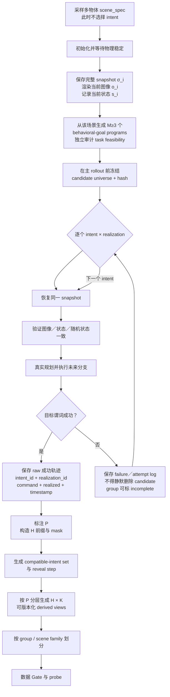
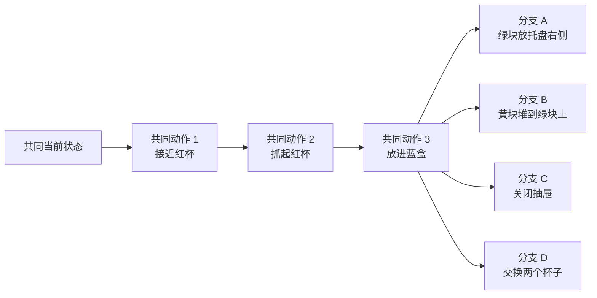
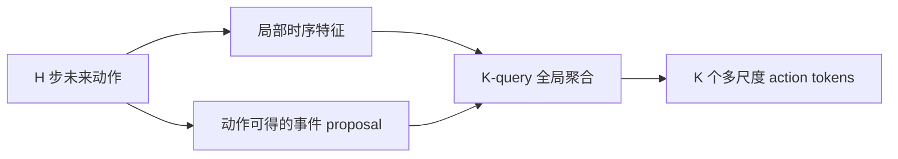

# 未来动作意图数据集构造方案

> [!abstract] 这份数据到底要构造什么
> 对同一个当前时刻 $t$，严格固定当前观测图像、机器人状态、物体状态、相机和随机状态；从该快照真实执行多条不同的**未来动作分支**。  
> 同一个 current 对应多个可验证行为目标；同一个行为目标也要包含多条成功轨迹实现，避免模型只识别 planner／路径指纹。模型读取：
>
> $$
> \text{当前图像}+\text{当前机器人状态}+\text{未来动作前缀}
> $$
>
> 并推断仍然隐藏的结构化操作目的。数据集的中心不是 left/right，也不是优先做一个庞大 benchmark，而是受控测量三个量：**未来看多远 $H$、指定 comparison cohort 内的不同未来先共同持续多久 $P$，以及覆盖同样长的未来时最少压成多少 token $K$ 仍能保留意图。** 同时用 realization 数 $R$ 防轨迹指纹。未量化连续 token 只比较 representation footprint；只有具有可复核实际／估计码长时才比较 encoded rate。

> [!danger] 构造方向
> 动作片段必须从锚点 $t$ **向未来切片**：`a[t : t+H]`。  
> 禁止退回 `a[t-H : t]` 的历史动作识别路线。

## 阅读导航

| 阅读目标 | 章节 |
|---|---|
| 先用简单语言快速理解整套方案 | [[未来动作意图数据集构造方案_2026.7.31_简明版]] |
| 先看整个生成流程 | [[#2. 总体生成流程]] |
| 理解“同观测、多未来”的数据单元 | [[#1. 数据集的基本单元]] |
| 看“同一意图、多轨迹实现”怎样防指纹 | [[#3.6 同一意图必须有多种成功实现]] |
| 看复杂多物体场景怎样设计 | [[#3. 场景与意图程序设计]] |
| 看怎样保证每条分支真的从同一状态出发 | [[#4. Snapshot 分支生成]] |
| 看动作、时间戳与字段怎样保存 | [[#5. Raw 数据：必须先完整保存]] |
| 看 H、P、K 和 mask 样本怎样派生 | [[#7. H、P 与可识别性标注]] |
| 看长动作怎样压缩 | [[#8. Action token 构造与压缩]] |
| 看怎样防泄漏和正确划分 | [[#10. 防捷径与数据划分]] |
| 看逐项验收门槛 | [[#12. 数据质量 Gate]] |
| 看一个完整样本 | [[#13. 完整样本示例]] |
| 回到 idea 总分析 | [[未来动作条件意图理解_idea内容分析_2026.7.31]] |

---

## 0. 十二条不可妥协的原则

1. **Future-relative-to-anchor**  
   文件中的轨迹虽然已经采集完成，但样本输入必须是相对当前锚点 $t$ 的未来动作。

2. **Same current, multiple futures**  
   一个数据单元不是独立 episode，也不只是 left/right pair，而是一个当前快照对应至少三条可成功执行的未来分支。共享未来前缀 $P$ 必须记录在具体 `prefix_controlled` comparison cohort 上，不属于无条件的 root group。不同 $P$ 默认只分 cohort 描述；只有 matched-P family 才直接比较。

3. **复杂度服务于控制变量**  
   多物体、多目标和多阶段只需复杂到足以阻断方向、终点、执行臂等捷径，并支撑 $H/P/K$ 实验；当前不以优先扩成大而全的 benchmark 为目标。

4. **Raw first, derived later**  
   采集层完整保存原始动作、时间、状态与验证真值；$H$ 切片、重采样、mask 和 $K$-token 压缩都在可追溯的 derived 层完成。

5. **短未来允许“不知道”**  
   若未来前缀尚未区分多个意图，正确监督是候选意图集合／概率分布，而不是强迫模型猜一个 branch label。

6. **先证明未来动作有价值，再研究压缩**  
   先用 raw／近乎无压缩的未来动作完成机制验证与 $H/P$ 曲线；只有这些 Gate 通过，才比较 $K$ 和 learned compressor。future action 始终只是训练／诊断期特权输入，部署 rollout 不读取 expert／oracle future，接口必须与 policy-only 相同。

7. **Same intent, multiple realizations**  
   主机制数据不能让一个意图永久绑定一条 canonical trajectory；同一意图要有不同 planner seed、路径／速度或可行接近方式，并显式记录 realization family。

8. **Compatible set for every H**  
   $H\le P$ 必然不可区分，但 $H>P$ 也可能只是数值分叉。`prefix_controlled` cohort 的每个 H 都由版本化 task tree 产生 compatible-intent set；训练／主评测使用只依赖模型可见输入的 observable node，oracle node 仅作审计。有限轨迹距离只作为 empirical diagnostic，不能在越过 P 后自动改成 one-hot。

9. **K、表示占用与编码率分开报告**  
   K 仍是模型接口的 token 数；未量化连续 token 报 representation footprint，离散／量化表示报明确 code budget，只有实际／估计编码码长可审计时才称 encoded rate。三者都不等于实际互信息。

10. **统计单位是 root group／scene family**  
    一条轨迹派生出的多个 H、K、mask、replacement 不是独立样本；划分、置信区间和显著性必须按 group／scene family 聚类。

11. **Candidate universe 先冻结，planner 成功后审计**  
    候选在主 rollout 前按 task／physical feasibility 冻结并记录 hash。planner solvability 单独记录；规划失败不得静默删除候选，只能重试／换 planner、标记 group incomplete，或整组退出正式 cohort 并报告 attrition。

12. **候选必须被语义条件化评分**  
    机制主任务使用共享 candidate-conditioned scorer；禁止把 group-local `intent_00/01/02` 做成固定分类头。全部候选对称可见但真实 target／branch ID 不可见；必须加入 candidate-only prior baseline、候选顺序置换检查和候选内容泄漏审计。

---

## 1. 数据集的基本单元

### 1.1 Controlled multi-future group

第 $i$ 个数据单元定义为：

$$
\mathcal{G}_i
=
\left(
x_i,\;
\sigma_i,\;
\left\{
\left(
y_{i,j},
\left\{
\left(A^+_{i,j,r},v_{i,j,r}\right)
\right\}_{r=1}^{R_{i,j}}
\right)
\right\}_{j=1}^{M_i}
\;,\;
\left\{\mathcal Q_{i,c}\right\}_{c=1}^{L_i}
\right)
$$

其中：

- $x_i=(o_i,s_i)$：模型可见的、所有分支共享的当前图像与机器人状态；
- $\sigma_i$：生成／恢复／等同性审计使用的完整仿真 snapshot，不自动进入模型输入；
- $M_i$：从同一当前状态出发的不同结构化意图数；
- $y_{i,j}$：第 $j$ 个轨迹可验证行为目标／操作程序；
- $R_{i,j}$：意图 $j$ 的成功执行 realization 数；
- $A^+_{i,j,r}$：意图 $j$ 的第 $r$ 条成功未来动作序列；
- $v_{i,j,r}$：基于仿真真值的成功验证结果；
- $L_i$：root group 中的 comparison cohort 数；
- $\mathcal Q_{i,c}$：第 $c$ 个 comparison cohort，保存 purpose、成员 branch、candidate universe、task-tree ref，以及仅对 `prefix_controlled` 主 cohort 有效的 $P_{i,c}$。

同一个 root group 可同时包含：

| comparison cohort | 用途 | $P$ 的地位 |
|---|---|---|
| `prefix_controlled` | 逐 cohort 的主 $\mathrm{IntentScore}(H\mid P,c)$ 曲线 | 受控、严格定义并保存 prefix hash；跨 $P$ 直接比较只限 matched-P family |
| `trajectory_invariance` | 同意图跨 planner／路径一致性 | 不进入严格 H/P 主曲线；其 exact P 即使可计算也不是受控主变量 |

> [!important] P 的归属
> `group_id` 只保证 same current；$P_{i,c}$ 属于 comparison cohort $\mathcal Q_{i,c}$。manifest 中不得在 root group 放一个无条件适用于所有 realization 的 `shared_future_prefix`。

一个 group 的核心约束是：

$$
o_{i,1}=o_{i,2}=\cdots=o_{i,M_i}
$$

$$
s_{i,1}=s_{i,2}=\cdots=s_{i,M_i}
$$

但：

$$
y_{i,j}\neq y_{i,k}
$$

对 $j\neq k$ 成立；同时同一意图内要求：

$$
y_{i,j,r}=y_{i,j,r'},\qquad
A^+_{i,j,r}\neq A^+_{i,j,r'}
$$

对至少一部分 $r\neq r'$ 成立。

### 1.2 为什么不再只叫 pair

二元 pair 只能回答“动作 A 还是动作 B”。主数据应允许：

```text
同一个 current observation
├─ future A → intent A
├─ future B → intent B
├─ future C → intent C
└─ future D → intent D
```

这更接近真实的多模态未来，也能避免模型把任务偷换成二分类。

还必须有：

```text
同一个 intent
├─ realization 1：planner/path A
├─ realization 2：planner/path B
└─ realization 3：planner/path C
```

前一方向测 controlled ambiguity，后一方向测 semantic invariance。若没有后一方向，模型可能只做 branch retrieval。

### 1.3 当前输入与验证真值要分层

| 数据 | 是否可进入模型 | 用途 |
|---|---:|---|
| 当前相机图像 $o_t$ | 是 | 当前场景 |
| 当前机器人状态 $s_t$ | 是 | 当前本体条件 |
| 未来动作前缀 $A^+_{t,H}$ | 是 | 特权意图证据 |
| 当前时刻的对象可见属性 | 可通过图像读取；结构化真值默认不直接输入 | 标注与审计 |
| 未来图像 | 否 | 只用于人工回放／调试 |
| 未来对象 pose／contact／谓词 | 否 | 成功验证与自动标注 |
| 原始任务指令 | 意图分支默认否 | raw metadata、对照实验 |
| 结构化 intent | 否 | 监督 target |

> [!warning] 未来状态不是未来动作
> 未来 RGB、最终物体 pose、成功谓词会直接暴露结果，不能因为它们也位于轨迹的未来就一并输入意图模型。主输入只使用当前观测／状态与规定的未来动作流。

---

## 2. 总体生成流程



### 2.1 核心顺序

> [!important] 先定场景，再选未来
> `scene_spec`、snapshot、当前图像和当前机器人状态必须在 intent 选择之前确定。  
> 若先选择 label 再摆物体，颜色、位置、执行臂、碰撞难度或相机画面都可能泄露答案。

实验顺序也必须固定：

1. raw／近乎无压缩未来动作是否比 `H=0` 明显改善意图推断；
2. 为同一 intent 生成不同成功 realization，确认模型不能只靠 planner／时长／路径指纹；
3. 控制共享前缀 $P$，扫描 $H$，定位数值分叉与语义 reveal；
4. 保持 current 不变，把 future A 替换为同组 future B，并把监督目标同步切换；
5. 固定 $H$ 与 $P$，再比较 $K$、representation footprint 和 compressor；具有可复核实际／估计码长后才比较 encoded rate；
6. 机制成立后，才扩场景、做 π0.5 transfer mechanism 与 rollout。

### 2.2 建议的实现伪代码

```python
scene_spec = sample_scene_without_intent(seed)
env.reset(scene_spec)
wait_until_stable(env)

root_snapshot = env.serialize_full_state()
current_obs = render_current_cameras(env)
current_robot_state = read_robot_state(env)
current_context_ref = save_current_context_once(
    current_obs,
    current_robot_state,
)

intent_programs = enumerate_candidate_intents(
    scene_spec=scene_spec,
    min_branches=3,
    require_shared_prefix=True,
)

feasibility_records = audit_task_feasibility_without_primary_planner_success(
    root_snapshot=root_snapshot,
    intent_programs=intent_programs,
)
candidate_universe = freeze_candidate_universe_before_rollout(
    intents=intent_programs,
    feasibility_records=feasibility_records,
)

for intent in candidate_universe:
    for realization_spec in sample_realizations(intent, min_count=R_min):
        restore_or_reconstruct_anchor(env, root_snapshot, scene_spec)
        assert_same_physical_anchor(env, current_robot_state)

        rollout = plan_and_execute_future(intent, realization_spec)
        verdict = verify_with_simulator_truth(rollout, intent)

        if verdict.success:
            save_raw_branch(
                rollout,
                intent_id=intent.id,
                realization_id=realization_spec.id,
                current_context_ref=current_context_ref,
            )
        else:
            save_failure_log(rollout, intent, realization_spec, verdict)

finalize_group_eligibility_without_pruning_candidates(
    candidate_universe=candidate_universe,
    required_successful_realizations=R_min,
)
```

这里的 task／physical feasibility 判定不能由同一个 primary planner 的 rollout 成功与否循环定义；必须保存判定器、规则版本、证据和不确定性。`freeze_candidate_universe_before_rollout` 之后，planner 连续失败只能改变 `planner_solvability` 与 group eligibility，不能删除 candidate。  

这只是逻辑接口，实际函数名必须以服务器 RoboTwin 版本为准。[RoboTwin 官方公开采集文档](https://robotwin-platform.github.io/doc/usage/collect-data.html)说明了 seed 搜索／回放与 HDF5 保存，但没有据此确认通用 `serialize_full_state()`／`restore_full_state()` API；正式实现必须把 snapshot 能力标记为 `serialized`、`reconstructed` 或 `canonical_replay`，并分别审计，不能把伪代码当成官方现成功能。

---

## 3. 场景与意图程序设计

### 3.1 用“任务图变换”定义复杂意图

把当前场景写成实体—关系图：

$$
G_t=(V_t,E_t)
$$

意图不是一个方向词，而是一段对关系图进行修改的可验证程序：

$$
y=
\left[
\mathrm{op}_1(\cdot),
\mathrm{op}_2(\cdot),
\ldots,
\mathrm{op}_L(\cdot)
\right]
$$

建议的基础操作族：

| 类型 | 结构化例子 | 主要验证 |
|---|---|---|
| 放置关系 | `place(red_mug, inside, blue_box)` | inside + margin |
| 相对关系 | `place(green_block, between, cup_A, cup_B)` | 几何关系 |
| 堆叠 | `stack(yellow_block, on_top_of, red_block)` | 接触 + 高度 + 稳定 |
| 可动部件 | `close(drawer_1)` | articulation state |
| 交换 | `swap(red_mug, blue_mug)` | 两个目标区域 |
| 排序 | `order([A,B,C], left_to_right)` | 有序关系 |
| 多阶段组合 | `seq(place(A,in,B), stack(C,on,D))` | 顺序 + 两个谓词 |
| 带约束操作 | `place(A,in,B) while_keep(C,upright)` | 目标 + 约束 |

`left_of/right_of` 可以是关系词之一，但不能是主标签的全部信息。

### 3.2 角色化采样多物体

每个 scene 不应只是随机堆很多东西，而要覆盖不同角色：

| 角色 | 建议内容 | 目的 |
|---|---|---|
| 操作对象候选 | 多个杯、块、工具或容器 | 产生对象选择歧义 |
| 参照对象 | 盒、托盘、块、标记区域 | 需要视觉—动作 grounding |
| 同类 distractor | 同类别、相近外观的多个实例 | 防止用类别先验猜 |
| 可动结构 | 抽屉、门、盖子 | 引入不同操作原语 |
| 障碍／路径约束 | 不能碰撞的物体或狭窄通道 | 产生真实时序结构 |
| 非任务物体 | 与任一当前分支无关 | 防止固定目标位置捷径 |

对象实例必须能通过当前视觉中的可观察属性指代，例如：

- `leftmost_red_mug`；
- `blue_box_near_drawer`；
- 带有可见纹理／颜色标记的实例。

禁止把不可见的仿真 `instance_id` 当成模型需要预测的语义。

### 3.3 建议的复杂度阶梯

> [!note] 以下是 pilot 建议，不是已经确认的数据规模
>
> 场景复杂度是防捷径和支撑 $H/P/K$ 的实验控制，不是第一阶段追求 benchmark 规模或任务种类数量的目标。

| 阶段 | 当前场景 | 每个 group 的未来分支 | 程序结构 | 作用 |
|---|---|---:|---|---|
| C0 管线 smoke | 4–6 个实体 | 2–3 | 单步，可含 left/right | 只验证 snapshot／字段 |
| C1 核心机制 | 6–8 个实体 | 3–4 | 同一对象、不同目的地／关系 | 证明 future value，研究 $P/H$ |
| E1 长未来扩展 | 8–12 个实体 | 4–6 | 共享第一子任务、第二阶段分叉 | 机制通过后研究 $K$／压缩 |
| E2 组合泛化 | 多类实体与可动结构 | 4–6 | 顺序、组合、约束 | 后续 OOD 扩展 |

场景复杂度的最终 Gate 是：

- visual/state-only 无法唯一识别 branch；
- `state + future action（no vision）` 与纯 `future-action-only` 都不能稳定绕过视觉对象 grounding；
- visual + correct future action 能逐步消除歧义；
- 早期 future prefix 对多个 branch 仍真正兼容。

### 3.4 怎样刻意制造“晚一点才看得出来”

最差的设计：

```text
branch A 第一步向左
branch B 第一步向右
branch C 第一步抓另一个物体
```

这种数据用极短 horizon 就能分类。

主数据应通过任务树共享真实前缀：



保证共同前缀的最好方法不是“希望不同规划器恰好走得像”，而是：

1. 把共同子程序真实执行一次；
2. 在共同节点保存 snapshot；
3. 从该节点分别生成不同后续；
4. 若需要根节点完整轨迹，就把同一份共同前缀与不同后缀拼成可追溯的任务树路径。

这样可以准确知道分支事件从哪里开始，而不是事后凭肉眼猜。

对第 $i$ 个 root group 的第 $c$ 个 H/P comparison cohort，先定义被纳入该曲线的轨迹索引集合 $\mathcal C_{i,c}$。其中可以包含不同意图及其多个 realization。严格共享未来前缀长度定义为：

$$
P_{i,c}=
\max\left\{
p:
\forall b,b'\in\mathcal C_{i,c},\;
A^+_{i,b}[0:p]
=
A^+_{i,b'}[0:p]
\right\}
$$

这里的 $b$ 是 `(intent_id, realization_id)` 的复合索引。“相同”优先通过复用同一份 canonical prefix 及其 hash 保证，而不是事后给连续动作任意设一个宽松阈值。若某个自由路径 realization 从第一步就不同，应放入单独的 invariance cohort，不得悄悄把主 H/P cohort 的 $P$ 压成 0 后仍声称做了晚期 reveal。数据中同时保存：

- `P_steps`：共享的 raw action steps；
- `P_seconds`：由 timestamp 计算的真实时长；
- `P_events`：覆盖的完整语义事件／子任务数；
- pairwise action divergence：各分支对首次超过预注册数值阈值的时刻。

> [!important] $P$ 与 `H_reveal` 不相同
> 当 $H\le P_{i,c}$ 时，同一 comparison cohort 的分支给模型的未来动作输入完全一致，branch-specific intent 在信息上不可唯一识别。  
> 当 $H>P_{i,c}$ 时，分支证据才**可能**出现；某个模型达到可靠语义识别的 `H_reveal` 可以晚于 $P_{i,c}$。

### 3.5 Intent program 必须由仿真器验证

结构化标签应由任务生成器产生，由环境真值验证：

```yaml
intent_program:
  - op: place
    object: red_mug_left_of_blue_box
    relation: inside
    reference: blue_box_right_of_red_mug
  - op: stack
    object: yellow_block
    relation: on_top_of
    reference: green_block
ordered: true
constraints:
  - keep_upright: red_mug_left_of_blue_box
```

自然语言标签从结构化程序模板化派生：

> “先把红杯放入蓝盒，再把黄块堆到绿块上，并保持红杯直立。”

自然语言是显示层；结构化程序才是 exact match、组件准确率和成功验证的主真值。

### 3.6 同一意图必须有多种成功实现

对同一 current $x_i$ 和同一行为目标 $y_{i,j}$，构造：

$$
\left\{
A^+_{i,j,1},
A^+_{i,j,2},
\ldots,
A^+_{i,j,R_{i,j}}
\right\}
$$

允许变化：

- planner seed／采样解；
- 碰撞安全但形状不同的路径；
- 速度 profile 与短暂停顿；
- time warp；
- 接近方向；
- 在任务允许且平衡设计时使用不同执行臂；
- 保持相同目标与约束的局部绕障。

必须保持：

- 同一 current context 与物理 anchor；
- 同一结构化目标、顺序和 verifier；
- 同一动作语义与采样规范；
- 全部 realization 真实执行且成功；
- 变化因素不与 intent label 固定绑定。

这里的 planner seed 是**在 anchor 之后显式施加的 realization 因子**。anchor snapshot 中的物理状态、环境随机状态与模型输入保持一致；不能为了换 planner seed 而重新初始化场景。每个 realization 保存 `base_snapshot_hash + post_anchor_planner_seed`。

建议分两类收集：

| cohort | 目的 | 约束 |
|---|---|---|
| `prefix_controlled` | 主 H/P reveal | 所有 realization 复用 canonical prefix，只在后缀变化 |
| `trajectory_invariance` | 防 planner／路径指纹 | 允许从较早时刻产生同义路径变化，不用于严格 cohort-level P 主曲线 |

数量建议：

- smoke：每个 intent 1–2 条，只验证生成与字段；
- 主机制：可行任务建议每个 intent $R\ge3$；
- 若计算成本不足：至少保证所有标签的 R 分布平衡，并预注册覆盖率。

必做评测：

- **正式主测试**：完整 held-out root groups；同一 group 的所有 realization 永不跨 train/validation/test；
- **planner OOD**：train groups 只使用 seen planner family／configuration；完全 held-out 的 test groups 中，对同一 test current／intent 同时生成 seen-distribution planner realization 与 unseen-family realization，两者都只属于 test。优先做组内配对比较；若某 planner 无法在同一 current 成功，则使用严格匹配的 held-out-group 对并单独报告；
- same-intent cross-trajectory retrieval；
- time-warp／speed-normalized／path-perturbation invariance；
- planner-ID adversarial probe。

可以额外做：

```text
同一 group 内 r1/r2 建 gallery 或拟合专用 diagnostic
→ r3 做 query
```

但它只能命名为 `in_group_trajectory_invariance_diagnostic`：

- 不属于正式 test generalization；
- 不用于选择主模型、H、阈值或 compressor；
- 不增加统计上的独立有效 N；
- 若在 held-out test group 内建 gallery，主模型参数必须已冻结，且结果仍单列为组内一致性诊断。

---

## 4. Snapshot 分支生成

### 4.1 同 seed 不是同场景

相同随机 seed 只说明伪随机序列起点相同。若两个任务：

- 调用随机数的次数不同；
- 初始化顺序不同；
- 对象候选池不同；
- 先根据 label 筛选位置；

最终场景仍会不同。

因此正式数据必须保存并恢复完整 snapshot，不能用“same seed”代替。

### 4.2 Snapshot 至少包含什么

| 类别 | 必须保存 |
|---|---|
| 机器人 | qpos、qvel、夹爪、控制器内部状态、执行臂模式 |
| 物体 | pose、velocity、articulation、joint state、是否休眠 |
| 环境 | 仿真时间、physics state、接触相关必要状态 |
| 相机 | 内参、外参、分辨率、渲染配置 |
| 随机性 | Python／NumPy／仿真器／规划器 RNG state |
| 任务 | scene spec、对象角色、可行目标集合 |
| 软件 | RoboTwin commit、环境配置 hash、资产版本 |

若环境无法一次序列化全部内部状态，至少保存可重建 scene spec，并对每次恢复后的图像、机器人状态、对象 pose 和相机做逐项一致性验证。

每个 group 必须记录恢复模式：

```yaml
anchor_restore:
  mode: serialized | reconstructed | canonical_replay
  api_or_script_version: ...
  physics_state_coverage: ...
  controller_state_coverage: ...
  planner_state_coverage: ...
  audit_status: ...
```

`serialized` 只有在实际 API 与覆盖字段经过服务器审计后才能使用；`reconstructed` 表示从 scene spec／物理状态重建；`canonical_replay` 表示从根状态重复执行同一公共前缀到达 anchor。三者的等同性误差必须分开报告。

### 4.3 当前输入只保存一次、所有分支共同引用

为消除渲染器微小非确定性造成的 current leakage：

1. 根 anchor 的当前 RGB／proprioception 只生成并保存一次；
2. 所有 intent／realization 只引用同一 `current_context_ref` 与 hash；
3. 恢复后的重新渲染仅用于 snapshot equality audit，不作为不同 branch 的模型输入；
4. 若在任务树中有多个 anchor，每个 anchor 也各自只保存一份 current context。

这样保证模型收到的 current 字节严格相同；但物理执行状态是否相同仍必须通过下一节的 state／object／camera 审计，不能只靠共用图片掩盖恢复误差。

### 4.4 模型可见 current state 必须白名单化

完整 snapshot 可以包含 planner target、controller setpoint、task phase、goal ID 等内部状态，但这些不得自动进入 $s_t$。

首轮模型输入白名单建议：

```text
qpos
qvel（可选）
gripper state
EEF pose（可选）
base state（若使用）
```

明确禁止：

```text
planner goal / target
controller future setpoint
task progress flag
intent ID
branch ID
success predicate
```

schema 中同时保存 `snapshot_fields` 与 `model_state_whitelist`，并做 state-only leakage probe。

### 4.5 恢复后的强制断言

在每个 branch 开始规划前检查：

```text
当前 head 图像 hash 一致
当前 wrist 图像 hash 一致（若作为当前输入）
机器人 qpos / gripper 一致
所有对象 pose / articulation 一致
相机内外参一致
当前任务目标尚未成立
所有候选意图在该状态下可行
```

确定性渲染优先使用 exact hash。若渲染器存在不可消除的微小非确定性：

1. 对同一 snapshot 重复恢复多次；
2. 先测“无分支变化”的自然像素差分布；
3. 再预注册容差；
4. 不允许看完不同 intent 图像后临时放宽阈值。

### 4.6 分支执行控制变量

除非 intent 本身要求不同机械臂，否则同一 group 应控制：

- 执行臂；
- planner；
- 控制器；
- 最大规划时间；
- 碰撞配置；
- 动作频率；
- 相机；
- domain randomization；
- 重规划规则。

同 intent 多 realization 实验可以按预注册设计改变 planner seed／路径 profile；这些变化必须发生在 current anchor 之后、对各 intent 平衡，并记录为 `realization_spec`，不能混入未声明的 branch-specific 配置。

如果 branch A 总由左臂完成、branch B 总由右臂完成，模型可能只读执行臂而不理解多物体意图。

### 4.7 成功与失败如何处理

每条正分支必须：

- 完成全部结构化目标；
- 满足顺序和约束；
- 目标在稳定窗口内保持；
- 没有无效／未记录的 planner fallback；
- 有完整动作与时间戳；
- 能从 raw 轨迹复算验证。

失败轨迹不要删除，也不要混为正样本。单独保存：

```text
failure_reason
planner_status
last_valid_step
violated_constraint
partial_predicates
collision/contact summary
```

失败数据未来可用于诊断或 hard negative，但第一阶段不应把它与“另一种成功意图”混淆。

每个冻结 candidate 还必须保存：

```yaml
candidate_status:
  task_feasibility:
    status: feasible        # feasible / infeasible / uncertain
    assessor_version: feasibility_rules_v1
    evidence_ref: feasibility/intent_00.json
  planner_solvability:
    planner_family_id: seen_rrt_v2
    attempt_budget: 5
    planner_attempts: 5
    successful_realizations: 2
  formal_cohort_eligible: false
```

`task_feasibility.status` 不能由同一 primary planner 的成功率代替。冻结后若成功 realization 未达到 Gate，candidate 仍保留在 manifest，group 标为 `incomplete`；重试／换 planner 或整组退出正式 cohort 都要记录。禁止只删除难规划 intent 后把剩余分支冒充 balanced group。

---

## 5. Raw 数据：必须先完整保存

### 5.1 为什么不能采集时就压缩

本项目要比较不同 $H$ 与不同 $K$。如果采集时只保存 8 个摘要 token：

- 无法回到更长 horizon；
- 无法更换压缩器；
- 无法检查时间对齐；
- 无法定位意图暴露事件；
- 无法验证压缩是否丢失信息。

所以 raw 是不可逆事实层，derived 才是实验视图。

### 5.2 动作流至少保存两类

> [!important] command 与 realized 必须区分

| 流 | 示例 | 作用 |
|---|---|---|
| `action_command` | 控制器实际接收的关节／EEF 命令 | 最接近“机器人将要执行什么” |
| `action_target` | policy／planner 的目标动作 | 分析 action chunk 与控制器接口 |
| `robot_state` | 每个采样点实际 qpos／qvel／gripper | 判断动作实现结果 |
| `eef_state` | 末端 pose／velocity | 可解释事件与跨机器人表示 |

如果服务器数据链路只能提供其中一类，必须在 manifest 中准确命名，不能把 shifted next qpos 写成 delta EEF command。

这些流不仅要保存，还应成为预注册输入消融：

1. **Command-only**

$$
(o_t,s_t,A^{cmd}_{t:H})\rightarrow y
$$

2. **Target-only**

$$
(o_t,s_t,A^{target}_{t:H})\rightarrow y
$$

3. **Realized-state-only**

$$
(o_t,s_t,S^{real}_{t+1:t+H})\rightarrow y
$$

第三项必须明确命名为 `future realized state sequence`，不能继续统称 action。若 target 与 realized state 能映射到同一控制空间，可再构造 tracking residual：

$$
e_t=
\Pi(S^{real}_{t+1})-A^{target}_t
$$

其中 $\Pi$ 是经过审计的坐标／维度映射。没有共同语义空间时禁止直接相减。

首轮机制实验应在服务器 schema 审计后预注册一个 primary future stream；其余作为消融，避免看完结果后挑最好的动作定义。

### 5.3 时间对齐约定

建议把每个控制步定义为：

```text
observation/state[t]
    ↓
action_command[t] 在区间 [timestamp[t], timestamp[t+1]) 生效
    ↓
observation/state[t+1]
```

并写单元测试验证：

- 数组长度关系；
- `action[t]` 与 `state[t]`／`state[t+1]` 的真实语义；
- episode 边界；
- dropped frame；
- 重复 timestamp；
- 重采样前后的索引映射。

### 5.4 频率必须以真实时间为准

每条轨迹保存：

- `sim_step`;
- `sim_time`;
- `control_timestamp`;
- `observation_timestamp`;
- `action_timestamp`;
- nominal fps；
- 实测 fps；
- `save_freq`;
- 重采样方法与版本。

> [!warning] 不要把多个 fps 口径硬拼
> 历史固定版本审计曾同时观察到约 16.67 Hz 的名义采集口径、30 fps 视频／公开数据声明，以及转换脚本中的其他 fps 设置。新数据必须靠本次服务器实际 `sim_step/timestamp` 定义物理时长，不能从文件帧数反推后直接假定。

### 5.5 推荐的 raw episode 字段

| 路径／字段 | 形状示例 | 说明 |
|---|---|---|
| `/time/sim_step` | `[T]` | 仿真 step |
| `/time/timestamp` | `[T]` | 秒 |
| `/action/command` | `[T,d_cmd]` | 控制器命令 |
| `/action/target` | `[T,d_target]` | 若存在 |
| `/robot/qpos` | `[T,d_q]` | realized qpos |
| `/robot/qvel` | `[T,d_q]` | realized qvel |
| `/robot/gripper` | `[T,d_g]` | 夹爪 |
| `/eef/pose` | `[T,n_arm,7]` | xyz + quaternion |
| `/observation/<camera>/rgb` | `[T,...]` 或编码字节 | 未来 RGB 仅审计，不进主输入 |
| `/objects/pose` | `[T,n_obj,7]` | verifier-only |
| `/objects/contact` | 可变／稀疏 | verifier／事件候选 |
| `/events/*` | 可变 | 后处理派生或原始控制事件 |
| `/success/predicates` | `[T,n_pred]` | verifier-only |

字段名最终以实际实现为准，关键是语义、形状、单位和可见性都写入 schema。

---

## 6. Raw／Derived 分层与目录

建议结构：

```text
future_action_intent_dataset/
├─ README.md
├─ dataset_card.md
├─ metadata/
│  ├─ dataset_info.json
│  ├─ action_schema.json
│  ├─ camera_schema.json
│  ├─ software_versions.json
│  └─ split_manifest.parquet
├─ scene_specs/
│  └─ scene_<scene_id>.json
├─ snapshots/
│  └─ group_<group_id>.snapshot
├─ current_context/
│  └─ group_<group_id>/
│     ├─ head.png
│     ├─ wrist_left.png
│     ├─ wrist_right.png
│     └─ current_state.npz
├─ raw/
│  └─ group_<group_id>/
│     ├─ branch_<branch_id>.hdf5
│     └─ branch_<branch_id>.json
├─ failures/
│  └─ group_<group_id>/
├─ derived/
│  ├─ horizon_views_v1/
│  ├─ masks_v1/
│  ├─ event_segments_v1/
│  └─ compressed_tokens_<method>_<version>/
└─ audits/
   ├─ snapshot_equality.parquet
   ├─ time_alignment.parquet
   ├─ leakage_checks.parquet
   └─ success_verification.parquet
```

### 6.1 ID 层级必须分开

| ID | 含义 |
|---|---|
| `scene_id` | 一个场景规格，可有不同稳定 snapshot |
| `group_id` | 一个严格共享当前状态的 controlled multi-future group |
| `intent_id` | group 内局部的结构化行为目标 ID |
| `global_intent_program_id`／`ontology_id` | 可跨 group／split 复用的全局结构语义；不是 split 绑定键 |
| `within_group_equivalence_family_id` | 同一 root group、同一 intent 内的轨迹等价族 |
| `realization_id` | 等价族中的一次 planner／路径实现 |
| `branch_id` | 一条具体未来轨迹，推荐由 intent + realization 显式关联 |
| `comparison_cohort_id` | 一组用于 H/P reveal 或 trajectory invariance 的 branch 成员集合 |
| `candidate_universe_id` | 该机制评测可选择的结构化 intent 候选全集 |

另外可有：

- `anchor_id`：任务树中的当前节点；
- `episode_id`：一次实际 rollout；
- `view_id`：某个 $H$、mask、重采样或 compressor 的派生视图。
- `planner_id/config_hash`：只作审计和 fingerprint probe，不进入主模型。

旧字段名 `equivalence_family_id` 若仍存在，必须在 schema 迁移时明确等价于 `within_group_equivalence_family_id`；不得把跨场景共享的 ontology label 当成“全部 realization 必须同 split”的 family，否则会错误阻断正常的语义标签复用。

禁止用文件夹名中的 `left/right/task_name` 充当隐式标签。

### 6.2 版本化每次派生

每个 derived view 保存：

```yaml
source_raw_hash: ...
anchor_index: ...
horizon_steps: ...
horizon_seconds: ...
resample_method: ...
compressor_name: ...
compressor_version: ...
token_budget_K: ...
token_dim_or_vocab: ...
representation_footprint_bits: ...
representation_footprint_bits_per_second: ...
nominal_code_bits: ...       # 仅离散／量化且编码规则明确
encoded_bits: ...            # 仅真实 bitstream／估计码长可复核时
encoded_bits_per_second: ...
normalization_stats_version: ...
created_by_commit: ...
```

从任何一个 $K$-token 样本都应能追溯回唯一 raw branch、锚点和动作索引区间。

---

## 7. H、P 与可识别性标注

这是本数据集区别于普通动作分类数据的关键。

| 符号 | 数据含义 | 主要回答 |
|---|---|---|
| $H$ | 当前样本实际向模型展示的未来长度 | 模型看多远 |
| $P$ | 指定 `prefix_controlled` comparison cohort 内多个未来完全相同的共享前缀长度 | 意图最早何时有可能分叉 |
| $H_{\mathrm{reveal}}$ | 某模型／checkpoint 按预注册指标达到可靠可识别性的长度 | 分叉证据何时足够；属于 evaluation artifact |
| $K$ | 将同一 $H$ 压缩后的 action token 数 | 用多少容量表达 |

### 7.1 为每个 H/P cohort 标注共享前缀 $P$

$P$ 是指定比较 cohort 的数据属性，不是模型超参数。主 H/P cohort 应由任务树主动控制 $P$，并保存：

```yaml
comparison_cohort:
  cohort_id: hp_main_00
  purpose: prefix_controlled
  member_branch_ids:
    - b00
    - b00_r01
    - b01
    - b02
  candidate_universe_id: candidates_group_000042_v1
  task_tree_id: task_tree_group_000042_v4
  task_tree_version: task_tree_v4
  P_steps: 118
  P_seconds: 7.08
  P_events:
    - approach_red_mug
    - grasp_red_mug
    - place_red_mug_in_blue_box
  P_event_count: 3
  prefix_type: shared_semantic_subtask
  matched_p_family_id: matched_p_family_01
  candidate_difficulty_signature:
    candidate_count: 3
    program_step_count_multiset: [2, 2, 2]
    signature_version: candidate_difficulty_v1
    hash: sha256:...
  post_divergence_program_family: second_subtask_choice_v1
  contains_artificial_idle_or_padding: false
  canonical_prefix_action_hash: sha256:...
  construction: canonical_prefix_reuse
```

要求：

- `P_steps` 由所有 branch 共同复用的 raw action 索引边界给出；
- `P_seconds` 必须由 timestamp 计算，不能只用名义 fps 推测；
- `P_events` 只计完整覆盖的事件／子任务；
- `prefix_type` 固定为 `kinematic_shared_path`、`shared_semantic_subtask` 或 `mixed`；`mixed` 专指完整共同子任务之外还含额外路径延长／中性停顿，必须分解报告，默认不进入直接 matched-$P$ 效应比较；
- 人工 idle、padding 或无任务意义停顿不得用于做大主实验 $P$；若为诊断保留，必须设置 `contains_artificial_idle_or_padding: true` 并从 matched-P 主比较排除；
- 不同 $P$ 的 cohort 默认分别报告。只有 `matched_p_family_id` 相同，且 candidate 数量／难度、程序结构、分叉后任务、planner／动作空间、总时长等已匹配时才直接比较 $P$；
- `candidate_difficulty_signature` 必须版本化，至少覆盖 candidate count、program step-count multiset、主要 op／relation 分布和语义相似度分箱；
- `action_divergence_step` 另按预注册数值阈值记录，不能拿它替代严格 $P$；
- 若一个 cohort 内不同 branch pair 的分叉深度不同，cohort-level $P$ 取所有成员共同前缀，pairwise 值另表保存；
- `trajectory_invariance` cohort 必须有独立成员列表并设置 `include_in_hp_main: false`；即使可以事后算出 exact P，也不把未经控制的 P 混入主 reveal 曲线。

### 7.2 为每条分支生成 future prefix

从完整未来动作 $A^+_{i,j}$ 派生：

$$
A^+_{i,j,0},\;
A^+_{i,j,H_1},\;
\ldots,\;
A^+_{i,j,H_m}
$$

其中 `H=0` 是纯当前图像／状态基线。

Horizon 网格应同时包含：

1. 按真实时间对数增长的 prefix；
2. 机器人事件结束点；
3. 任务树已知分叉点；
4. 完整未来或完整语义段。

例如：

```text
H_time = {0, 0.25s, 0.5s, 1s, 2s, 4s, ...}
H_event = {reach_end, grasp_end, first_subgoal_end, branch_event, ...}
```

具体秒数必须在核实采样频率与轨迹长度后调整；不应把某组 raw step 数无条件套到所有数据。

### 7.3 “少了难以判断”不能被标成普通错误

假设四条 branch 的 $P=100$。对 $H=50$，有 $H\le P$：

```text
输入：相同当前图像 + 相同当前状态 + 相同未来 50 步
标签：A / B / C / D
```

若仍使用四个不同 one-hot 标签，训练数据会对同一个输入给出互相冲突的答案。正确做法是保存：

$$
\mathcal{Y}^{obs}_{i,c,b,H}
=
\{y_{i,j}:
\text{该意图仍与 source branch }b\text{ 的当前 future prefix 兼容}\}
$$

并可定义目标分布：

$$
p^\*
\left(
y\mid x_i,A^+_{i,b}[0:H],c
\right)
$$

在 $H\le P$ 的完全共同前缀内，observable compatible set 通常等于整个 candidate universe，此时 set-marginal loss 恒为 0。只有 benchmark 明确采用预注册、branch-balanced 的人为采样协议时，才可另设均匀 `balanced_candidate_protocol` 作为训练／校准基准；它不能冒充真实 $p(y\mid x,A)$，也不能由 source branch 的 hidden label 给相同输入强塞 one-hot。没有可辩护先验时，这些 view 更适合作不确定性评测。当 $H>P$ 后，候选集合才可能随着 input-observable 结构证据逐步缩小；若分叉后的短暂动作仍不足以表达对象／关系，经验 `H_reveal` 会继续晚于 $P$。

因此 compatible set 必须对**每个 H** 标注，而不是只对 $H\le P$ 处理。对 `prefix_controlled` 主 cohort，定义不应依赖当前有限 realization 库，而应来自 rollout 前冻结的 candidate universe 与版本化任务树，并严格拆成 observable／oracle 两条边界。

$$
n^{obs}_{i,c,b}(H)
=
g^{obs}_{\mathcal T_{i,c},v}
\left(
o_i,\;
s_i,\;
A^+_{i,b}[0:H],\;
\mathrm{timestamp},\;
\mathrm{mask}
\right)
$$

$$
\mathcal Y^{obs}_{i,c,b,H}
=
\operatorname{Leaves}
\left(
\operatorname{Subtree}_{\mathcal T_{i,c}}
\left(n^{obs}_{i,c,b}(H)\right)
\right)
$$

其中：

- $\mathcal T_{i,c}$：comparison cohort $c$ 的版本化 task tree；
- $n^{obs}_{i,c,b}(H)$：只根据模型可见的 current RGB、白名单 state、future action prefix、timestamp／mask，以及预注册版本 $v$ 的确定性 evidence rules，在 horizon $H$ 时能确认的最深结构节点；
- $n^{oracle}_{i,c,b}(H)$：可使用 future object pose、contact、success predicate、planner target／phase 或 verifier state 的审计节点，不进入训练 target；
- `Leaves(Subtree(...))`：该节点子树中、属于本 cohort candidate universe 的所有 intent leaves；子树包含节点自身，因此 leaf 节点返回自身；
- observable 节点只因输入中可重现的对象选择、关系、顺序或任务边证据前进，不能因第一次数值 jerk／planner 差异，或模型不可见的 future truth 就收缩集合；也不能根据 test 模型表现事后改规则；
- 若可观察性无法可靠确认，observable node 留在更早父节点，宁可让集合偏宽；oracle node 仅用于解释两种边界的差距。

observable 任务树集合是**相对于预先冻结 candidate universe 的保守结构化真值**，不冒充世界中所有物理可行意图的全集。增加新的同义 realization 不应改变它。同一 cohort 在 $H>P$ 后，不同 source branch 可落入不同节点，因此每个 `(cohort_id, source_branch, H)` view 至少保存：

```yaml
compatibility_source: task_tree
candidate_universe_id: candidates_group_000042_v1
task_tree_version: task_tree_v4
task_tree_id: task_tree_group_000042_v4
tree_node_observable_at_H: shared_first_subtask
tree_node_oracle_at_H: second_subtask_contact_started
observable_evidence_rule_version: observable_evidence_v1
observable_evidence_sources:
  - current_rgb
  - current_robot_state_whitelist
  - future_action_prefix
  - timestamp
  - mask
oracle_event_sources:
  - future_object_pose
  - contact
  - planner_or_verifier_phase
compatible_intent_ids_observable:
  - intent_00
  - intent_01
  - intent_02
compatible_intent_ids_oracle_audit:
  - intent_01
compatible_set_for_training: observable
target_mode: set
```

对 `trajectory_invariance` cohort，主任务通常只是验证同一 intent 的表示／排序一致性，并不强制构造 H/P compatible set。只有确需近似自由路径 prefix 兼容性时，才定义：

$$
\widehat{\mathcal Y}^{emp}_{i,c,b,H}
=
\left\{
y:
\exists A'\in\widehat{\mathcal A}(x,y),
\ d_H
\left(
A'[0:H],A^+_{i,b}[0:H]
\right)
\le\epsilon_H
\right\}
$$

它必须命名为 `empirical_trajectory_compatibility_set`，并保存 realization-library hash、$d_H$、$\epsilon_H$ 与定义版本。该集合可能随轨迹库扩充而改变，不替代 observable task-tree compatible set，也不要求与 observable／oracle 两套集合相等。先报告采样覆盖与距离／阈值敏感性；只有 empirical set 在 observable 结构证据出现前持续分离 compatible intents，且 planner-ID／path probe 同时成功时，才视为轨迹指纹警报。

### 7.4 三种可配合使用的训练／评测方式

| 方法 | 短 prefix 怎样标 | 优点 | 注意 |
|---|---|---|---|
| Set-valued target | 保存所有兼容意图 | 最忠实反映歧义 | 需要 set accuracy／ranking |
| Soft target | 给兼容意图分配训练权重 | 可训练校准概率 | 必须记录 `target_distribution_basis`，不能冒充真实世界 $p(y\mid x,A)$ |
| Deterministic subset | 只在首个可辨认点之后训练单标签 | 实现最简单 | 早期 prefix 只能作评测 |

推荐：

- immutable raw／reference 层永久保存 candidate universe、task tree、semantic event／edge 映射及其 hash；
- 每个 H 的 compatible set、node/evidence status 与 target mode 保存到可追溯、版本化的 derived view，不能回写或改写 raw；
- 机制 probe 先支持 set／soft target；
- soft target 若使用均匀权重，应明确命名为 `balanced_candidate_objective`，而不是“真实意图先验”；
- 若 π0.5 接入只方便单标签训练，可只采样 **observable task-tree compatible set** 已成为单例的 `deterministic_eligible` 样本；不能用 oracle set 或 test 模型事后得到的 `H_reveal` 选择训练样本。仍应在完整 horizon 曲线上评测不确定性。

### 7.5 如何定义 `reveal_step`

不同层级必须分开保存：

- **comparison-cohort manifest**：`shared_prefix_end`、`P_steps/P_seconds/P_events`、canonical prefix hash、member branches、candidate universe 与 task-tree ref；P 不写到无条件 root group 或单独 branch；
- **immutable branch／task-tree reference**：source branch 的 raw action／timestamp、task-tree path、结构事件及其时间索引；
- **versioned derived／audit artifact**：pairwise `action_divergence_step`、每个 H 的 structural evidence／tree node，以及 `human_readable_reveal` 抽检结果。

`H_reveal` 的**判定规则**应在测试前预注册，但其数值依赖模型、checkpoint、metric、threshold 与随机种子，应保存为 evaluation artifact：

```yaml
model_checkpoint_hash: ...
metric: candidate_set_recall
threshold: ...
threshold_definition_version: ...
H_reveal_steps: ...
H_reveal_seconds: ...
```

不能把某个模型得到的 `H_reveal` 写成 raw 数据固定真值。P、结构事件、动作分叉与经验 `H_reveal` 不一定相等，论文必须明确使用哪一个。

### 7.6 Prefix 之外的 mask／replacement 视图

每条 raw branch 可派生：

| 视图 | 做法 | 回答的问题 |
|---|---|---|
| `prefix_H` | 只保留前 H 步 | 看多远才够 |
| `suffix_H` | 只保留最后 H 步 | 是否只靠末端 |
| `event_drop` | 删除一个完整事件 | 哪个阶段贡献最大 |
| `middle_mask` | 局部时间遮挡 | 证据位置 |
| `temporal_shuffle` | 打乱顺序但保留值分布 | 是否使用时序 |
| `future_replacement_same_group` | current 不变，把 future A 换成同组真实 future B，target 同步从 intent A 换成 B | 预测是否对 future 证据发生正确切换 |
| `wrong_scene_same_intent` | 动作来自不匹配场景 | 是否做视觉 grounding |
| `endpoint_only` | 只保留动作首尾 | 长路径是否必要 |

所有视图只记录索引／变换规则，不覆盖 raw。

> [!danger] 同组真实未来不是“错误动作”
> `current + future B` 在同一个 group 中本身就是合法样本，其正确 target 是 intent B。future-conditioned prediction-switch test 必须检查预测能否从 A 切到 B；若仍固定 intent A 再把 future B 称为 wrong future，会把一个有效替代未来输入错误地标成负样本。该测试验证模型输入依赖，不证明 future action 因果地产生 intent。

---

## 8. Action token 构造与压缩

> [!important] 压缩不是第一个问题
> 先用 raw padded sequence、足够密的固定 stride 或其他近乎无压缩表示证明：正确 future 确实增加意图信息，并得到按 $P$ 分层的 $H$ reveal 曲线。若这一机制 Gate 未通过，不进入 learned $K$-query 或 event-aware 主实验。

### 8.1 压缩前先统一动作语义

压缩器输入前处理至少包括：

```text
原始 action
→ 按明确 schema 拆分 arm / gripper
→ 单位与坐标系统一
→ 使用 train split 统计量归一化
→ 附加 Δt / timestamp encoding
→ 附加 padding mask
→ 可选派生 Δq / velocity / EEF
```

测试集不得参与归一化统计。

### 8.2 K、representation footprint 与 encoded rate 的公平账本

固定 K 只固定 Transformer 接口长度，不固定表示容量。每个压缩视图必须记录：

$$
F_{\mathrm{repr}}^{cont}=K\,d_z\,b_{\mathrm{store}}
$$

离散 token ID 在同一接口边界的实际存储占用为：

$$
F_{\mathrm{repr}}^{disc}
=
N_{\mathrm{tok}}\,b_{\mathrm{id,store}}
$$

其中变长序列必须按样本保存真实 $N_{\mathrm{tok}}$ 分布，并另报 length／padding side metadata。两者都按覆盖时长计算：

$$
R_{\mathrm{repr}}=\frac{F_{\mathrm{repr}}}{\tau_H}
$$

> [!important] footprint 的比较边界
> `representation footprint` 固定测量 **compressor serialized output → VLA input adapter** 之间的接口表示：连续方法计 latent 数值，离散方法计 token IDs。离散 ID 之后查表形成的 $d_{\text{model}}$ embedding activation、attention cache 与运行显存另作 compute／activation cost 报告，不能混进接口 footprint 后再声称 matched。  
> 因此 matched representation-footprint 只表示同一接口边界的存储占用接近，不表示等计算量、等有效信息或等互信息。

对离散或量化表示，在明确词表／codebook 和固定长编码规则后，可报告 nominal code budget：

$$
B_{\mathrm{code,nom}}^{disc}
=
K\left\lceil\log_2|\mathcal V|\right\rceil
$$

其中：

- $d_z$：连续 token 维度；
- $b_{\mathrm{store}}$：实际存储 dtype 的位数；
- $N_{\mathrm{tok}}$：离散 tokenizer 对该样本产生的真实 token 数；
- $b_{\mathrm{id,store}}$：接口中每个 token ID 的实际存储位数；
- $|\mathcal V|$：离散词表或 codebook 大小；
- $\tau_H$：该 H 覆盖的真实秒数。

若实际进行 bit packing／熵编码，或使用 held-out token 概率估计码长，则另存：

$$
B_{\mathrm{encoded}},
\qquad
R_{\mathrm{encoded}}
=
\frac{B_{\mathrm{encoded}}}{\tau_H}
$$

必须说明是否包含可变长度、padding、header、side information 与 codebook amortization。

> [!warning] 三种账本都不是实际互信息
> `K` 是 token 接口长度；$F_{\mathrm{repr}}$ 是 representation footprint；$B_{\mathrm{code,nom}}$ 是明确固定长规则下的 nominal code budget；$B_{\mathrm{encoded}}$ 才是实际／估计码长。它们都不能被宣称为模型真正使用的互信息。  
> 未量化连续 token 与离散 tokenizer 默认只能做 **matched representation-footprint** 比较；只有双方都有可复核实际／估计码长时，才称 **matched-rate**。

压缩报告至少包含：

- K 或可变 token 长度的均值／分位数；
- token dim、dtype、量化方式或词表大小；
- representation footprint 与 footprint/s；
- 离散／量化表示的 nominal code budget；
- 若已编码，实际／估计 encoded bits 与 bits/s；
- encoder 参数量、FLOPs、显存、延迟；
- action reconstruction；
- structure-aware intent score。

> [!note] 字母命名不混用
> 研究假设 **A／B／C** 分别指“信息存在性／涌现与压缩／控制迁移”；本节压缩器统一记为 `Comp-*`。文末“阶段 A–G”只是工程执行阶段，不是研究假设，也不能据阶段字母跨越 A → B → C 的证据顺序。

### 8.3 Comp-0：无压缩与简单压缩

必须保留：

1. raw padded sequence；
2. 固定 stride；
3. 均匀 $K$ 窗口统计；
4. endpoint-only；
5. cumulative delta。

均匀窗口 token 可包含：

$$
[\mathrm{first},\mathrm{last},\mathrm{mean},
\mathrm{std},\mathrm{max\_speed},\Delta q,\Delta g]
$$

它是必要的可解释基线，但不是默认主方法。

### 8.4 Comp-1：DCT／FAST-style 频域压缩

正式压缩阶段应包含：

1. DCT 后固定保留低频／大幅值系数；
2. DCT + 量化；
3. FAST-style 的 DCT + 量化 + 低频优先展平 + BPE。

[FAST](https://arxiv.org/abs/2501.09747) 产生可变长离散 token，不自动满足固定 K。比较时应：

- 固定同一 comparison cohort $c$ 及其 $H,P$；
- 报告 token 长度分布与词表大小；
- 与未量化连续表示按 representation footprint／预注册长度档位匹配；
- 只有实际／估计编码码长可复核时才补充 matched encoded-rate；
- 不无声截断高频／尾部 token；
- 只在 train split 拟合量化尺度和 BPE。

FAST 的重构—压缩曲线是有价值的信号基线，但本项目主问题是语义保真，因此至少画 `intent score vs token count／nominal code budget`；若真正执行／估计编码，再画 `intent score vs encoded rate`。

### 8.5 Comp-2：Temporal encoder + K learnable queries

$$
E_\phi(A^+_{t,H})\rightarrow
\mathrm{CrossAttn}(Q_{1:K},E_\phi)\rightarrow Z^a_{1:K}
$$

优点：

- 可处理可变 $H$；
- 输出严格固定为 $K$；
- 能跨远距离动作聚合；
- 适合在固定 $P$ 的条件下绘制 $H\times K$ 曲面。

必须检查它是否只读取：

- 总长度；
- padding pattern；
- 某个固定执行臂；
- 最后一个 qpos；

而没有学习真正的对象相关时序。

### 8.6 Comp-3：Event-aware tokens

先从低层动作和 verifier-only 信号确定事件边界，再对每段编码：

```text
approach
align
grasp
lift
transport
place
release
arm switch
subgoal boundary
```

事件边界来源分两种：

- **部署可得动作信号**：速度、夹爪变化、关节／EEF 轨迹；
- **数据标注专用真值**：contact、物体 pose、谓词变化。

主模型若声称只看动作，不能把 verifier-only 物体状态偷偷塞进 event token。可以用真值事件做上界，但必须单独命名。

### 8.7 Comp-4 候选主方法：Event proposal + learned K-query



该方法的价值要通过以下事实证明：

- 相同 $H,P,K$ 下超过简单窗口；
- 相同参数／预算下超过纯 K-query；
- event-drop 与 shuffle 对结果产生合理影响；
- 在未见对象布局与更长未来上仍有效。

### 8.8 固定 $P$ 的 `H × K × compressor` 实验缓存

不要为每个 K 重复采集轨迹。流程应是：

```text
一份 raw future trajectory
        ↓
按 comparison cohort 记录／分层 P
        ↓
同一 P 条件下的多个 H prefix
        ↓
同一 H 下多个 compressor
        ↓
每个 compressor 多个 K
```

缓存 token 时必须绑定 compressor checkpoint hash；否则相同 `K=16` 可能实际来自不同模型而无法追溯。

比较 compressor 时必须固定 $H$ 与 $P$，并尽量匹配 intent、轨迹时长、事件数和场景复杂度。除固定 K 曲线外，未量化方法做 matched representation-footprint 比较；只有显式编码条件才做 matched encoded-rate。否则不能判断差异来自 token 维度／词表、共享前缀难度还是语义证据本身。

---

## 9. 标签、负样本与对照

### 9.1 主标签组件

本文中的 intent 是 **trajectory-grounded behavioral goal／structured task-operation program**，不是任意心理动机或自由语言解释。只有能由场景、动作 realization 与 verifier 支持的内容才进入主真值。

建议每个 intent 至少包含以下**程序级**字段；`op/object/relation/reference` 是 `steps[]` 中每一步的槽位，不是只能表达单步任务的平铺标签：

| 字段 | 示例 |
|---|---|
| `program.num_steps` | `2` |
| `program.steps[].step_index` | `0, 1, ...` |
| `program.steps[].op` | `place` / `stack` / `swap` / `close` |
| `program.steps[].object` | `red_mug_left_of_blue_box` |
| `program.steps[].relation` | `inside` / `on_top_of` / `between` |
| `program.steps[].reference` | `blue_box_right_of_red_mug` |
| `program.constraints` | `keep_upright` |
| `intent_text` | 模板化自然语言 |
| `verifier_spec` | 可执行谓词与容差 |

### 9.2 两种输出协议必须分开

首轮 schema 固定：

```yaml
evaluation_modes:
  - same_group_candidate_ranking
  - global_structured_program_decoding
```

#### 机制主任务：same-group candidate ranking

- 候选是本 group／comparison cohort 的 canonical structured programs 或其等义模板文本，不是无语义 `intent_id`；
- E0–E3 对照必须看见完全相同的候选集合，只有 future 输入按实验变化；
- 候选顺序每次随机化并保存 `candidate_order_seed`；
- 不得出现 branch／planner／文件名等 ID；
- 短 H 的主 target 是 `compatible_intent_ids_observable` 集合，按集合概率质量、set recall 与 ranking 计分；oracle IDs 只审计；
- 只有 compatible set 为单例时才统计 branch-specific accuracy 和 prediction switch。

`intent_00/01/02` 只是局部索引，禁止使用依赖其类别位置的固定 $M$-分类 head。候选结构化程序必须作为语义输入，由同一 shared candidate-conditioned scorer 评分：

$$
u_m
=
F_\theta
\left(
o_i,\;
s_i,\;
A^+_{i,b}[0:H],\;
E_y(y_m);\;
\mathcal U_{i,c}
\right),
\qquad
p_\theta(y_m\mid\cdot)
=
\operatorname{softmax}_m(u_m)
$$

可以使用逐候选 cross／dual encoder，也可以联合编码整个候选集；但必须共享参数、实际读取 candidate content，并通过候选顺序置换一致性测试。短 H 的默认 partial-label objective 为：

$$
\mathcal L_{\mathrm{set}}
=
-\log
\sum_{y\in\mathcal Y^{obs}_{i,c,b,H}}
p_\theta(y\mid o_i,s_i,A^+_{i,b}[0:H],\mathcal U_{i,c})
$$

当 $\mathcal Y^{obs}=\mathcal U$ 时该损失恒为 0，不提供 branch-specific 梯度，也不约束集合内 entropy；这不能被误写成“模型已经校准”。此类 H 可以只评测，或使用明确标记 `target_distribution_basis: balanced_candidate_protocol` 的人为平衡目标。它只代表 benchmark 采样设计，不是真实世界 prior。set-mass NLL 因 target set 随 H 改变，不能直接用于跨 H 的 NLL reduction；如需该曲线，必须在固定 candidate universe 和固定 branch-balanced protocol 下另算 `NLL_bal`。

推荐字段：

```yaml
candidate_universe_id: candidates_group_000042_v1
candidate_program_refs:
  - intents/intent_00.json
  - intents/intent_01.json
  - intents/intent_02.json
candidate_order_seed: 20260731
scorer_contract:
  type: shared_candidate_conditioned
  group_local_fixed_class_head_forbidden: true
  candidate_permutation_test_required: true
compatible_intent_ids_observable:
  - intent_00
  - intent_01
compatible_set_for_training: observable
scoring_version: candidate_conditioned_set_rank_v2
```

#### 泛化副任务：global structured program decoding

不提供 group-local candidates，直接在固定 ontology 上预测：

```yaml
slot_target:
  num_steps: 2
  steps:
    - step_index: 0
      op: place
      object: red_mug_left_of_blue_box
      relation: inside
      reference: blue_box_right_of_red_mug
    - step_index: 1
      op: close
      object: drawer_front_left
      relation: null
      reference: null
  constraints: []
```

必须保存 `ontology_version` 与 `slot_target`，并在未见 object-role／intent composition 上单独报告 program exact match、step-slot metrics 与 sequence edit distance。step index 表达顺序；单个平铺 `order` slot 无法表达多阶段程序。

对象／参照物槽位必须通过版本化 object-reference registry 映射到当前场景实例：

```yaml
object_reference:
  canonical_expression: red_mug_left_of_blue_box
  expression_version: referring_expression_v1
  reference_resolvability: unique
  verifier_instance_id: obj_0042
  visible_attributes:
    color: red
    category: mug
    relation_anchor: blue_box
  current_frame_grounding_audit:
    bbox_ref: grounding/current_head/obj_0042.bbox.json
    mask_ref: grounding/current_head/obj_0042.mask.png
    model_input: false
```

- 模型／candidate program 可读取或输出 `canonical_expression`，不能读取 `verifier_instance_id`；
- instance ID 只用于评测映射，不能出现在文件名、candidate 文本或输入 state；
- bbox／mask 默认只作 current-frame grounding 评测与审计，不是主模型额外输入；任何 future bbox／mask 始终不可见；
- canonical expression 只能使用当前视图中可观察的属性／关系，并由固定版本 resolver 验证；
- 若多个实例在当前可见证据下不可区分，设置 `reference_resolvability: set_valued` 并保存 compatible instance set，或排除出 instance-level exact-match；不得强迫模型猜 simulator ID。

> [!warning] 结论边界
> same-group ranking 用于回答 future-value、H/P reveal 与 prediction-switch；global structured program decoding 用于回答结构化组合泛化。两者不能混在同一主指标表，也不能仅凭组内候选分类宣称开放意图理解。自由 JSON／自然语言生成延后，不作为首轮唯一真值。

### 9.3 层级标签的正确地位

主监督优先采用可验证的：

- **subgoal intent**：当前未来分支正在完成的结构化对象—关系操作；
- **task-operation intent**：多阶段 future 最终服务的有序操作程序。

`approach/grasp/lift/transport/release` 等 **primitive intent** 主要用于 reveal 与 event diagnostic，不应把主任务退化成低层动作分类。

> [!note] 不预设 $H$ 与层级一一对应
> 不能先写死“短 $H$=primitive、长 $H$=task goal”。应在相同 $H,P$ 下分别评测 primitive、subgoal 与 task-operation label，观察各层的经验 reveal curve。

### 9.4 同组 future replacement：核心输入依赖样本

对同一 group 中 $j\neq k$ 的两条真实未来：

$$
(x_i,A^+_{i,j,H})\rightarrow y_{i,j}
$$

$$
(x_i,A^+_{i,k,H})\rightarrow y_{i,k}
$$

构造 replacement 时，`current_context` 的路径、hash 和数值完全不变，只替换 future source，并同步替换 target。它回答的不是“模型性能是否下降”，而是：

> **唯一改变 future action 证据后，模型预测是否切换到该 future 真正对应的 intent？**

只在 observable task-tree compatible set 已收缩为单例的预注册 eligible horizon 上统计 branch-specific switch rate；$H\le P_{i,c}$ 时一定不能要求切换，但 $H>P_{i,c}$ 后也要先检查 observable set，而不是自动视为可辨认。

这项实验应命名为 `future-conditioned prediction-switch` 或 `counterfactual input-dependence`。它不证明 future action 在真实世界中产生 intent。

### 9.5 必做破坏性负样本与输入对照

1. 同 intent、不同 scene 的 wrong-scene；
2. 时间打乱；
3. 事件顺序交换；
4. 目标对象动作片段替换；
5. 只有 endpoint；
6. current state + future action（no vision）；
7. 纯 future-action-only；
8. visual/state-only；
9. instruction-only；
10. 随机噪声／零动作，作为非语义控制。

同组 future replacement 是合法反事实正样本，不属于这份负样本列表。若额外构造“future 与固定错误 target”的拒绝／对比学习样本，必须单独命名并明确其训练目标，不能与主 replacement 指标混用。

同一 intent 的不同 realization 也是正样本／语义等价样本，不能当作 hard negative。可用于 supervised contrastive positive、cross-trajectory retrieval 与 invariance 评测。

### 9.6 不要把失败轨迹直接当 wrong-intent

失败动作可能仍然清楚表达了正确意图，只是执行失败。把它标成“错误意图”会混淆：

- intent；
- competence；
- planning failure；
- control failure。

失败轨迹应有独立标签，例如：

```yaml
intended_goal: ...
execution_status: failed
failure_type: collision
```

是否纳入训练需另设实验。

---

## 10. 防捷径与数据划分

### 10.1 最常见的泄漏源

| 泄漏 | 模型怎样作弊 | 处理 |
|---|---|---|
| 指令含目标 | 复述文字 | intent 分支 mask |
| 文件夹／任务名含 label | 读 metadata | 使用无语义 ID |
| label 决定初始摆位 | 看当前图猜 | 先 snapshot 后选 intent |
| label 决定执行臂 | 看哪只臂动 | 同 group 控制／平衡 |
| 目标物固定位置 | future-action-only 看绝对终点 | 随机化参照物位置 |
| 每类 intent 长度固定 | 只数步数 | 长度匹配／报告 length-only |
| 每个 intent 只有一个 planner／路径 | 识别轨迹指纹 | 同 intent 多 realization、unseen-planner |
| 分叉后第一步 jerk 固定 | 识别 branch ID | 低通／删除早期分叉步／事件级 reveal |
| padding pattern 与 intent 绑定 | 读取 mask／长度 | matched-duration、统一 padding 与 leakage probe |
| 最终帧／对象 pose | 直接看结果 | 禁止进入输入 |
| 同 snapshot 洩到不同 split | 记住画面 | group-level split |
| 同 raw 轨迹的不同 H 分散到各 split | 近重复泄漏 | raw-branch-level 绑定 |
| compressor 在全数据拟合统计量 | 测试信息进入编码 | train-only fit |

### 10.2 划分的最小单位

以下内容必须永远位于同一 split：

- 一个 `group_id` 的所有 branch；
- 同一 `within_group_equivalence_family_id` 的所有 realization；
- root group 下的所有 comparison cohort 与 candidate-order view；
- 每条 branch 的所有 H 前缀；
- 所有 mask／future-replacement view；
- 所有 K 与 compressor 缓存；
- 同 snapshot 的所有相机增强；
- 同一 raw 轨迹的所有 anchor 派生样本。

最安全的划分键：

```text
scene_family_id / generator_seed_family / group_id
```

而不是逐行随机划分。

若同一 scene family 可重建出多个近重复 snapshot，也应整体绑定到一个 split；否则模型可能通过布局模板记忆行为目标。

每条记录至少显式保存：

```yaml
primary_split: train
split_unit_id: scene_family_007/group_000042_root
planner_family_id: planner_rrt_v2
planner_config_hash: sha256:...
path_profile_id: cautious_arc
diagnostic_fold: null
```

`diagnostic_fold` 只服务于同组 trajectory-invariance 诊断，不得覆盖 `primary_split`。任何同组 `r1/r2→r3` 划分都不能称为正式 test；它不增加独立 N，也不能参与模型／阈值选择。

### 10.3 推荐测试子集

| 子集 | 测什么 |
|---|---|
| IID-held-out groups | 基本机制 |
| unseen layouts | 空间泛化 |
| unseen object instances | 对象外观泛化 |
| unseen object-role combinations | compositional grounding |
| unseen intent compositions | 操作程序组合 |
| held-out groups, seen planner distribution | 主 IID 泛化 |
| held-out groups, unseen planner family/config | planner／path OOD；与 IID 分表 |
| longer shared prefixes | horizon 外推 |
| longer full futures | 压缩扩展性 |
| distractor-heavy scenes | 抗捷径 |

### 10.4 数据平衡

平衡的不只是 intent 数量，还包括：

- 对象颜色与类别；
- 目标／参照角色；
- 初始空间位置；
- 执行臂；
- 轨迹长度；
- 事件数；
- planner 路径模式；
- 每个 intent 的 realization 数；
- planner seed／configuration；
- padding／时长分布；
- 成功 margin；
- 当前场景复杂度；
- candidate program step 数与序列／模板长度；
- candidate `op/relation/constraint` 频率；
- candidate 在各显示位置和各 split 的 exposure；
- 各 intent 的 planner attempts／success rate；
- 因 candidate 不完整而整组退出正式 cohort 的 group-level attrition。

建议训练一个只读取这些 metadata 的 leakage classifier，并单独运行 candidate-only scorer。若它们能高准确率预测 intent，先修数据，不要把 metadata 丢掉后假装问题消失。

---

## 11. 评测协议

### 11.1 输入对照矩阵

下表针对 `same_group_candidate_ranking`；每一行都使用相同冻结 candidate universe 和同一个 shared candidate-conditioned scorer：

| 编号 | 候选程序 | 当前视觉 | 当前状态 | 未来动作 | 用途 |
|---|---:|---:|---:|---:|---|
| E-Cand | ✓ | ✗ | ✗ | ✗ | candidate-only prior／内容泄漏 |
| E0 | ✓ | ✓ | ✓ | ✗ | current + candidate，$H=0$ ambiguity baseline |
| E1a | ✓ | ✗ | ✓ | ✓ | state + future + candidate（no vision） |
| E1b | ✓ | ✗ | ✗ | ✓ | future + candidate（no current） |
| E2 | ✓ | ✓ | ✓ | 正确 prefix | 完整主输入 |
| E3 | ✓ | ✓ | ✓ | same-group future replacement；target 同步切换 | future-conditioned prediction switch |
| E4 | ✓ | ✓ | ✓ | shuffled future | 顺序敏感性 |
| E5 | ✓ | ✓ | ✓ | endpoint only | 长序列必要性 |
| E6 | ✓ | ✓ | ✓ | event-dropped | 关键阶段 |
| E7 | ✓ | ✓ | ✓ | wrong-scene future | 对象 grounding |

E3 应成组统计：同一个 current 下，`future A → intent A` 与 `future B → intent B` 都要正确。只观察替换后置信度下降不够；核心指标是预测是否切换到 B。

在 `same_group_candidate_ranking` 中，E-Cand–E7 必须使用同一 `candidate_universe_id` 和相同结构化候选内容，仅按预注册 seed 随机化候选显示顺序；candidate programs 是对所有分支对称可见的选择集合，不等于泄露真实 target。真实 branch target、local class index、planner／文件 ID 仍不可见。A/B 机制 probe 继续屏蔽正常任务 instruction。C 阶段 deployment student 则正常读取 instruction $\ell$，两种 visibility 必须分别记录，不能共用一个含糊的 `instruction: false`。

E-Cand 必须配合 candidate metadata probe，审计 program step 数、序列／模板长度、op／relation／constraint 频率和 candidate exposure／position。若 candidate-only 显著超过预注册 prior，先修 candidate sampling／balancing，不能把它当作 future-value。

### 11.2 Horizon 指标

- compatible-set accuracy；
- compatible-set coverage／set size；
- same-group candidate ranking／set recall；
- NLL／Brier score；
- 按 $P$ 分层的预测 entropy–$H$ 曲线；
- 首次稳定超过预注册阈值的 $H_{first}$；
- 达到完整未来增益 90% 的 $H_{90}(P)$；
- horizon curve AUC；
- 从 task-tree candidate compatible set 推导的 `num_steps／step-role／relation` component-set shrink time；
- same-group future replacement prediction-switch rate；
- accuracy 相对 `action_divergence_step`、`structural_reveal_event_observable` 与 `structural_reveal_event_oracle` 的三重对齐曲线。

上述是机制主任务指标。global structured program decoding 的 `num_steps`、逐 step `op/object/relation/reference`、constraints、sequence edit distance 与 composition-OOD exact match 单列，不与 candidate-ranking accuracy 求平均。

compatible set 大小时不同，不能只用 raw set recall 横跨所有 H 作“future-value”结论：歧义 H 主要报告 compatible-set probability mass、相对预注册 target distribution 的 KL／proper score、entropy 与校准；task-tree set 成为单例后才比较 Top-1、branch NLL 和 prediction-switch。

主曲线首先按每个 comparison cohort $c$ 写成条件关系，而不是把不同共享前缀难度混成一条：

$$
\mathrm{IntentScore}(H\mid P=P_c,c)
$$

只有共享 `matched_p_family_id`，且 candidate difficulty、程序结构、分叉后任务、planner／动作空间和时长已匹配的 cohort 才直接比较 $P$；否则按 $P$／`prefix_type` 分层描述，不解释成纯 $P$ 效应。matched family 内还报告相对分叉位置 $H-P$。

若要计算跨 H 的预测损失改善，必须固定 candidate universe 与 branch-balanced benchmark sampling protocol：

$$
\Delta_{\mathrm{NLL,bal}}(H;c)
=
\mathrm{NLL}_{bal}(H=0;c)
-
\mathrm{NLL}_{bal}(H;c)
$$

并保存 `target_distribution_basis: balanced_candidate_protocol`。该人为平衡分布不是自然世界 intent prior，也不等于互信息。compatible-set probability mass／set-marginal NLL 因 target set 会随 H 收缩，只能单独报告，不能直接代入这个差分。

在 `H < H_reveal` 时，不应只报告 one-hot accuracy；模型保持合理不确定性本身就是正确行为。

### 11.3 Compression 指标

固定 $H$ 与 $P$ 后报告：

- intent score vs K；
- intent score／semantic distortion vs representation footprint；
- 离散／量化表示的 nominal code budget；
- 只有实际／估计码长可复核时，报告 intent score／semantic distortion vs encoded bits 与 bits/s；
- token dim／dtype／量化或词表大小；
- 可变长 tokenizer 的长度分布；
- full-sequence retention；
- token 数、参数量、FLOPs、显存与延迟；
- shuffle／event-drop sensitivity；
- OOD horizon 保真；
- 每种 compressor 的训练预算。

动作重构误差可以辅助诊断，但不是主指标。重构得好不等于保留意图。

### 11.4 Grounding 指标

结构化组件分别计分：

```text
verb
target object
reference object
relation / destination
step order
constraints
```

还应在同一 current group 内做 future–intent retrieval，避免跨场景分类被视觉差异污染。

candidate-ranking 与 global structured program decoding 必须分表；后一项至少按 ontology version、seen／unseen composition、step index 和各 slot 分解报告。

另外必须报告：

- same-intent cross-trajectory retrieval；
- held-out-group 内 seen-planner vs unseen-planner paired intent accuracy；
- time-warp／speed-normalization／path-perturbation invariance；
- planner-ID probe 与 trajectory-length-only probe。

### 11.5 最后才是控制实验

数据／probe Gate 通过后，在相同部署输入下比较：

```text
C0  policy-only
C1  policy + structured-intent loss
    输入 current + normal instruction，不使用 future
C2  policy + text-goal latent alignment
    不使用 future
C3  shared future-action intent, no explicit alignment
C4  future-teacher → deployment-path latent alignment
C5a shuffled/wrong-future shared objective
     架构匹配 C3
C5b shuffled/wrong-future teacher alignment
     架构匹配 C4
C6  equal-capacity nonsemantic auxiliary
```

控制增益必须来自 rollout；数据集 intent 准确率不能替代。

latent alignment 是候选 transfer mechanism，不是当前必选主方法。student 必须读取部署时真实可见的 current observation、state 与正常 instruction，并且 action expert 实际消费被对齐的表示；image-only student 不可能在同 current 多意图数据上复现 branch-specific one-hot。

C1–C6 应尽量匹配 target 粒度、head／adapter 参数、数据量和训练步数。C3 必须相对 C1、C2、C5a、C6，C4 必须相对 C1、C2、C5b、C6 达到预注册且带置信区间的稳定优势，才支持对应架构下的“future-action-specific transfer”；若只优于 C0，只能说明额外语义／辅助损失有效。

### 11.6 统计单位与不确定性

一条 raw trajectory 派生的多个 H、K、mask、replacement 和 augmentation 高度相关。有效样本数必须分别报告：

- 独立 `scene_family_id` 数；
- root `group_id`／anchor snapshot 数；
- intent 数；
- raw realization 数；
- derived view 数（仅作规模说明，不作为独立 N）。

统计要求：

1. split 以 scene family／group 为最小单位；
2. 置信区间使用 group-level 或更保守的 scene-family cluster bootstrap；
3. 模型随机种子与数据 cluster 两种方差分开报告；
4. 所有 H/K view 固定在同一 split；
5. 不使用 test group 的 reveal curve 选择 $H$、阈值或 compressor；
6. prediction-switch 成对统计同一 group 内的 before／after；
7. 功效分析使用独立 group 数，而不是派生行数；
8. `comparison_cohort/branch/realization/H/K` 都嵌套在 root group 内；in-group diagnostic fold 不增加有效 N；
9. planner-OOD 与 IID held-out-group 结果单列，不把两个变化因素混成一条平均曲线。

---

## 12. 数据质量 Gate

> [!success] 只有前一 Gate 通过，才进入下一阶段

### G0：定义 Gate

- [ ] 所有样本动作索引均为 `t:t+H`；
- [ ] 文档、字段和代码中不存在把主输入称为 past/history action；
- [ ] 明确区分 command、target 与 realized state；
- [ ] 明确区分 H、P、真实秒数、策略 action horizon 与 K；
- [ ] 明确 $P$ 是 comparison-cohort 数据属性，`H_reveal` 是 model/checkpoint/metric 相关 evaluation artifact，二者不能混用；
- [ ] 主输出锁定 same-group candidate ranking，泛化副输出为 global structured program decoding，指标与结论边界已预注册；
- [ ] candidate ranking 明确使用 shared candidate-conditioned scorer，禁止 group-local 固定分类头。

### G1：Snapshot 等同性 Gate

- [ ] 同 group 所有 branch 恢复后机器人状态一致；
- [ ] 所有对象 pose／articulation 一致；
- [ ] 当前相机内外参与图像一致；
- [ ] RNG 与控制配置记录完整；
- [ ] intent 在 snapshot 完成后才选择。
- [ ] `serialized/reconstructed/canonical_replay` 恢复模式与实际覆盖字段已记录；
- [ ] 当前 RGB／state 只保存一次，所有 branch 引用相同 `current_context_ref`；恢复后图像只用于审计。

### G2：多未来可行性 Gate

- [ ] 主 group 至少有 3 个不同 intent；
- [ ] 主机制可行任务中，每个 intent 建议至少 3 条成功 realization；若未达到，覆盖率与原因已预注册；
- [ ] 同 intent realization 的目标、顺序与 verifier 相同，但路径／planner 因素确有变化；
- [ ] 各意图在当前状态尚未成立；
- [ ] candidate universe 在主 rollout 前冻结并保存内容 hash；
- [ ] task／physical feasibility 的判定器、证据、版本与不确定性已保存，未用 primary planner success 循环定义；
- [ ] planner solvability、attempt budget、attempts 与 successful realizations 单独记录；
- [ ] 每条分支由真实 planner／controller 执行；
- [ ] 每条 branch 的结构化目标和约束均由仿真真值验证；
- [ ] 失败分支有独立日志，失败 candidate 未被静默删除；不完整 group 已标记并报告 group-level attrition。

### G3：复杂性与延迟消歧 Gate

- [ ] left/right 仅在 smoke 集；
- [ ] 主集合含多物体、多参照与 distractor；
- [ ] 至少一部分 group 共享完整第一子任务；
- [ ] 预注册并覆盖多个 $P$ 档位，而不是所有 `prefix_controlled` comparison cohort 都在第一步分叉；
- [ ] 每个 `prefix_controlled` comparison cohort 保存成员列表、`P_steps/P_seconds/P_events`、prefix hash、candidate universe 与 task-tree ref；
- [ ] 每个 cohort 保存 `prefix_type`；共享低层路径、完整语义子任务与 mixed 不被简单平均；
- [ ] 直接跨 $P$ 比较只发生在带 `matched_p_family_id` 且 candidate difficulty／程序／分叉后任务／planner／时长匹配的 family 内；
- [ ] 人工 idle／padding 未用于做大主实验 P；如保留已显式标记并排除出 matched-P 主比较；
- [ ] `trajectory_invariance` cohort 独立标识且不混入严格 H/P 主曲线；
- [ ] 短 prefix 的 compatible-intent set 大于 1；
- [ ] 分别记录 observable／oracle 结构分叉点与动作数值分叉点。
- [ ] 包含 matched-duration、统一 padding、time-warp／低通或删除早期分叉步中的预注册指纹对照；
- [ ] planner-ID／length-only probe 不应高准确预测 intent。

### G4：时间与动作 Gate

- [ ] 保存 `sim_step/timestamp`；
- [ ] 单元测试确认 action 与 state 时间对齐；
- [ ] 记录 raw fps 与重采样映射；
- [ ] 无跨 episode 索引；
- [ ] padding mask 与真实长度正确。

### G5：防泄漏 Gate

- [ ] intent 分支不读取原始答案指令；
- [ ] 不读取未来 RGB／物体 pose／成功谓词；
- [ ] ranking 中全部 candidate programs 对称可见，但真实 target、local class／branch ID 不可见；
- [ ] verifier instance ID、current-frame audit mask／bbox 不进入主模型，future mask／bbox 始终不可见；
- [ ] 文件路径与 ID 不编码 label；
- [ ] 模型可见 $s_t$ 使用白名单，不含 planner target、task phase、goal／branch ID；
- [ ] 执行臂、对象颜色、初始位置、轨迹长度不与 label 固定绑定；
- [ ] metadata-only 与 candidate-only leakage probe 接近预期 prior；
- [ ] candidate program step／长度、op／relation／constraint 与显示位置已平衡或显式审计。

### G6：H/P 标注 Gate

- [ ] `H=0`、时间 prefix、事件 prefix 和 full future 均可追溯；
- [ ] 所有 $H\le P$ 的 branch-specific 冲突标签已改为 compatible set／soft target；
- [ ] `prefix_controlled` 的**每个 H** 都同时保存 observable／oracle task-tree node 与 compatible set；训练／主评测只用 observable set，$H>P$ 不自动视为 one-hot；
- [ ] observable evidence rules 已预注册、版本化，只读取 current RGB、白名单 state、future-action prefix、timestamp／mask；不读取 future pose／contact、planner target／verifier phase，也不由 test 模型表现反推；
- [ ] 证据可观察性不确定时集合保守偏宽，`deterministic_eligible` 仅由 observable set 单例决定；
- [ ] empirical trajectory-compatibility set 仅作自由路径诊断，保存 realization-library hash、距离、阈值与版本；
- [ ] `H_reveal` 的判定规则在测试前固定，其数值只写入带 model/checkpoint/metric/threshold 的 evaluation artifact；
- [ ] soft target 的 `target_distribution_basis` 已保存；均匀权重不冒充真实世界先验；
- [ ] set-marginal objective 在 compatible set 等于全集时零梯度的边界已处理；跨 H 的 NLL reduction 仅使用固定 `balanced_candidate_protocol`，不混用变化的 set-mass NLL；
- [ ] mask／future replacement 不修改 raw；
- [ ] H 与 P 均以 steps、seconds、events 报告。

### G7：Split Gate

- [ ] 同 group 所有 branch 在同一 split；
- [ ] 同 `within_group_equivalence_family_id` 的所有 realization 在同一 split；
- [ ] root group 的全部 comparison cohort／candidate-order view 继承同一 primary split；
- [ ] 同 scene family 的近重复 snapshot 不跨 split；
- [ ] 同 raw 的所有 H／K／mask 在同一 split；
- [ ] train-only 统计量；
- [ ] split manifest 可复现；
- [ ] 至少有布局／对象组合／意图组合中的一种 OOD 划分。
- [ ] 统计方案按 group／scene family 聚类，不把 derived rows 当独立样本。
- [ ] 同组 `r1/r2→r3` 仅标为 in-group diagnostic，不作为正式 generalization／模型选择，也不增加有效 N；
- [ ] planner OOD 使用完全 held-out groups；同一 test current／intent 同时含 seen-distribution 与 unseen-family realization并做配对统计，无法配对时使用严格匹配 held-out-group 对；

### G8：机制 Gate

- [ ] raw／近乎无压缩的 `visual + correct future` 稳定优于 `visual/state only`；
- [ ] shared candidate-conditioned scorer 通过候选置换一致性检查，且没有 group-local fixed class head；
- [ ] candidate-only 表现接近预注册 prior；candidate content／position 不能单独解释主结果；
- [ ] same-group future replacement 后 target 同步切换，模型也以预注册比例正确切换到 replacement intent；结论命名为 input-dependence／prediction-switch，不写成 intent 因果生成；
- [ ] E2（visual + state + future）优于 E1a 与 E1b，证明需要当前视觉 grounding，并区分 current state 的贡献；
- [ ] same-intent cross-trajectory 与 held-out-group paired planner-shift 表现达到预注册门槛；
- [ ] 机制主指标来自 same-group candidate ranking；短 H 使用 set target，singleton 后才统计 branch-specific switch；
- [ ] global structured program decoding 独立分表，未由组内 candidate accuracy 外推开放理解；
- [ ] shuffle／event-drop 呈现合理下降；
- [ ] 提供按 P 分层的 H 曲线，而非只报 full trajectory；
- [ ] 上述机制成立后才启动 learned compression；
- [ ] 机制不成立时停止 π0.5 大规模接入。

### G9：压缩公平性 Gate

- [ ] 只有 G8 通过后才训练 learned compressor；
- [ ] 每个比较固定 comparison cohort $c$、H、P、数据、训练预算和主输入流；
- [ ] 未量化连续 token 报 K、$d_z$、dtype、representation footprint／s、参数、FLOPs 与延迟；
- [ ] 离散／量化表示另报 nominal code budget；只有实际／估计码长可复核时才称 encoded rate／matched-rate；
- [ ] FAST／DCT 可变长度不被无声截断，长度分布已报告；
- [ ] semantic distortion 与 action reconstruction 分开；
- [ ] compressor／tokenizer 仅在 train split 拟合。

### G10：部署迁移 Gate

- [ ] 部署 policy 不读取 expert／oracle future；future action 仅用于训练期特权分支；
- [ ] independent probe、shared-no-alignment 与 alignment 候选分开比较；
- [ ] 不使用 future 的 structured-intent loss 与 text-goal alignment 语义基线已纳入；
- [ ] intent 梯度确实进入部署保留参数；
- [ ] 若使用 student，student 只读取部署可见输入且 action expert 实际消费其表示；
- [ ] C3 有架构匹配的 shuffled／wrong-future shared-objective control，C4 有架构匹配的 shuffled／wrong-future alignment control；
- [ ] future-specific 结论要求 future 条件相对普通语义基线、自身架构匹配的 corruption control 与非语义辅助达到预注册稳定优势；
- [ ] rollout 输入与 policy-only 完全一致；
- [ ] probe 正结果未被写成 rollout 增益。

---

## 13. 完整样本示例

<details>
<summary><strong>展开：一个 controlled multi-future group 的 manifest 示例</strong></summary>

```json
{
  "schema_version": "future-intent-v4",
  "design_version": "v1",
  "example_gate_status": "SCHEMA_ONLY_NOT_FORMAL_R_COMPLETE",
  "scene_id": "scene_000042",
  "scene_family_id": "scene_family_007",
  "group_id": "group_000042_root",
  "anchor_id": "root_t0",
  "snapshot_hash": "sha256:...",
  "current_context": {
    "head_rgb": "current_context/group_000042_root/head.png",
    "head_rgb_hash": "sha256:...",
    "robot_state_path": "current_context/group_000042_root/current_state.npz",
    "timestamp": 0.0,
    "shared_by_all_branches": true,
    "model_state_whitelist": ["qpos", "qvel", "gripper", "eef_pose"]
  },
  "object_reference_registry": {
    "path": "grounding/group_000042_root/object_reference_registry.json",
    "version": "referring_expression_v1",
    "verifier_instance_ids_model_visible": false,
    "current_frame_masks_or_bboxes_model_visible": false,
    "future_masks_or_bboxes_model_visible": false
  },
  "anchor_restore": {
    "mode": "SERVER_AUDIT_PENDING",
    "api_or_script_version": "PENDING",
    "physics_state_coverage": "PENDING",
    "controller_state_coverage": "PENDING"
  },
  "software": {
    "robotwin_commit": "SERVER_AUDIT_PENDING",
    "generator_commit": "PENDING",
    "config_hash": "PENDING"
  },
  "intents": [
    {
      "intent_id": "intent_00",
      "global_intent_program_id": "prog_place_then_stack_v1",
      "program_ref": "intents/intent_00/program.json",
      "text_ref": "intents/intent_00/text.zh-CN.txt",
      "verifier_ref": "intents/intent_00/verifier.json",
      "slot_target_ref": "intents/intent_00/slot_target.json",
      "object_reference_refs": ["grounding/group_000042_root/red_mug_left_of_blue_box.json"],
      "candidate_status": {
        "task_feasibility": {
          "status": "feasible",
          "assessor_version": "feasibility_rules_v1",
          "evidence_ref": "feasibility/group_000042_root/intent_00.json"
        },
        "planner_solvability": {
          "planner_family_id": "seen_rrt_v2",
          "attempt_budget": 5,
          "planner_attempts": 3,
          "successful_realizations": 2
        },
        "formal_cohort_eligible": false
      }
    },
    {
      "intent_id": "intent_01",
      "global_intent_program_id": "prog_place_then_close_v1",
      "program_ref": "intents/intent_01/program.json",
      "text_ref": "intents/intent_01/text.zh-CN.txt",
      "verifier_ref": "intents/intent_01/verifier.json",
      "slot_target_ref": "intents/intent_01/slot_target.json",
      "object_reference_refs": ["grounding/group_000042_root/drawer_front_left.json"],
      "candidate_status": {
        "task_feasibility": {
          "status": "feasible",
          "assessor_version": "feasibility_rules_v1",
          "evidence_ref": "feasibility/group_000042_root/intent_01.json"
        },
        "planner_solvability": {
          "planner_family_id": "seen_rrt_v2",
          "attempt_budget": 5,
          "planner_attempts": 2,
          "successful_realizations": 1
        },
        "formal_cohort_eligible": false
      }
    },
    {
      "intent_id": "intent_02",
      "global_intent_program_id": "prog_place_then_relate_v1",
      "program_ref": "intents/intent_02/program.json",
      "text_ref": "intents/intent_02/text.zh-CN.txt",
      "verifier_ref": "intents/intent_02/verifier.json",
      "slot_target_ref": "intents/intent_02/slot_target.json",
      "object_reference_refs": ["grounding/group_000042_root/green_block_near_tray.json"],
      "candidate_status": {
        "task_feasibility": {
          "status": "feasible",
          "assessor_version": "feasibility_rules_v1",
          "evidence_ref": "feasibility/group_000042_root/intent_02.json"
        },
        "planner_solvability": {
          "planner_family_id": "seen_rrt_v2",
          "attempt_budget": 5,
          "planner_attempts": 2,
          "successful_realizations": 1
        },
        "formal_cohort_eligible": false
      }
    }
  ],
  "candidate_universes": [
    {
      "candidate_universe_id": "candidates_group_000042_v1",
      "intent_ids": ["intent_00", "intent_01", "intent_02"],
      "candidate_program_refs": [
        "intents/intent_00/program.json",
        "intents/intent_01/program.json",
        "intents/intent_02/program.json"
      ],
      "ontology_version": "future_intent_program_v1",
      "frozen_before_rollout": true,
      "freeze_stage": "after_task_feasibility_before_primary_planner",
      "candidate_universe_hash": "sha256:...",
      "group_formal_cohort_eligible": false
    }
  ],
  "group_eligibility": {
    "status": "incomplete_pilot",
    "formal_cohort_eligible": false,
    "reason_codes": ["FORMAL_R_NOT_MET_FOR_ALL_CANDIDATES"],
    "attrition_reporting_unit": "root_group"
  },
  "task_trees": [
    {
      "task_tree_id": "task_tree_group_000042_v4",
      "version": "task_tree_v4",
      "path": "task_trees/group_000042_v4.json",
      "hash": "sha256:..."
    }
  ],
  "comparison_cohorts": [
    {
      "cohort_id": "hp_main_00",
      "purpose": "prefix_controlled",
      "member_branch_ids": ["b00", "b00_r01", "b01", "b02"],
      "candidate_universe_id": "candidates_group_000042_v1",
      "task_tree_id": "task_tree_group_000042_v4",
      "P_controlled": true,
      "P_steps": 118,
      "P_seconds": 7.076,
      "P_events": [
        "approach_red_mug",
        "grasp_red_mug",
        "place_red_mug_in_blue_box"
      ],
      "P_event_count": 3,
      "prefix_type": "shared_semantic_subtask",
      "matched_p_family_id": "matched_p_family_01",
      "candidate_difficulty_signature": {
        "candidate_count": 3,
        "program_step_count_multiset": [2, 2, 2],
        "signature_version": "candidate_difficulty_v1",
        "hash": "sha256:..."
      },
      "post_divergence_program_family": "second_subtask_choice_v1",
      "contains_artificial_idle_or_padding": false,
      "canonical_prefix_action_hash": "sha256:...",
      "construction": "canonical_prefix_reuse",
      "include_in_hp_main": true
    },
    {
      "cohort_id": "inv_intent_00",
      "purpose": "trajectory_invariance",
      "member_branch_ids": ["b00", "b00_r01"],
      "candidate_universe_id": "candidates_group_000042_v1",
      "P_controlled": false,
      "P_steps_audit_only": null,
      "include_in_hp_main": false
    }
  ],
  "evaluation_modes": [
    "same_group_candidate_ranking",
    "global_structured_program_decoding"
  ],
  "mechanism_scorer_contract": {
    "type": "shared_candidate_conditioned",
    "group_local_fixed_class_head_forbidden": true,
    "candidate_permutation_test_required": true,
    "scoring_version": "candidate_conditioned_set_rank_v2",
    "balanced_eval_protocol_ref": "protocols/balanced_candidate_protocol_v1.yaml"
  },
  "branches": [
    {
      "branch_id": "b00",
      "intent_id": "intent_00",
      "within_group_equivalence_family_id": "eq_intent_00",
      "realization_id": "r00",
      "realization_spec": {
        "base_snapshot_hash": "sha256:...",
        "intervention_timing": "post_anchor",
        "planner_family_id": "seen_rrt_v2",
        "planner_id": "PENDING",
        "planner_config_hash": "PENDING",
        "post_anchor_planner_seed": 4101,
        "path_profile_id": "arc_a"
      },
      "raw_episode": "raw/group_000042_root/branch_b00.hdf5",
      "future_action_semantics": "AUDIT_PENDING",
      "event_index_ref": "raw/group_000042_root/branch_b00.events.json",
      "derived_audit_ref": "derived/audits/group_000042_root/b00.json",
      "success": true,
      "success_verifier_ref": "verification/group_000042_root/b00.json"
    },
    {
      "branch_id": "b00_r01",
      "intent_id": "intent_00",
      "within_group_equivalence_family_id": "eq_intent_00",
      "realization_id": "r01",
      "realization_spec": {
        "base_snapshot_hash": "sha256:...",
        "intervention_timing": "post_anchor",
        "planner_family_id": "seen_rrt_v2",
        "planner_id": "PENDING",
        "planner_config_hash": "PENDING",
        "post_anchor_planner_seed": 4102,
        "path_profile_id": "arc_b"
      },
      "raw_episode": "raw/group_000042_root/branch_b00_r01.hdf5",
      "future_action_semantics": "AUDIT_PENDING",
      "event_index_ref": "raw/group_000042_root/branch_b00_r01.events.json",
      "derived_audit_ref": "derived/audits/group_000042_root/b00_r01.json",
      "success": true,
      "success_verifier_ref": "verification/group_000042_root/b00_r01.json"
    },
    {
      "branch_id": "b01",
      "intent_id": "intent_01",
      "within_group_equivalence_family_id": "eq_intent_01",
      "realization_id": "r00",
      "realization_spec": {
        "base_snapshot_hash": "sha256:...",
        "intervention_timing": "post_anchor",
        "planner_family_id": "seen_rrt_v2",
        "planner_id": "PENDING",
        "planner_config_hash": "PENDING",
        "post_anchor_planner_seed": 4201,
        "path_profile_id": "drawer_arc"
      },
      "raw_episode": "raw/group_000042_root/branch_b01.hdf5",
      "future_action_semantics": "AUDIT_PENDING",
      "event_index_ref": "raw/group_000042_root/branch_b01.events.json",
      "derived_audit_ref": "derived/audits/group_000042_root/b01.json",
      "success": true,
      "success_verifier_ref": "verification/group_000042_root/b01.json"
    },
    {
      "branch_id": "b02",
      "intent_id": "intent_02",
      "within_group_equivalence_family_id": "eq_intent_02",
      "realization_id": "r00",
      "realization_spec": {
        "base_snapshot_hash": "sha256:...",
        "intervention_timing": "post_anchor",
        "planner_family_id": "seen_rrt_v2",
        "planner_id": "PENDING",
        "planner_config_hash": "PENDING",
        "post_anchor_planner_seed": 4301,
        "path_profile_id": "tray_right_arc"
      },
      "raw_episode": "raw/group_000042_root/branch_b02.hdf5",
      "future_action_semantics": "AUDIT_PENDING",
      "event_index_ref": "raw/group_000042_root/branch_b02.events.json",
      "derived_audit_ref": "derived/audits/group_000042_root/b02.json",
      "success": true,
      "success_verifier_ref": "verification/group_000042_root/b02.json"
    }
  ],
  "primary_split": "train",
  "split_cluster_id": "scene_family_007",
  "split_assignment_key": "split_cluster_id",
  "split_unit_id": "group_000042_root",
  "diagnostic_fold": null,
  "audit_status": {
    "snapshot_equal": true,
    "time_alignment_checked": false,
    "leakage_checked": false,
    "same_intent_multi_realization_checked": false,
    "planner_fingerprint_checked": false,
    "candidate_universe_freeze_checked": true,
    "observable_evidence_rules_checked": false,
    "candidate_only_prior_checked": false
  }
}
```

示例中的 `PENDING` 明确表示服务器事实尚未审计，不能在真实数据中保留含糊占位符后就宣布完成。`primary_split` 必须由更保守的 `split_cluster_id` 分配；这里它等于 `scene_family_id`，`group_id` 只是该 cluster 内的从属单元，不能自行哈希后把同 scene family 的不同 group 分到不同 split。`SCHEMA_ONLY_NOT_FORMAL_R_COMPLETE` 也明确表示该紧凑示例没有达到正式 $R\ge3$ Gate。

</details>

<details>
<summary><strong>展开：同一 branch 的 H 视图示例</strong></summary>

```yaml
view_id: group_000042_root__b00__prefix_050
source_branch_id: b00
comparison_cohort_id: hp_main_00
anchor_index: 0
horizon:
  raw_steps: 50
  seconds: 2.998   # 示例值；真实值由 timestamp 计算
  event_coverage:
    - approach
comparison_cohort_prefix:
  P_steps: 118
  relation: H_le_P
compatibility_source: task_tree
candidate_universe_id: candidates_group_000042_v1
task_tree_id: task_tree_group_000042_v4
task_tree_version: task_tree_v4
tree_node_observable_at_H: shared_first_subtask
tree_node_oracle_at_H: branch_b00_planner_selected
structural_evidence_status_observable: before_second_subtask_choice
structural_evidence_status_oracle: hidden_planner_target_available
observable_evidence_rule_version: observable_evidence_v1
observable_evidence_sources:
  - current_rgb
  - current_robot_state_whitelist
  - future_action_prefix
  - timestamp
  - mask
oracle_event_sources:
  - planner_target
compatible_intent_ids_observable:
  - intent_00
  - intent_01
  - intent_02
compatible_intent_ids_oracle_audit:
  - intent_00
compatible_set_for_training: observable
compatible_set_version: observable_tree_compat_v4
deterministic_eligible: false
target_mode: set
training_objective: set_marginal
target_distribution_basis: compatible_set_only_no_internal_prior
balanced_eval_protocol_ref: protocols/balanced_candidate_protocol_v1.yaml
evaluation_mode: same_group_candidate_ranking
scorer_contract:
  type: shared_candidate_conditioned
  group_local_fixed_class_head_forbidden: true
  candidate_permutation_test_required: true
candidate_order_seed: 20260731
candidate_order_algorithm: fisher_yates_v1
ordered_candidate_intent_ids:
  - intent_02
  - intent_00
  - intent_01
future_action_slice:
  start: 0
  stop_exclusive: 50
input_visibility:
  candidate_programs: true
  branch_target_or_local_class_id: false
  current_rgb: true
  current_robot_state: true
  future_action: true
  instruction: false
  future_rgb: false
  future_object_state: false
  verifier_instance_id: false
  grounding_mask_or_bbox: false
```

这个样本满足 $H=50\le P=118$，模型可见输入没有足够结构证据区分三个 candidate intent。因此训练 target 使用 observable task-tree node 下的三个兼容意图；即使 hidden planner target 已让 oracle node 指向 `intent_00`，也不能强行用 oracle 单标签监督。

</details>

<details>
<summary><strong>展开：global structured program decoding 视图示例</strong></summary>

```yaml
view_id: group_000042_root__b01__prefix_full__program
source_branch_id: b01
comparison_cohort_id: hp_main_00
evaluation_mode: global_structured_program_decoding
ontology_version: future_intent_program_v1
candidate_universe_visible: false
horizon:
  raw_steps: 240
  seconds: 14.39
deterministic_eligible: true
slot_target:
  num_steps: 2
  steps:
    - step_index: 0
      op: place
      object: red_mug_left_of_blue_box
      relation: inside
      reference: blue_box_right_of_red_mug
    - step_index: 1
      op: close
      object: drawer_front_left
      relation: null
      reference: null
  constraints: []
scoring_version: structured_program_v1
object_reference_registry_ref: grounding/group_000042_root/object_reference_registry.json
input_visibility:
  current_rgb: true
  current_robot_state: true
  future_action: true
  instruction: false
  future_rgb: false
  future_object_state: false
  verifier_instance_id: false
  grounding_mask_or_bbox: false
```

该 view 与 candidate ranking 分开训练／评测；它不读取 group-local candidates，顺序由 `steps[].step_index` 表达。

</details>

---

## 14. 历史固定版本事实对新构造的影响

2026-07-30 的固定版本公开数据审计虽然属于旧口径文档，但以下工程证据仍值得保留：

| 历史审计证据 | 对新方案的直接影响 |
|---|---|
| RoboTwin commit `13c3c47ff4312dd62484bcd51be034af55c062d1` 的 raw `/joint_action/vector` 被解析为 `[T,14]` absolute qpos | 新生成器必须明确区分 realized qpos 与 command action，并尽量同时保存 |
| 公开 LeRobot revision `1287871839fae2296bc27b88a5457c3e1eba8e1f` 中曾验证 `action[t] == observation.state[t+1]` | 不能默认公开 `action` 就是低层命令；future input 语义需逐链路审计 |
| stock left/right 相同 seed 的真实样本不是同一场景 | 新数据必须用完整 snapshot 多分支，不用 same-seed 拼接 |
| stock 指令直接含 left/right | 意图分支必须 mask 答案指令 |
| 多个 fps 口径不一致 | 新数据强制保存 sim step 与 timestamp |
| stock HDF5 缺 pair/group id 与逐帧 verifier 字段 | 新 schema 必须显式加入 group／branch／snapshot／success 元数据 |

这些结论只针对已记录的固定版本。服务器开始生成前仍要完成实际版本审计。

---

## 15. 分阶段落地

### 阶段 A：服务器事实审计

- 固定 RoboTwin 与 openpi commit；
- 新生成一条成功轨迹；
- 对齐 command、target、qpos、LeRobot action；
- 核实控制／保存频率；
- 核实 π0.5 action horizon、每次实际执行步数和重规划。
- 核实 RoboTwin 当前版本是否有可覆盖物理／控制器状态的 snapshot API；若无，选择 reconstructed／canonical-replay 并记录误差。

### 阶段 B：管线 smoke group

建议先生成少量 group，只验证：

- snapshot 恢复；
- 2–3 个未来分支；
- 每个 intent 1–2 个 realization；
- current context 单份保存与共享引用；
- raw schema；
- 时间对齐；
- 成功 verifier；
- $P/H$ 派生。

left/right 可在这里出现，但不得作为后续主结果。

### 阶段 C：raw future-value 核心机制

> [!important] Pilot scope lock
> 首轮冻结为：**一个最低充分复杂度任务族；每个 group $M=3$；每个 intent pilot $R=2$，正式机制可行任务建议 $R\ge3$；一个经服务器审计的 primary future stream；保留每个 raw／dense-stride step、没有固定小 $K$ bottleneck 的 temporal encoder；shared candidate-conditioned scorer。**  
> Snapshot 等同性、raw timestamp、严格 root-group split、verifier 和泄漏审计不能因 MVP 缩减而省略。

先实现 2–5 个 root groups，只用于验证 snapshot、candidate freeze、planner-attempt logging、observable／oracle task tree、shared scorer、compatible set 与 raw H 曲线能否端到端运行；该数量不能产生统计性研究结论。

MVP 只运行七项：

1. candidate-only prior／permutation baseline；
2. visual/state-only + candidate；
3. state + future action + candidate（no vision），并补充 pure future + candidate（no current）；
4. visual/state + correct raw future + candidate；
5. same-group future replacement prediction-switch，target 同步切换；
6. same-intent cross-trajectory；
7. 至少两个受控 comparison-cohort 上逐 cohort 的 $\mathrm{IntentScore}(H\mid P,c)$；若要直接比较 $P$，这两个 cohort 必须属于同一 matched-P family。

以上实验开始前，必须已经冻结 candidate universe，完成 task feasibility／planner solvability 分账，并为 `prefix_controlled` cohorts 建好成员列表、`prefix_type`、matched-P metadata、task tree，以及每个 `(cohort, source branch, H)` 的 observable／oracle node 与 compatible sets；阶段 D 再扩展系统 $P$ 网格，而不是先跑曲线、后补 P。

同时运行 length-only／planner-ID leakage probe。planner OOD 必须用完整 held-out groups；在同一 test current／intent 内优先同时生成 seen-distribution 与 unseen-family realization做配对比较，不得把同一 group 的 r1/r2 与 r3 放进不同 primary split。

在 G8 通过前暂缓：

- FAST／DCT learned pipeline；
- event-aware／K-query compressor；
- π0.5 共享训练；
- latent alignment；
- 大规模 OOD benchmark；
- 完整 semantic rate–distortion。

### 阶段 D：$P/H$ intent-reveal 实验

- 用任务树主动构造多个 $P$ 档位；
- 非 matched cohort 只逐 cohort／按 `prefix_type` 描述；只有 matched-P family 才作 $P$ 的直接对照；
- $H$ 网格同时覆盖 $H<P$、$H=P$ 与 $H>P$；
- 每个 `prefix_controlled` comparison cohort 的 candidate universe、task tree 与 $P$；
- 每个 H 都由预注册 input-observable evidence 映射生成主 task-tree compatible set，并另存 oracle audit set，而非只处理 $H\le P$；
- primitive／subgoal／task-operation 分层 reveal；
- future replacement prediction-switch rate；
- event mask 与相对分叉位置 $H-P$ 曲线。
- 数值 divergence、observable structural reveal 与 oracle structural reveal 三重对齐曲线；
- time-warp、matched-duration、低通／删除早期分叉步对照。

### 阶段 E：固定 comparison cohort 与 $H/P$ 的 $K$ 与压缩

只有阶段 C–D 的 future-value 与 reveal Gate 通过后：

- 先跑 raw／fixed-stride／uniform pooling；
- 再跑 DCT／FAST-style；
- 再跑 K-query；
- 最后跑 event-aware 与混合方法；
- 同时做相同 $H,P,K$ 与 matched representation-footprint 比较；
- 只有实际／估计编码码长可复核时才做 matched encoded-rate；
- 报告 token dim／词表、量化、footprint、nominal code budget、可用时的 encoded bits/s、参数、FLOPs、显存、延迟和 OOD horizon 保真。

### 阶段 F：规模化、复杂度扩展与 split

先用 pilot 方差和 group-level 指标做功效分析，再决定最终 scene／group 数量。不能因为“已有很多 episode”就忽略每个 group 的反事实结构。

在这里才增加更长程序、更多物体类型和组合 OOD；不能让“大 benchmark”反过来阻塞核心 $H/P/K$ 受控实验。

### 阶段 G：π0.5 联合训练

只有 G0–G8 机制通过后：

- 接入共享 LoRA／Adapter；
- 确认 intent 梯度进入部署保留参数；
- 比较 policy-only、无 future 的 structured-intent loss、无 future 的 text-goal alignment、shared future-no-alignment、future-teacher → deployment-path alignment，以及分别匹配 shared／alignment 架构的 shuffled／wrong-future controls 与等容量非语义辅助；
- 保持 rollout 输入完全相同；
- 做等参数、等预算对照；
- 只有 future 条件稳定超过普通语义基线与破坏性对照，才写 future-action-specific transfer；
- 报告负结果。

---

## 16. 最终交付清单

数据集真正“构造完成”至少需要：

- [ ] `dataset_card.md`；
- [ ] 固定软件 commit 与许可证；
- [ ] action／state／camera schema；
- [ ] scene specs 与 snapshot；
- [ ] snapshot restore mode、覆盖字段与误差审计；
- [ ] 单份 current context 与共享引用；
- [ ] raw branch 轨迹；
- [ ] 结构化 intent programs；
- [ ] rollout 前冻结的 candidate universe、内容 hash、task-feasibility 证据与 planner-solvability／attempt 记录；
- [ ] incomplete group 与 group-level attrition 报告，确认没有按 planner success 静默删 candidate；
- [ ] same-intent realization family、planner metadata 与成功验证；
- [ ] 仿真成功 verifier；
- [ ] comparison cohort membership／purpose／task-tree ref；
- [ ] 各 `prefix_controlled` cohort 的 $P$ steps／seconds／events、`prefix_type`、matched-P metadata 与 canonical prefix hash；
- [ ] H prefix、observable／oracle task-tree nodes 与 compatible sets、evidence-rule whitelist／version、candidate-universe／tree version；
- [ ] `H_reveal` evaluation artifacts 带 model/checkpoint/metric/threshold/version，未混入 raw 真值；
- [ ] candidate-ranking 与 global structured program decoding 两种评测 schema；
- [ ] shared candidate-conditioned scorer contract、候选 permutation test 与禁止 local fixed-class head 的断言；
- [ ] canonical referring-expression／verifier-only instance mapping，以及 current-frame grounding audit；
- [ ] mask／future-replacement 视图及 target-switch 规则；
- [ ] root-group／scene-family split manifest 与单独的 in-group diagnostic fold；
- [ ] snapshot equality 审计；
- [ ] time alignment 审计；
- [ ] leakage 审计；
- [ ] candidate-only、visual/state-only、state+future-action（no vision）、纯 future-action-only、correct-future／replacement probe；
- [ ] same-intent cross-trajectory／unseen-planner／planner-ID probe；
- [ ] raw future-value Gate 与按 $P$ 分层的 $H$ reveal 曲线；
- [ ] 固定 comparison cohort 与 $H/P$ 的 `K × compressor` 与 matched representation-footprint 生成配置；
- [ ] 仅在可复核编码条件下提供 matched encoded-rate 配置；
- [ ] token dim／词表、量化、representation footprint、nominal code budget、可用时的 encoded bits／s 与计算成本报告；
- [ ] 完整失败日志；
- [ ] 至少一份可视化样本回放与字段核对报告。

> [!failure] 当前状态
> 截至 2026-07-31，本文件已冻结为 **v1 数据构造与实现规范**；除用户／师哥纠正或服务器审计暴露硬冲突外，不再继续扩展理论范围，下一步进入 2–5 个 root groups 的管线验收。  
> 尚未实现服务器生成器，尚未生成任何正式 controlled multi-future／same-intent multi-realization group，也尚未得到 $P/H$ reveal、future replacement、compression 或 rollout 实验结果。
