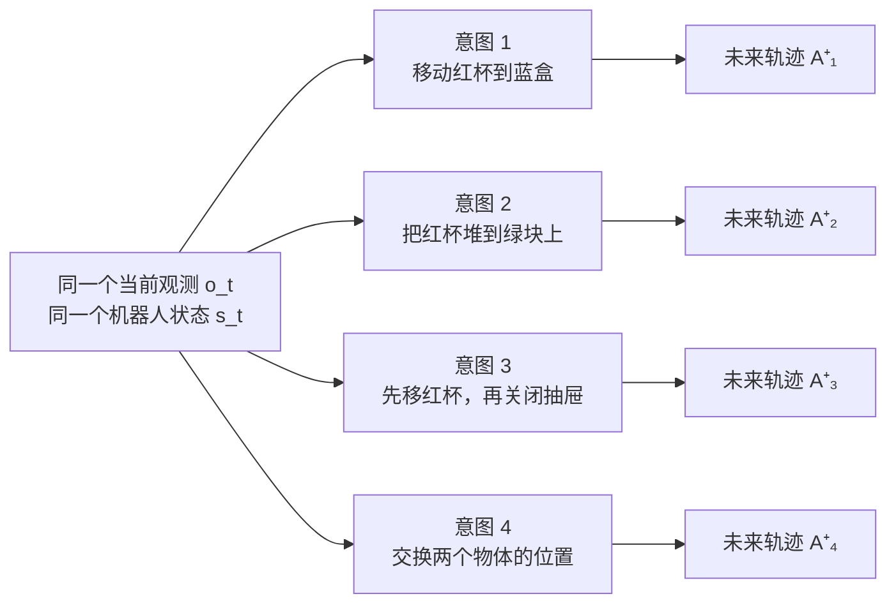
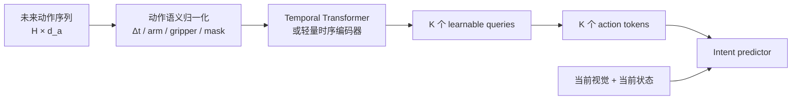
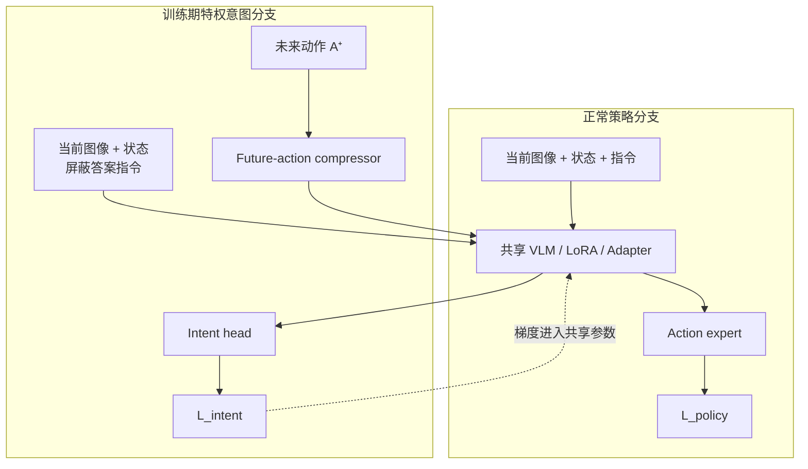

# 未来动作条件下的意图理解

> [!abstract] 一句话定义
> **训练时，以当前时刻的观测图像与机器人状态为锚点，把从该时刻开始的一段未来动作序列作为特权信息，让 VLA 推断轨迹所表达的可验证行为目标／操作程序；核心研究未来看多远 $H$、不同未来共享多久 $P$，以及覆盖相同未来后最少压成多少 token $K$。部署执行时仍使用正常策略接口，不向机器人额外提供真实未来动作。**

> [!danger] 不可再次颠倒的时间方向
> 正确样本是  
> `当前图像 o_t + 当前机器人状态 s_t + 未来动作 a_t:a_{t+H-1} → 意图 y_t`  
> 而不是  
> `当前／最终图像 + t 之前已经发生的动作 → 已完成行为／意图`。

![[Pictures/image from Idea.png]]

## 阅读导航

| 想先回答什么 | 跳转 |
|---|---|
| 这个 idea 到底是什么？ | [[#1. 正确的问题定义]] |
| “未来动作”在离线数据里到底指什么？ | [[#2. 最容易再次混淆的边界]] |
| 为什么不再以 left/right 为主？ | [[#4. 从二元左右升级为复杂多物体歧义]] |
| “多少 future token”怎样严谨研究？ | [[#5. 真正的核心：H、P、K 是三个不同变量]] |
| 为什么同一意图也必须有多条轨迹？ | [[#3.3 同一意图、多种执行实现]] |
| 长动作可以怎样编码？ | [[#7. 长未来动作的编码路线]] |
| 怎样接入 π0.5 又不改变部署接口？ | [[#8. 训练与部署的信息流]] |
| 与 PRTS、LACY 等怎样划界？ | [[#10.1 2026-07-31 最近工作核查与新颖性边界]] |
| GPT 这批建议哪些采纳、哪些不照抄？ | [[#14. 对 Gpt建议.md 的最终判断]] |
| 三轮审阅后最终冻结了什么？ | [[#16. 对 Gpt三轮建议.md 的最终判断与 v1 冻结]] |
| 以前哪些工作错了、哪些证据还能用？ | [[#11. 当前状态与旧工作的纠正]] |
| 想先快速理解数据怎样构造？ | [[未来动作意图数据集构造方案_2026.7.31_简明版]] |
| 数据具体怎样生成？ | [[未来动作意图数据集构造方案_2026.7.31]] |

---

## 0. 信息源优先级

本分析只按以下顺序定义当前 idea：

1. 用户在 2026-07-31 转述的师哥最新纠正；
2. [[Idea]] 及其原始截图 [[Pictures/image from Idea.png]]；
3. 后续由用户或师哥明确确认的新信息；
4. 固定版本官方代码、论文、数据与服务器实测，仅用于核实客观工程事实。

> [!warning] 历史材料边界
> 旧文档曾把输入动作解释成“已经发生的动作／历史动作”，已整体移至 [[Idea/归档/2026-07-31_偏离口径_已执行动作路线/README|归档说明]]。  
> `前置论文/` 和该归档都不能反过来覆盖本文件中的时间方向与研究问题。

---

## 1. 正确的问题定义

### 1.1 以当前时刻为锚点

在一条机器人轨迹中选定当前锚点 $t$：

- 当前视觉观测：

$$
o_t=\{I_t^{head}, I_t^{wrist}, \ldots\}
$$

- 当前机器人状态：

$$
s_t=[q_t,\;g_t,\;\text{optional proprioception}]
$$

- 从当前时刻开始的未来动作片段：

$$
A^+_{t,H}=(a_t,a_{t+1},\ldots,a_{t+H-1})
$$

- 该未来分支所服务的轨迹可验证行为目标／操作程序：

$$
y_t
$$

动作压缩器把长序列变为 $K$ 个模型可读取的动作 token：

$$
Z^a_{t,H,K}=C_\phi(A^+_{t,H},\,\Delta t,\,m)\in\mathbb{R}^{K\times d_z}
$$

意图任务是：

$$
p_\theta\left(y_t\mid o_t,s_t,Z^a_{t,H,K}\right)
$$

这里的 $y_t$ 不表示无法从数据验证的心理动机，而是 `behavioral goal`、`trajectory-grounded subgoal` 或 `executable task-operation program`。重点不是把低层动作简单翻译成一句话，而是判断：

> **在当前场景存在多个合理未来时，给出多长的未来动作证据，模型才足以识别机器人究竟要完成哪个多物体操作目标？**

真实生成方向与模型推断方向不能写反：

$$
y_t\longrightarrow A^+_{t,H}
$$

$$
(o_t,s_t,A^+_{t,H})\longrightarrow \hat y_t
$$

前式表示行为目标和任务程序产生未来动作；后式才是本项目训练的逆推任务。未来动作是**关于意图的证据**，不是意图的物理原因。

### 1.2 与正常策略任务的关系

正常 VLA 策略仍然学习：

$$
(o_t,s_t,\ell)\rightarrow A^+_{t,C}
$$

其中 $\ell$ 是正常任务指令，$C$ 是策略一次预测的动作 horizon。

新增的训练期意图任务学习：

$$
(o_t,s_t,A^+_{t,H})\rightarrow y_t
$$

两者可以共享视觉—语言骨干、LoRA 或 Adapter，通过联合目标训练：

$$
\mathcal{L}
=
\mathcal{L}_{policy}
+
\lambda_{intent}\mathcal{L}_{intent}
$$

若希望主张“意图理解反哺动作预测”，则 $\mathcal{L}_{intent}$ 必须更新正常策略实际使用的共享参数；完全独立的分类器只能证明数据中存在可读的意图信息。

### 1.3 更准确的英文表述

推荐主表述：

> **Future Action as Privileged Intent Supervision**

或：

> **Future-Action-Conditioned Intent Inference**

其中：

- **future-action-conditioned**：未来动作是条件；
- **intent inference**：被预测的是隐藏意图；
- **privileged supervision**：未来动作主要在训练／诊断阶段可见，部署控制不依赖真实未来轨迹。

不建议单独写成 “future prediction”，因为本辅助任务并不是在预测未来动作；未来动作已经作为输入。

---

## 2. 最容易再次混淆的边界

### 2.1 离线轨迹已被记录，不等于它对样本是“过去”

一条演示轨迹在磁盘上当然已经采集完毕，但时间含义必须相对样本锚点 $t$ 定义：

```text
完整离线轨迹

... a_{t-2}, a_{t-1} | o_t, s_t | a_t, a_{t+1}, ... a_{t+H-1} ...
         过去部分       当前锚点              未来动作输入
```

因此，构造样本时从轨迹文件中读取 `t:` 之后的数据，也必须称为：

- future actions relative to anchor $t$；
- 未来专家动作；
- 未来轨迹片段；

不得因为它来自一条已保存的 demonstration，就改称“已经执行的历史动作”。

### 2.2 当前主线中的未来动作来源

第一阶段最清楚的定义是：

> 从成功的专家／规划器轨迹中，截取相对锚点 $t$ 的未来动作片段。

需要另外记录动作究竟是：

- 控制器命令；
- 目标关节位置；
- delta action；
- 还是下一时刻实现出来的 realized state。

“使用策略自己预测的未来动作再判断意图”是可研究的鲁棒性或闭环扩展，但它引入策略误差，不能替代第一阶段的干净定义。

### 2.3 训练可见与部署可见

| 信息 | 正常策略训练／部署 | 训练期意图分支 |
|---|---:|---:|
| 当前图像 $o_t$ | 是 | 是 |
| 当前机器人状态 $s_t$ | 是 | 是 |
| 正常任务指令 $\ell$ | 是 | 默认屏蔽 |
| 真实未来动作 $A^+_{t,H}$ | 作为策略监督 target；部署未知 | 作为特权输入 |
| 未来图像／未来物体状态 | 否 | 默认禁止 |
| 意图标签 $y_t$ | 非部署输入 | 监督 target |

> [!important] 为什么意图分支默认屏蔽指令
> 若原始指令已经写明“把红杯放进蓝盒”，模型可以复述指令而不读取未来动作。  
> 数据可以保留原始指令作为 raw metadata，但进入意图分支前必须显式 mask，并设置 instruction-only 对照。

### 2.4 本项目不是以下任务

- 不是 `past actions → what just happened` 的已完成行为识别；
- 不是只看末帧判断最终左右关系；
- 不是把动作方向直接分类成 left/right；
- 不是让部署策略凭空读取真实未来；
- 不是把整条轨迹平均成一个向量后直接宣称“理解长动作”；
- 不是只训练一个与策略完全隔离的 probe 后宣称控制得到改善。

---

## 3. 为什么未来动作是有价值的特权信号

仅给当前图像与机器人状态时，同一场景通常允许多种合理意图：

$$
p(y\mid o_t,s_t)
$$

可能是多峰的。加入未来动作后：

$$
p(y\mid o_t,s_t,A^+_{t,H})
$$

应当随着动作证据增多而逐渐收缩。



如果当前图像已经唯一决定标签，未来动作没有必要；如果动作的第一个控制步就直接编码标签，任务也过于简单。好的数据应处在中间：

1. 当前观测本身有真实歧义；
2. 不同意图共享一段相似动作前缀；
3. 随着未来 horizon 增长，区别意图的证据逐步出现；
4. 只有结合“场景里有哪些物体”与“机器人未来怎样运动”，才能解释动作针对谁、要形成什么关系。

这也是该 idea 比二元 left/right 更有研究价值的地方。

### 3.1 Future replacement 测的是输入依赖，不是世界因果方向

保持 $o_t,s_t$ 不变，把 future A 替换为同组 future B，同时把正确 target 从 intent A 换为 intent B，是很强的受控输入干预：

$$
(x_i,A^+_{i,A,H})\rightarrow y_{i,A}
$$

$$
(x_i,A^+_{i,B,H})\rightarrow y_{i,B}
$$

它回答：

> 模型的输出是否对所提供的未来动作证据保持一致，并在证据变换后作出正确的 prediction switch？

推荐名称：

- **future-conditioned prediction-switch test**；
- **counterfactual input-dependence test**。

它不能单独证明“未来动作因果地产生意图”，因为真实生成方向是 intent／task program 先于轨迹。后文保留 “counterfactual group” 时，只表示“同一 current 下的替代可行未来”，不表示已经完成因果识别。

### 3.2 “意图”的可操作定义

一条把红杯放入蓝盒的轨迹，可能被自由语言解释为“整理桌面”“给绿块腾空间”或“清洁任务的第一步”。仅从当前状态与动作，无法判断哪一种更抽象的心理动机才是唯一真值。

因此本项目主监督限定为：

> **能由当前场景、未来动作及仿真 verifier 共同支持的行为目标、结构化子目标或可执行操作程序。**

主标签应满足：

- 对象、参照物、关系、顺序和约束可结构化；
- 成功条件可由仿真真值自动验证；
- 同义自然语言可从同一结构化程序派生；
- 不把无法从轨迹识别的更高层理由强行作为唯一答案。

论文标题和正文可以继续使用 intent，但首次出现时必须给出上述 operational definition，避免被理解成不可观测的 mental intent。

### 3.3 同一意图、多种执行实现

仅有 `one current → many intents` 仍可能退化成 branch ID／planner fingerprint 识别。更完整的数据单元应为：

$$
\mathcal G_i=
\left(
x_i,\;
\left\{
\left(
y_{i,j},
\left\{A^+_{i,j,r}\right\}_{r=1}^{R_{i,j}}
\right)
\right\}_{j=1}^{M_i}
\right)
$$

其中：

- $j$：同一 current 下的不同意图；
- $r$：同一意图的不同成功执行实现；
- $R_{i,j}$：该意图的 realization 数。

两个方向分别回答不同问题：

$$
\text{one current}\rightarrow\text{many intents}
$$

用于测量未来动作怎样消除当前观测歧义；

$$
\text{one intent}\rightarrow\text{many trajectories}
$$

用于测量模型是否对速度、路径形状、planner seed、暂停位置、可行接近方向与轻微 time warp 保持语义不变。

首轮 smoke 可以每个意图只生成 1–2 条 realization 来验证管线；进入主机制数据前，建议可行任务至少达到 $R\ge 3$，并保留 unseen-planner／unseen-path 测试。若成本不允许覆盖所有意图，应预注册覆盖比例，不能只给某一标签增加多样性。

> [!warning] $R$ 不替代 $H/P/K$
> $R$ 是防止轨迹指纹的 nuisance-control/data dimension，不是新的论文主横轴。  
> 为避免多实现把严格共享前缀 $P$ 压成 0，H/P 主 cohort 应复用同一 canonical prefix，再只在分叉后的后缀生成同意图多实现；额外的自由路径不变性 cohort 可单独评测。
>
> planner seed／path variant 必须作为 anchor 之后的显式 realization intervention；不能为了生成多实现重新采样当前场景。所有 realization 共享同一 current bytes 与物理 anchor，并记录 `base_snapshot_hash + realization_spec`。
>
> 正式 train/validation/test 以完整 root group（必要时进一步以 scene family）为最小划分单位。同一 current 下的全部 intent、realization、H/K/mask/replacement 与 cohort view 必须同 split。`r1/r2` 用于拟合、`r3` 用于测试的做法只能标为 **in-group trajectory-invariance diagnostic**，不能作为 unseen-trajectory／unseen-current 主泛化结论，也不能用于正式模型选择。
>
> planner OOD 也不能靠把同组 realization 拆到 train/test 制造。train groups 只含 seen planner；完全 held-out test groups 对同一 test current／intent 同时生成 seen-distribution 与 unseen-family realization，做 test-only 配对比较，从而把 planner shift 与 current/group holdout 尽量分开。

### 3.4 模型到底输出什么：双评测协议

“结构化意图”如果不定义输出接口，后续很容易出现“训练做组内四分类，论文却声称开放理解任意意图”的越界。因此第一阶段固定两个互不混表的任务。

#### A. 机制主任务：same-group candidate retrieval／ranking

输入当前图像、状态、future prefix，以及该 group 的 canonical structured-intent candidates；模型对候选排序。它最适合回答：

- correct future 是否提供增量信息；
- 每个 comparison cohort 内 $\mathrm{IntentScore}(H\mid P,c)$ 如何变化；
- replacement 后预测是否切换；
- 同意图不同 realization 是否得到一致排序。

但 `intent_00／01／02` 只是 group-local 索引，不能实现成“共享表示 → 固定 $M$ 分类头”。令 $\mathcal U_{i,c}$ 为 comparison cohort 的候选程序集合，$y_{i,c,m}$ 为第 $m$ 个 canonical structured program。必须使用同一套共享的 candidate-conditioned scorer：

$$
u_{i,c,b,H,m}
=
F_\theta
\left(
o_i,\;
s_i,\;
A^+_{i,b}[0:H],\;
E_y(y_{i,c,m});\;
\mathcal U_{i,c}
\right)
$$

$$
p_\theta
\left(
y_{i,c,m}
\mid
o_i,s_i,A^+_{i,b}[0:H],\mathcal U_{i,c}
\right)
=
\frac{\exp u_{i,c,b,H,m}}
{\sum_q\exp u_{i,c,b,H,q}}
$$

这里不强制某一种架构：cross-encoder、dual-encoder 或联合候选集编码都可以；但候选的**语义内容必须实际进入评分**，所有候选共享参数，输出对候选排列应当置换等变／鲁棒，不能只读取 local ID、固定位置或 group-specific head。

当 input-observable compatible set $\mathcal Y^{obs}_{i,c,b,H}$ 大于 1 时，默认使用 partial-label／set-marginal objective：

$$
\mathcal L_{\mathrm{set}}
=
-\log
\sum_{y\in\mathcal Y^{obs}_{i,c,b,H}}
p_\theta
\left(
y\mid o_i,s_i,A^+_{i,b}[0:H],\mathcal U_{i,c}
\right)
$$

并报告兼容候选概率质量与校准；只有集合收缩为单例后才统计 branch-specific accuracy／switch。只有确有预注册先验依据时才使用 soft distribution；“兼容集合内均匀”只能命名为人为训练目标，不能冒充真实后验。候选顺序必须随机化并做 permutation consistency test，输入中不得出现 branch ID、文件名或固定 candidate position。

特别地，当 $\mathcal Y^{obs}_{i,c,b,H}=\mathcal U_{i,c}$ 时，$\mathcal L_{\mathrm{set}}=0$，不会提供 branch-specific 梯度，也不会自动约束集合内部 entropy；这正好反映输入尚未排除任何候选。此类短 H 可以只作不确定性评测，或另加明确命名的 `balanced_candidate_objective`／训练集先验校准项，但不能把它包装成由当前输入识别出的真实意图分布。

#### B. 泛化副任务：global structured program decoding

不提供 group 候选，直接从全局 ontology 预测可变长有序程序：

```text
num_steps
steps[1:L].{op, object, relation, reference}
constraints
```

step index 本身表达顺序，避免用一个平铺 `order` slot 假装能表示 `seq(place(...), close(...))`。对象槽位不能只输出可能对应多个实例的类别字符串；主标签应使用当前视图中可解析的 canonical referring expression，并由隐藏的 verifier-only instance ID 做评测映射。若两个实例在当前可见证据下仍不可区分，应使用 set-valued reference 或把该样本排除出 instance-level exact match，不能强迫模型猜 simulator ID。segmentation mask／bbox 只作 grounding 评测与审计，默认不进入主模型。

该任务用于测对象 grounding、未见组合与多阶段操作程序泛化。其 program exact match、step-level slot accuracy、reference resolution、sequence edit distance 与 compositional OOD 指标必须独立报告。自由文本／自由 JSON 生成可作为后续扩展，但不作为首轮主任务或唯一真值。

### 3.5 Candidate universe 必须在 rollout 前冻结

同一 current 的 candidate universe 应在任务／物理可行性审计后、调用主 planner 生成分支之前冻结并记录 hash。必须区分：

- **task／physical feasibility**：目标在当前物理状态和约束下是否成立／可实现，记录判定器、证据、版本与不确定性；
- **planner solvability**：指定 planner／配置在给定次数内是否找到并执行成功的轨迹。

主 planner 成功不能反过来定义“物理可行”。若一个已冻结候选经审计可行、但当前 planner 连续失败，不得悄悄从候选集合删除；只能：

1. 按预注册上限重试或换用记录清楚的 planner；
2. 将 group 标记为 `incomplete`／`formal_cohort_eligible: false`；
3. 或整组不进入正式 balanced cohort，并报告 group-level attrition。

所有失败尝试、planner family／config、尝试次数和成功 realization 数都要保留。否则最终 candidate universe 会被 planner 成功率筛选，模型可能只学到“什么目标容易规划”，而不是 future action 中的意图证据。

---

## 4. 从二元左右升级为复杂多物体歧义

### 4.1 left/right 的正确位置

`left_of`／`right_of` 可以保留为：

- 数据管线 smoke test；
- snapshot 恢复与反事实分支验证；
- 最简单的 action-conditioning sanity check。

但它不能承担主结论，因为“向左运动”可能直接暴露 `left`，模型无需绑定物体、关系或长时程结构。

### 4.2 主场景应具有的结构

> [!important] 数据为 H/P/K 服务，不以复杂 benchmark 为先
> 多物体不是越多越好。第一阶段只需要少量、严格受控的任务族，使 visual-only 和方向／终点捷径失效，并能人为控制共享前缀 $P$。只有核心机制成立后，才扩展任务数量、组合复杂度与 OOD benchmark。

建议把每个场景表示成一个多物体关系图：

$$
G_t=(V_t,E_t)
$$

其中：

- $V_t$：可见物体、容器、抽屉、托盘、机械臂等实体；
- $E_t$：`left_of`、`inside`、`on_top_of`、`near`、`open` 等当前关系；
- 意图 $y_t$：要对图执行的结构化变换或有序操作程序。

首批主场景只需达到足以排除捷径的最低复杂度，例如：

- 多个可操作物体；
- 多个可作为参照／容器的物体；
- 外观相似或同类别 distractor；
- 至少一种会造成路径或选择歧义的障碍／空间约束；
- 同一初始状态下不少于三条可成功执行的未来分支。

数量不是越多越好。复杂度应按“是否迫使模型做对象—动作 grounding、是否形成延迟消歧”验收，而不是只数桌面上摆了几个道具。

### 4.3 推荐的难度阶梯

| 层级 | 同一当前状态下的未来分支 | 意图证据何时出现 | 用途 |
|---|---|---|---|
| S0：方向 smoke | 同一物体放左／右 | 搬运方向很早出现 | 只验管线 |
| S1：对象选择 | 抓不同物体去同一容器 | 接近／抓取阶段出现 | 验对象 grounding |
| S2：目的地选择 | 抓同一物体，送往不同容器／参照物 | 抓取前缀相同，搬运后出现 | 主 horizon 入门 |
| S3：共享第一子任务 | 先完成完全相同的一步，再在第二步选择不同物体或关系 | 第一子任务结束后才出现 | 长 horizon 主体 |
| S4：顺序与组合 | 使用相同物体和近似终态，但操作顺序／约束不同 | 需跨多个事件整合 | 机制成立后的扩展 |

### 4.4 一个真正有区分力的反事实组

同一场景中可见：

- 红杯、蓝杯；
- 绿块、黄块；
- 蓝盒、灰盒；
- 一个抽屉、一个托盘；
- 若干相似 distractor。

从完全相同的当前快照分支：

```text
分支 A：
先把红杯放进蓝盒，
再把绿块放到托盘右侧。

分支 B：
先把红杯放进蓝盒，
再把黄块堆到绿块上。

分支 C：
先把红杯放进蓝盒，
再交换蓝杯与灰盒旁物体的位置。

分支 D：
先把红杯放进蓝盒，
再关上抽屉。
```

这些分支共享较长的第一个子任务。短 horizon 只能看到共同前缀，理论上不应高置信度猜出完整意图；只有覆盖第二阶段的未来动作后，意图才真正可识别。

> [!tip] “难”不是让轨迹更长
> 如果四条轨迹在第一步就朝四个方向走，再长也只是把早期答案重复很多次。  
> 真正有用的难度来自：**共享前缀、多个候选对象、晚期分叉、组合关系与顺序信息。**

---

## 5. 真正的核心：H、P、K 是三个不同变量

用户和师哥提出的“输入多少未来 token”至少包含三个必须分开的变量。

### 5.1 变量一：未来覆盖长度 $H$

$H$ 表示从当前锚点开始纳入多少个原始动作时刻：

$$
A^+_{t,H}=(a_t,\ldots,a_{t+H-1})
$$

它回答：

> 模型需要看多远的未来，动作才开始充分暴露意图？

但 $H$ 必须同时报告：

- 原始 action step 数；
- 真实秒数；
- 数据采样频率；
- 覆盖了哪些语义事件。

只写 `H=50` 没有完整含义，因为不同数据频率下对应的物理时长不同。

### 5.2 变量二：共享未来前缀长度 $P$

$P$ 表示同一个 current 下、**指定 H/P comparison cohort** 中，多条未来动作从锚点开始保持完全相同的前缀长度：

$$
a^{(1)}_{t:t+P-1}
=
a^{(2)}_{t:t+P-1}
=\cdots=
a^{(M)}_{t:t+P-1}
$$

它回答：

> 数据把意图证据人为推迟了多久，模型在看到多少未来以后才有可能区分这些分支？

$P$ 应同时记录：

- raw action steps；
- 真实秒数；
- 共享事件数／子任务数；
- comparison-cohort-level 公共 $P$；
- 必要时的 branch-pair divergence step。

当 $H\le P$ 时，分支级完整意图尚不可识别；此时合理输出是兼容意图集合或分布，而不是高置信度 one-hot。

> [!important] $P$ 不属于无条件的 root group
> 同一个 root group 可以同时拥有一个或多个 `prefix_controlled` H/P cohort，以及不把 $P$ 作为受控主变量、也不进入严格 H/P 主曲线的 `trajectory_invariance` cohort。所有受控 P、prefix hash 和成员列表都必须挂在 comparison cohort 上，不能只在 group 根节点保存一个对所有 realization 都未必成立的 P。

> [!warning] 不同 $P$ 的 cohort 不天然可直接比较
> 每个 cohort 首先单独报告 $\mathrm{IntentScore}(H\mid P,c)$，再按 $P$ 分层做描述性汇总；不能因为长 $P$ cohort 更难，就直接宣称“增长 $P$ 因果地推迟 reveal”。只有共享同一 `matched_p_family_id`，且 candidate 数量／难度、程序结构、分叉后任务、planner、动作空间和总时长已匹配、原则上只改变共同前缀长度时，才做 $P$ 的直接对照。此时仍同时报告 $H-P$ 与 fixed balanced-candidate protocol 下相对同 cohort $H=0$ 的 $\mathrm{NLL}_{bal}$ reduction。

共享前缀还必须标注其语义类型：

| `prefix_type` | 含义 | 报告要求 |
|---|---|---|
| `kinematic_shared_path` | 共享低层运动／路径，但未完整覆盖共同子任务 | 重点报告 steps／seconds |
| `shared_semantic_subtask` | 共享一个或多个完整、可验证的子任务；其内部自然包含完成子任务所需的低层动作 | 同时报完整 event／subtask 数 |
| `mixed` | 完整共同子任务之外，还额外包含不构成新子任务的路径延长／中性停顿 | 分解报告两部分；默认不进入直接 matched-$P$ 效应比较 |

不能用人工等待、padding 或无任务意义的停顿来“做大 $P$”并混入主结论；这些时段必须单独标记并从 matched-$P$ 主比较中排除。推荐 cohort 字段为 `prefix_type`、`matched_p_family_id`、`candidate_difficulty_signature`、`post_divergence_program_family` 与 `contains_artificial_idle_or_padding`。

### 5.3 变量三：输入模型的 token 数 $K$

$K$ 是压缩后送进意图分支的动作 token 数：

$$
C_\phi:\mathbb{R}^{H\times d_a}\rightarrow\mathbb{R}^{K\times d_z}
$$

它回答：

> 在已经覆盖同样长的未来时间后，最少用多少个模型 token 才能保留足够意图信息？

### 5.4 K 之外还要报告表示占用；有可复核码长后才报告编码率

相同 $K$ 不一定表示相同容量。例如，16 个连续 1024 维 float token 与 16 个词表大小为 1024 的离散 token，不是公平的等预算比较。

对未量化连续 token，应报告 representation footprint／interface storage cost：

$$
F_{\mathrm{repr}}^{cont}=K\,d_z\,b_{\mathrm{store}}
$$

离散 token ID 在相同接口边界的 footprint 为：

$$
F_{\mathrm{repr}}^{disc}
=
N_{\mathrm{tok}}\,b_{\mathrm{id,store}}
$$

其中 $d_z$ 是 token 维度，$b_{\mathrm{store}}$ 是每维实际存储位数，并按覆盖时长报告：

$$
R_{\mathrm{repr}}=\frac{F_{\mathrm{repr}}}{\tau_H}
$$

这些量固定测量 `compressor serialized output → VLA input adapter` 的接口表示占用，不能称为 channel capacity、有效信息量或互信息。离散 ID 查表后的 $d_{\mathrm{model}}$ embedding activation、KV cache 与运行显存另作 compute／activation cost，不能混入 footprint。

对离散／量化 token，若明确 codebook、量化精度和实际编码规则，可报告固定长码或估计码长：

$$
B_{\mathrm{code,nom}}^{disc}
=
K\left\lceil\log_2|\mathcal V|\right\rceil,
\qquad
R_{\mathrm{code,nom}}
=
\frac{B_{\mathrm{code,nom}}}{\tau_H}
$$

若实际执行 bit packing／熵编码，或使用 held-out token 概率估计码长，则另报告：

$$
B_{\mathrm{encoded}},
\qquad
R_{\mathrm{encoded}}
=
\frac{B_{\mathrm{encoded}}}{\tau_H}
$$

必须谨慎解释：

- 未量化 float token 的有效语义容量不能仅靠位数精确刻画；
- 可变长 tokenizer 应报告 token 长度分布，而不是只报平均值；
- compressor 参数量、FLOPs、显存、延迟和训练数据也要同时匹配／报告。
- 离散固定长码的 bit 数同样不等于模型真正使用的互信息。

因此主结果分两层：

```text
Intent score vs K
Intent score vs representation footprint

仅在具有可复核 bitstream／held-out 估计码长的编码实验中：
Intent score vs encoded rate
semantic distortion vs encoded rate
action reconstruction vs encoded rate（仅作辅助）
```

其中 semantic distortion 可以预注册为 $1-\mathrm{IntentScore}$ 或结构化风险；重构误差低不代表意图保真高。

> [!warning] matched-rate 的使用边界
> 未量化连续 K-query 与 FAST 等离散 tokenizer 之间默认只能做 **matched representation-footprint comparison**，同时匹配／报告 K、$d_z$、dtype、参数量和计算量。只有双方都有明确量化／编码账本，能给出可复核 bitstream 或估计码长时，才使用 **matched-rate comparison**。即使 matched-rate，也不能写成“等互信息”。

### 5.5 绝对不能混为一谈的量

| 符号 | 含义 | 是否等于“future token 数” |
|---|---|---|
| $T$ | 整条原始轨迹长度 | 否 |
| $H$ | 当前样本覆盖的未来原始动作步数 | 是“看多远”，但还不是压缩 token 数 |
| $\tau_H$ | $H$ 对应的真实物理时长 | 否，但必须报告 |
| $P$ | 多条未来完全相同的共享前缀长度 | 否；它控制“证据多晚出现” |
| $C$ | 正常策略一次预测的 action horizon | 否，除非实验特意令其相等 |
| $N_{raw}$ | 某种 tokenizer 对原始动作产生的 token 数 | 不一定 |
| $K$ | 本项目 compressor 输出给 VLA 的动作摘要 token 数 | 是“压成几个” |
| $F_{\mathrm{repr}}$／$R_{\mathrm{repr}}$ | 表示占用／每秒表示占用 | 不是信息量；用于记录未量化接口成本 |
| $B_{\mathrm{code,nom}}$／$R_{\mathrm{code,nom}}$ | 离散／量化表示的固定长 nominal code budget | 不是实际码率或互信息 |
| $B_{\mathrm{encoded}}$／$R_{\mathrm{encoded}}$ | 可复核实际 bitstream／held-out 估计码长 | 可用于 matched-rate；仍不等于互信息 |

> [!danger] 错误实验
> 只比较 `K=8/16/32`，但每个 K 同时覆盖不同 H 或使用不同 P，会无法判断收益来自“看得更远”“更早分叉”还是“编码得更细”。

### 5.6 正确的分阶段实验

第一阶段固定为 raw／近似无压缩动作，交叉控制 $H$ 与 $P$，先回答未来动作是否提供信息、意图何时 reveal：

$$
\text{IntentScore}_{raw}=f(H\mid P,c)
$$

只有机制通过后，第二阶段才在每个固定 comparison cohort $c$ 及其 $H,P$ 下交叉比较压缩预算 $K$：

| $H \backslash K$ | 4 | 8 | 16 | 32 | raw／近似无压缩 |
|---:|---:|---:|---:|---:|---:|
| 短未来 | ✓ | ✓ | ✓ | 可选 | ✓ |
| 中未来 | ✓ | ✓ | ✓ | ✓ | ✓ |
| 长未来 | ✓ | ✓ | ✓ | ✓ | 资源允许时 |
| 完整语义段 | ✓ | ✓ | ✓ | ✓ | 资源允许时 |

得到的不是一条孤立曲线，而是：

$$
\text{IntentScore}=f(H,K\mid P,c,\text{compressor})
$$

由此可以回答：

- 给定 comparison cohort 与共享前缀时的最小充分未来 horizon $H^\*(P,c)$；
- 在 matched-$P$ family 内，共享前缀 $P$ 的受控改变如何推迟 intent reveal；未匹配 cohort 只作分层描述；
- 给定 $H,P,c$ 时的最小充分 token 数 $K^\*(H,P,c)$；
- 给定 $H,P,c$ 时达到同等语义性能的最小 representation footprint；
- 可复核编码时达到同等语义性能的最小 encoded rate；
- 哪种压缩器在相同 $H,P,c,K$ 下保留更多意图；
- horizon 增长后，固定 K 是否成为信息瓶颈；
- 过长未来是否引入无关动作并导致性能下降。

---

## 6. “意图何时出现”：前缀遮挡与证据涌现

### 6.1 Prefix reveal

固定同一条完整未来轨迹，只逐步开放前缀：

```text
H = 0       只给当前图像和状态
0 < H ≤ P   仍处于完全共享前缀，完整分支意图不可辨认
H > P       开始看到真实分叉证据
H = h3      看到目的地选择
H = h4      看到第二个子任务
H = full    覆盖完整语义段
```

画出：

$$
\mathrm{Acc}(H\mid P),\quad
\mathrm{NLL}(H\mid P),\quad
\mathrm{Entropy}(H\mid P)
$$

理想现象不是从第一步就满分，而是：

```text
不可辨认 ── 共同动作前缀 ── 关键分叉事件 ── 置信度上升 ── 饱和
```

> [!important] $H\le P$ 是不可辨认的充分条件，不是 compatible set 的唯一触发条件
> 即使 $H>P$，planner 数值可能已经分叉，但对象选择、目的地或结构化程序在语义上仍未区分。  
> 对 `prefix_controlled` 主 cohort，compatible set 不应由“目前碰巧采到的轨迹”决定。令 $\mathcal T_{i,c}$ 是 comparison cohort $c$ 的版本化任务树。必须同时保存两个边界：
>
> - $n^{oracle}_{i,c,b}(H)$：可使用 future object pose、contact、success predicate、planner／verifier phase 的 oracle 节点，只作审计和解释；
> - $n^{obs}_{i,c,b}(H)$：只能由当前图像、白名单当前状态、future-action prefix、timestamp／mask 的预注册确定性规则推进的 input-observable 节点，用于训练和主评测。
>
> 主 compatible set 定义为：
>
> $$
> n^{obs}_{i,c,b}(H)
> =
> g^{obs}_{\mathcal T_{i,c},v}
> \left(
> o_i,\;
> s_i,\;
> A^+_{i,b}[0:H],\;
> \mathrm{timestamp},\;
> \mathrm{mask}
> \right)
> $$
>
> $$
> \mathcal Y^{obs}_{i,c,b,H}
> =
> \operatorname{Leaves}
> \left(
> \operatorname{Subtree}_{\mathcal T_{i,c}}
> \left(n^{obs}_{i,c,b}(H)\right)
> \right)
> $$
>
> 记号中 $v$ 是 observable-evidence rule version。`Subtree` 包含节点自身，因此当 $n^{obs}_{i,c,b}(H)$ 已是 leaf 时，集合就是该 leaf，而不是空集。节点只能因模型输入中可获得的预注册结构证据而前进，不能因为第一次数值 jerk，或 hidden future object pose／contact／planner target／verifier phase 而收缩集合；也不能用测试模型准确率事后反推节点。若证据是否可观察存在争议，$n^{obs}$ 必须停留在更早的父节点，宁可让集合偏宽。
>
> oracle 节点同样可生成 $\mathcal Y^{oracle}_{i,c,b,H}$，但只能解释“环境真值何时发生了结构变化”，不得替代 $\mathcal Y^{obs}$ 训练标签。每个 derived view 至少保存 `tree_node_observable_at_H`、`tree_node_oracle_at_H`、两套 compatible IDs、`compatible_set_for_training: observable`、evidence-source 白名单和规则版本。同一 cohort 在 $H>P$ 后，不同 branch 可以拥有不同节点与 compatible set。observable 集合相对于预先枚举并冻结的 candidate universe／task tree 是结构化真值，不冒充“世界中所有物理可行意图”的全集；增加同义 realization 不应改变它。
>
> `trajectory_invariance` cohort 通常直接测同意图一致性；只有确需近似自由路径前缀兼容性时，才另定义：
>
> $$
> \widehat{\mathcal Y}^{emp}_{i,c,b,H}
> =
> \left\{
> y:
> \exists A'\in\widehat{\mathcal A}(x,y),
> \ d_H
> \left(
> A'[0:H],A^+_{i,b}[0:H]
> \right)
> \le\epsilon_H
> \right\}
> $$
>
> 并明确命名为 **empirical trajectory-compatibility set**，保存 realization-library hash、$d_H$、$\epsilon_H$ 和版本。它是有限轨迹近似，不替代任务树主标签，也不要求与 observable／oracle tree set 相等。差异应先报告采样覆盖与距离／阈值敏感性；只有当 empirical set 持续在 observable 结构证据前分离同一 compatible intents，并伴随 planner-ID probe 成功时，才把它作为轨迹指纹警报。  
> $P$ 表示严格公共 raw prefix，`action_divergence_step` 表示数值分叉，`structural_reveal_event_observable` 与 `structural_reveal_event_oracle` 表示两种证据边界，$H_{\mathrm{reveal}}$ 表示按预注册指标得到的经验可识别边界；这些量不能互换。
>
> `H_reveal` 的定义必须在测试前预注册，但其数值依赖模型、checkpoint、指标和阈值，属于 evaluation artifact，不应写成 raw branch 的固定真值。

### 6.2 除了前缀长度，还要做什么 mask

- **后缀 mask**：只保留前 $H$ 步，测自然证据涌现；
- **事件删除**：删除抓取、释放、第二子任务等完整事件；
- **局部时间遮挡**：删除一小段，定位关键时间区间；
- **时间打乱**：保留动作值分布但破坏顺序；
- **future replacement**：在同一当前快照下换成另一个真实未来分支，并同步切换监督 target；
- **endpoint-only**：只给起点／终点动作状态，检查是否根本不需要序列。

> [!important] Future replacement 的正确判定
> 保持 $o_t,s_t$ 完全不变，把 future A 替换成同 group 的真实 future B，监督 target 也必须从 intent A 切换为 intent B。  
> 若模型仍坚持 A，说明它没有真正服从 future action。它比随机 shuffle 更强，因为 replacement future 仍然真实、可行且与当前 snapshot 匹配。  
> 但只应在预注册的可辨认 horizon 上统计 branch-specific switch；当 compatible-intent set 仍含多个候选时，不能强求单标签切换。该实验是 counterfactual input-dependence test，不是“未来动作产生意图”的因果证明。

### 6.3 防止“第一次数值差异”变成 branch ID

严格共享 prefix 结束后，第一步很小的浮点差异可能来自 planner seed、jerk、padding 或时长，而不是语义事件。如果模型在 $H=P+1$ 立刻接近满分，首先应怀疑轨迹指纹。

首轮必须加入：

- 同一意图多轨迹实现 $R$；
- matched-duration sampling 与统一 padding；
- time-warp、速度归一化和轻微 path perturbation；
- 低通滤波后的动作对照；
- 删除分叉后的最初若干数值步；
- planner-ID／trajectory-length adversarial probe；
- unseen-planner 与 same-intent cross-trajectory 测试；
- 按结构化事件而非第一次数值分叉报告 reveal。

合理曲线应允许“数值已经分叉但完整语义仍未 reveal”的区间。若准确率只跟 `action_divergence_step` 而不跟对象／目的地事件走，当前任务仍更像 trajectory fingerprint classification。

### 6.4 层级意图可以怎样使用

复杂任务确实可以标注：

- 当前动作原语；
- 当前／下一子目标；
- 完整组合任务目标。

但第一版不必建立庞大的意图本体，也不能预先规定“短 H 就应该预测 primitive、长 H 就应该预测 task goal”，再把这种人工映射当成发现。更稳妥的做法是：

1. 以可验证的结构化 subgoal／task operation 作为主标签；
2. primitive 只作为动作阶段诊断，避免主任务退化成低层 action recognition；
3. 从同一结构化程序派生 primitive、subgoal、task 三种读取层级；
4. 在相同 $H,P$ 下分别画各层级的 reveal curve，让数据说明哪个层级何时可识别；
5. 不把语言模型自由生成的解释当作唯一真值。

这样既能分析“局部动作语义如何逐步上升到完整任务目标”，又不让标签体系盖过 `H/P/K` 主线。

---

## 7. 长未来动作的编码路线

### 7.1 为什么不能只做简单平均

机器人动作具有稀疏而关键的事件：

```text
approach → align → grasp → lift → transport → place → release
```

均匀平均可能把短暂的夹爪切换、接触和方向改变冲淡；只取终点又会丢掉顺序与操作对象转换。

### 7.2 必须保留的简单基线

简单基线仍然重要，因为它告诉我们复杂模型是否真的必要：

1. raw sequence／padding；
2. 固定步长下采样；
3. 均匀 $K$ 窗口的 mean、std、首尾值、delta、速度峰值；
4. endpoint-only；
5. 累计 delta。

这些是可解释下限，不应被写成最终主方法，也不能因为“工程简单”而跳过。

### 7.3 DCT／FAST-style 频域基线

长动作压缩阶段应加入强于简单 stride 的频域基线：

1. DCT 系数按频率／幅值保留；
2. DCT + 量化；
3. FAST-style：DCT、量化、低频优先展平与 BPE。

[FAST](https://arxiv.org/abs/2501.09747) 的目标原本是高频机器人动作的离散 tokenization，而不是本项目的 intent bottleneck；它仍是非常相关的正式 baseline，因为它直接给出压缩—重构权衡。

需要注意：

- FAST 产生的是可变长离散 token 序列，不自动等于固定 $K$；
- 与未量化 $K$-query 比较时应固定 comparison cohort $c$ 及其 $H,P$，并按 token 长度分布、representation footprint、参数量与计算量匹配；
- 只有双方具有可复核实际／估计码长时，才补充 matched encoded-rate；
- DCT／FAST tokenizer 只能在 train split 拟合量化与 BPE；
- action reconstruction 是辅助指标，主指标仍是意图语义保真。

### 7.4 Temporal encoder + K queries

候选学习式压缩：



它允许固定 $K$ 读取可变长 $H$，适合直接研究 token bottleneck。

### 7.5 Event-aware compression

利用机器人事件边界切分：

- 夹爪开合变化；
- 末端速度谷值／停顿；
- 运动方向显著改变；
- 接近／离开物体；
- 接触建立与解除；
- 执行臂切换；
- 子任务验证谓词变化。

每个事件可以编码：

- 起止时间；
- 作用机械臂；
- 起止关节／末端状态；
- 路径统计；
- 夹爪状态；
- 与当前视觉对象的 grounding query；
- 事件在完整未来中的相对位置。

### 7.6 推荐主方法方向：多尺度事件—学习混合

纯手工事件会受阈值影响，纯 K-query 可能浪费容量学习明显的机器人边界。更值得验证的是：

```text
低层未来动作
   ├─ 局部细粒度编码：保留抓取、释放等短事件
   ├─ 事件边界候选：提供机器人先验
   └─ K-query 全局读取：跨事件整合长时程意图
```

但是否采用它应由同一 $H,K$ 下的实验决定，而不是先验认定更复杂一定更好。

### 7.7 动作 token 的最低元数据

无论使用哪种编码，都至少要显式保存／输入：

- `timestamp` 或 `sim_step`；
- action mask 与真实长度；
- 动作空间名称、维度、单位与归一化统计；
- 左／右臂和夹爪维度顺序；
- command action 与 realized state 的区分；
- 数据采样频率与任何重采样规则。

### 7.8 压缩比较的公平性清单

固定 comparison cohort $c$ 及其 $H,P$ 后，每个 compressor 至少报告：

| 维度 | 必须记录 |
|---|---|
| 接口长度 | $K$ 或可变 token 长度分布 |
| token 形式 | 连续／离散、$d_z$、dtype、量化 |
| 表示占用 | $F_{\mathrm{repr}}$、$R_{\mathrm{repr}}$，未量化连续接口只使用这一口径 |
| 离散／量化编码 | 词表／codebook、量化规则、nominal code budget $B_{\mathrm{code,nom}}$；可用时报告 $B_{\mathrm{encoded}},R_{\mathrm{encoded}}$ |
| 模型成本 | encoder 参数量、FLOPs、显存、延迟 |
| 训练成本 | 训练步数、数据量、随机种子 |
| 语义保真 | compatible-set、结构化 intent、replacement switch |
| 信号保真 | action reconstruction、事件保留，仅作辅助 |

不能把“相同 K”“相同 representation footprint”或“相同 encoded rate”直接写成“相同互信息”。未量化连续表示与离散 tokenizer 之间默认不使用 matched-rate 表述。

---

## 8. 训练与部署的信息流

### 8.1 强制顺序：raw future → H/P → K/compression

第一项机制结论必须使用 raw／近似无压缩未来动作，不让 learned compressor 成为混杂因素。先训练轻量诊断模型，比较：

```text
当前视觉 + 状态
当前视觉 + 状态 + raw 正确未来动作
当前视觉 + 状态 + same-group replacement future（target 同步切换）
当前视觉 + 状态 + 打乱未来动作
当前 state + future action（无视觉）
纯 future-action-only（可选）
endpoint only
```

实验按以下 Gate 前进：

1. **Future-value Gate**：correct raw future 是否相对 visual/state-only 提供稳定增量信息，replacement 是否使预测切换；
2. **H/P Gate**：各 cohort 中 intent 随可见 horizon $H$ 是否在合理分叉点后 reveal；只有 matched-$P$ family 才直接比较 $P$；
3. **Compression Gate**：前两项通过后，才固定 comparison cohort $c$ 及其 $H,P$ 比较 $K$ 与 uniform、K-query、event-aware；
4. **Policy Gate**：压缩机制通过后，才接入 π0.5 共享参数与 rollout。

若正确未来动作在严格同观测多分支数据上没有稳定增益，问题应优先归因到：

- 数据分支不够可区分；
- 标签错误；
- horizon 不足；
- 动作表示／时间对齐错误；

而不是直接扩大 compressor 或 π0.5 训练。

### 8.2 第二阶段：共享参数的联合训练



必须通过梯度检查确认 $\mathcal{L}_{intent}$ 真正更新了策略会保留的共享参数。

但“梯度进入共享层”只是必要条件，不是部署收益的充分条件。模型仍可能把 future-action 语义限制在只有 future token 才激活的路径中；部署移除 future encoder 后，正常 policy 未必能读取到它。

因此 independent probe 只作为 A/B 阶段的信息可读性诊断；进入 C 阶段后，至少按以下矩阵比较：

| 编号 | 训练条件 | 是否使用 future | 归因作用 |
|---|---|---:|---|
| C0 | policy-only | 否 | 控制基线 |
| C1 | policy + structured-intent loss，输入为部署可见的 $(o,s,\ell)$ | 否 | 普通结构化语义辅助 |
| C2 | policy + text-goal latent alignment | 否 | 普通目标语言对齐 |
| C3 | shared future-action intent objective，无显式 alignment | 是，仅训练期 | 检查共享目标是否迁移 |
| C4 | future-aware teacher → deployment-path alignment | 是，仅训练期 | 候选 privileged transfer |
| C5a | shuffled／wrong-future shared objective | 伪 future | 与 C3 架构匹配，排除 shared auxiliary 本身 |
| C5b | shuffled／wrong-future teacher alignment | 伪 future | 与 C4 架构匹配，排除 alignment 路径本身 |
| C6 | equal-capacity nonsemantic auxiliary | 否 | 排除等容量正则化效应 |

C1／C2 只属于控制迁移阶段，不能把正常指令重新放进 A/B 的 future-value probe。各条件要尽量匹配 target 粒度、head／adapter 参数量、训练步数与数据量。C3 必须相对 C1、C2、C5a、C6，C4 必须相对 C1、C2、C5b、C6 有预注册且稳定的增益，才支持相应架构下的“future-action-specific transfer”；若仅优于 C0，最多说明额外语义／辅助训练有效。

候选形式为：

$$
z_T=E_T(o_t,s_t,A^+_{t,H})
$$

$$
z_S=E_\pi(o_t,s_t,\ell)
$$

$$
\mathcal L
=
\mathcal L_{policy}
+
\lambda_1\mathcal L_{intent}(z_T,y)
+
\lambda_2\mathcal L_{align}
\left(\operatorname{sg}(z_T),z_S\right)
$$

这里 student 必须读取正常任务指令 $\ell$，且 action expert 必须实际消费 $z_S$；否则同一 $o_t,s_t$ 对应多意图时，image-only student 没有信息选择正确分支。`stop-gradient`／EMA teacher、MSE、对比对齐都只是候选实现，要与 shared-no-alignment、无 future 的 structured-intent／text-goal 语义基线、shuffled-future alignment 和等容量非语义辅助严格比较。

### 8.3 部署阶段

部署仍然是：

```text
当前视觉 + 当前机器人状态 + 正常任务指令
                ↓
             π0.5 policy
                ↓
           未来动作 chunk
```

训练期的：

- future-action encoder；
- compressor；
- intent head；

可以移除。部署时不输入 oracle future action，也不要求先生成自然语言意图再执行。

### 8.4 关于 teacher–student 的审慎结论

“future-action teacher → deployment student”可以作为后续 privileged learning 方案，但不能直接写成当前主定义或未经实验验证的唯一主方法。

原因是本数据刻意让同一 $o_t,s_t$ 对应多个意图，因此：

$$
p(y\mid o_t,s_t)
$$

本来就不应是单一答案。若强迫 image-only student 精确复现某个 future-conditioned teacher，可能产生互相冲突的监督。

可行的扩展包括：

- student 同时读取正常任务指令；
- 蒸馏候选意图分布，而非单一 one-hot；
- 只蒸馏共享动作语义表征；
- 把 teacher–student 作为与“共享联合损失”分开的消融。

在机制 A／B 通过并完成 π0.5 信息流审计前，它是候选 transfer mechanism，不是已决定路线。其价值必须由部署输入不变的 rollout 验证。

> [!note] π0.5 论文经验与开源实现边界
> [π0.5 论文](https://arxiv.org/abs/2504.16054) 的 implicit-HL ablation 表明：训练中包含 subtask prediction 数据、部署时不显式做高层推理，仍可能获得部分收益。这支持“共享联合损失值得先做”，但不证明本项目 future-action auxiliary 必然迁移。  
> [openpi 官方 README](https://github.com/Physical-Intelligence/openpi) 截至 2026-07-31 仍写明公开 π0.5 训练／推理只支持 flow-matching head；subtask prediction 的公开接入状态还需按实际 commit 审计。因此 shared loss、latent alignment 与 high-level decoding 都要视为本项目需要自行实现和验证的模块。

---

## 9. 核心实验与可证伪结论

整项研究应拆成三个独立假设，不能互相代替：

| 假设 | 问题 | 通过证据 | 不能推出什么 |
|---|---|---|---|
| A：信息存在性 | 同 current 下，future 是否额外揭示行为目标？ | correct future、compatible-set、prediction switch、grounding 对照 | 不能推出压缩有效或控制变好 |
| B：涌现与压缩 | 证据怎样随 $H-P$ 出现，固定证据后最小 $K$／representation footprint 是多少？可复核编码后 encoded rate 是多少？ | H/P reveal、事件曲线、footprint-aware compressor；可用时 matched encoded-rate | 不能推出部署 policy 吸收了该语义 |
| C：控制迁移 | 不读取 oracle future 的 policy 是否真正受益？ | 等预算共享／alignment 对照与多种子 rollout | 不能用 probe accuracy 代替 |

只有 A 通过后才研究 B；只有 A/B 都通过后才投入 C。A 成立但 C 失败仍是合法、必须如实报告的结果。

### 9.1 机制问题

> 在严格相同的当前图像与机器人状态下，raw／近似无压缩的正确未来动作是否比 visual/state-only 更能识别意图？把 future A 替换成同 group 的 future B 后，预测是否随 target 一起从 intent A 切换到 intent B？

若不能，不能声称未来动作携带了被模型利用的意图信息。若只在 seen planner 上有效、换同意图轨迹就失败，则更可能是轨迹指纹而不是语义理解。

### 9.2 Horizon 问题

> 在不同共享前缀长度 $P$ 下，意图性能如何随未来覆盖 $H$ 变化？哪个动作阶段开始暴露意图？

第一层先对每个 comparison cohort $c$ 安全地报告：

$$
\mathrm{IntentScore}(H\mid P=P_c,c)
$$

以及在**固定 candidate universe、固定 branch-balanced benchmark sampling protocol** 下，相对无 future 条件的 branch NLL reduction：

$$
\Delta_{\mathrm{NLL,bal}}(H;c)
=
\mathrm{NLL}_{bal}(H=0;c)-\mathrm{NLL}_{bal}(H;c)
$$

这里的 `balanced` 是人为控制的评测采样分布，必须记录 `target_distribution_basis: balanced_candidate_protocol`；它不是自然世界的真实 intent prior，也不称为互信息。set-marginal loss／compatible-set probability mass 因为 target set 随 H 收缩，不能直接代入上述差分。跨 cohort 按 $P$ 的汇总首先只是分层描述；只有共享 `matched_p_family_id`、主要难度因素已匹配且原则上只改变共同前缀长度时，才直接比较 $P$ 或解释 $H-P$ 差异。`prefix_type` 不同的 cohort 分表。

在上述边界内，还可报告：

$$
\Delta(H,K\mid P)
=
\mathrm{Score}(H,K\mid P)-\mathrm{Score}(H=0\mid P)
$$

以及达到完整未来性能某一预注册比例所需的最小 horizon，例如：

$$
H_{90}(P)
=
\min\{H:\Delta(H,K\mid P)\ge 0.9\Delta(H_{full},K\mid P)\}
$$

具体比例与容差应在看测试结果前确定。

### 9.3 Compression 问题

> 在相同共享前缀 $P$ 和未来覆盖 $H$ 下，不同压缩方法在固定 token 预算 $K$ 下保留多少意图信息？

主比较必须匹配：

- 同一训练数据；
- 同一 $H$；
- 同一 $P$；
- 同一 $K$；
- 相近参数与训练步数；
- 相同视觉／状态输入；
- 相同测试分组。

并同时报告 $K$、token 维度／词表、representation footprint 与计算成本；具有可复核实际／估计码长时再报告 encoded rate。“固定 K”本身不足以代表等容量。

### 9.4 复杂 grounding 问题

> 模型是否把未来动作与当前画面中的具体对象、参照物和操作顺序绑定，而非只读取绝对末端位置或夹爪模式？

必做对照：

- candidate-only：只读取候选程序，检查程序长度、op／constraint 频率、模板与候选先验；
- 对象位置置换；
- 同类 distractor；
- 参照物位置变化；
- current state + future action（no vision）；
- 纯 future-action-only；
- endpoint-only；
- 同动作在不兼容场景中的 wrong-scene；
- 同场景下 future replacement，并检查预测是否切换到 replacement intent。

对 candidate-ranking 输入应进一步拆成：`candidate-only`、`current+candidate (H=0)`、`state+future+candidate (no vision)`、`future+candidate (no current)` 与 `current+future+candidate`。全部使用同一冻结 candidate universe 和共享 scorer；候选步数、文本／序列长度、op 频率、constraint 比例与显示位置要平衡或显式做 leakage probe。

### 9.5 反哺控制问题

> 在部署输入完全相同、训练预算相近的条件下，共享的 future-action intent 目标是否改善正常策略？

至少比较：

- policy-only；
- policy + structured-intent loss，输入只含部署可见的 current／instruction，不使用 future；
- policy + text-goal latent alignment，不使用 future；
- future-action intent probe 但不回传共享层；
- shared future-action intent、无显式 alignment；
- future-action teacher → deployment-path alignment；
- shuffled／wrong-future shared objective（架构匹配 shared future objective）；
- shuffled／wrong-future teacher alignment（架构匹配 future-teacher alignment）；
- equal-capacity nonsemantic auxiliary。

要把收益归因于 **future-action-specific supervision**，future 条件必须相对两个无 future 的普通语义基线、与自身架构匹配的 shuffled／wrong-future control、以及等容量非语义辅助都达到预注册优势；否则只能说“增加语义或辅助损失有帮助”。

若 intent probe 明显有效但 rollout 没有稳定增益，正确结论是：

> 未来动作中的意图可被读取，但尚未证明这种训练信号能反哺控制。

### 9.6 主要指标

优先使用结构化指标，但两种输出模式必须分表：

- **机制主任务：same-group candidate retrieval/ranking**
  - candidate-only prior 与 permutation-consistency；
  - compatible-set probability mass／set recall；
  - 同一 current group 内的 candidate ranking；
  - singleton-eligible horizon 的 Top-1 accuracy／Recall@$k_{\mathrm{ret}}$（检索 cutoff 不使用核心压缩符号 $K$）；
  - replacement prediction-switch rate；
- **泛化副任务：global structured program decoding**
  - 完整结构化意图 exact match；
  - `num_steps`、每个 step 的 `op/object/relation/reference` 与 `constraints` 准确率；
  - sequence edit distance；
  - 未见 object-role／intent composition 的 step-slot 与 exact-match；
- 两类任务共同报告：
  - 预测置信度与校准；
  - 每 cohort 的 $\mathrm{IntentScore}(H\mid P,c)$、按 `prefix_type` 分层的曲线，以及 matched-P family 内的直接对照；
  - 固定 $P$ 的 `H × K` 性能—计算曲面；
  - same-intent cross-trajectory retrieval；
  - held-out test group 内 seen-planner vs unseen-family paired intent accuracy；
  - time-warp／path-perturbation invariance；
  - endpoint／shuffle／wrong-scene 性能差；
  - 最终策略 rollout 成功率与任务进度。

不同 H 的 compatible-set size 不同，不能只用 raw set recall 横向比较并宣称 future 增益。歧义 horizon 主要看 set probability mass、相对预注册 target distribution 的 proper score／KL、entropy 与校准；task-tree set 收缩为单例后才比较 Top-1、branch NLL 与 prediction-switch。

自由文本流畅度与注意力图只能作辅助展示。

---

## 10. 这个 idea 最可能成立的贡献结构

当前不预先宣称 novelty 已被文献检索证明。第一阶段贡献应围绕受控 H/P/K 机制，而不是先建设庞大 benchmark：

1. **受控问题与数据协议**  
   同一当前观测对应多个行为意图，每个意图又有多条成功轨迹实现；用可控共享前缀 $P$ 延迟意图证据，并用 future replacement 验证输入依赖与预测切换。机制稳定后，这套协议才可能扩展为 benchmark。

2. **Future Action Horizon / Prefix Reveal**  
   系统刻画意图信息随 $H$ 出现、增长和饱和的规律；不同 $P$ 先分层描述，只有 matched-$P$ family 才分析其受控改变如何推迟 reveal。

3. **Long-action Tokenization / Compression**  
   在 raw future 价值已经成立后，固定 comparison cohort $c$ 及其 $H,P$，研究如何用少量 token／representation footprint 保留跨事件、跨子任务的意图证据；具有可复核实际／估计码长后再研究 semantic encoded-rate。

4. **对 VLA 控制的作用**  
   在部署接口不增加 oracle 信息的前提下，检验该训练目标是否改善动作预测和 rollout。

其中前三项可以形成独立的诊断数据／方法价值；第四项必须由真实联合训练与 rollout 证明，不能从 probe 结果推断。

### 10.1 2026-07-31 最近工作核查与新颖性边界

根据本次对原始论文／官方仓库的核查，不能把贡献写成“首次输入未来动作理解意图”：

| 工作 | 已覆盖的相近部分 | 与本项目当前可防守差异 |
|---|---|---|
| [PRTS](https://arxiv.org/abs/2604.27472) | 当前多视角／本体状态 + FAST-tokenized $a_{t:t+H}$，构造 state-action 表征并与语言目标做双向对比；使用 role-aware mask | 未见其系统控制 same-current multi-intent、严格 $P$、compatible-set、H/P reveal 与 same-intent multi-realization 协议 |
| [LACY](https://arxiv.org/abs/2511.02239) | action-to-language 与 language-to-action 联合训练 | 不等同于本项目的受控未来可识别性与 H/P/K 测量 |
| [FutureVLA](https://arxiv.org/abs/2603.10712) | 用 future-aware joint visuomotor embedding 对齐下游 VLA 表征 | 提供 transfer 机制先例，但不是 structured future-action intent identifiability 协议 |
| [MINT](https://arxiv.org/abs/2602.08602) | 用多尺度频域 token 区分 intent／execution 表征 | 更接近生成与迁移中的 action hierarchy，不直接回答 same-current prefix reveal |
| [Coarse-to-Control](https://arxiv.org/abs/2606.07107) | 预测 coarse action tokens 作为未来计划，再生成低层动作 | 是前向 plan→action，不是将真实未来作为特权输入逆推可验证目标 |
| [FAST](https://arxiv.org/abs/2501.09747) | DCT、量化、BPE 的动作 tokenization 与压缩—重构分析 | 应作为长动作压缩 baseline，而非本项目 novelty |

因此当前更稳妥的研究定位是：

> **Controlled Multi-Future Intent Identifiability and Semantic Compression**

即受控测量：

- identifiability；
- controlled ambiguity；
- prefix／event reveal；
- future-conditioned prediction consistency；
- footprint-aware semantic compression；
- 显式量化／编码条件下的 semantic rate–distortion。

这是截至 2026-07-31 的非穷尽核查结论，不等于完整 novelty search 已结束。论文定稿前仍需系统检索，并逐项复现实验设置。

---

## 11. 当前状态与旧工作的纠正

### 11.1 2026-07-31 已纠正

- 输入动作从“已经发生／历史动作”改为**相对当前锚点的未来动作**；
- 样本从 binary matched pair 升级为**同一当前状态、多条未来分支**；
- left/right 降为 smoke test，不再承担主实验；
- 核心变量收敛为未来覆盖 $H$、共享前缀长度 $P$ 与压缩 token 预算 $K$；
- 场景复杂度被明确为排除捷径和控制 $P$ 的手段，不以庞大 benchmark 为第一目标；
- same-group future replacement 被定义为核心 counterfactual input-dependence／prediction-switch 检查，replacement 时 target 必须同步切换，但不宣称未来动作因果地产生意图；
- 数据单元补充 `one intent → multiple successful trajectories`，用 $R$ 控制 planner／路径指纹；
- “intent”收敛为轨迹可验证的 behavioral goal／structured task-operation program；
- compatible-intent set 扩展到每个 H；$H\le P$ 是确定不可辨认的充分条件，但 $H>P$ 不自动等于单标签可辨认；
- $P$ 收敛为 comparison-cohort 属性，不再无条件挂在 root group；prefix-controlled 与 trajectory-invariance cohort 分离；
- prefix-controlled 的 compatible set 改由版本化 task tree／candidate universe 定义，经验轨迹距离集合只作 invariance diagnostic；
- task tree 进一步拆成 input-observable 与 oracle node／set，训练和主评测只用 observable 边界；
- 正式 split 绑定完整 root group／scene family；同组 realization holdout 只作 in-group diagnostic；
- 机制主输出锁定 shared candidate-conditioned ranking，禁止 group-local fixed class head，并加入 candidate-only／permutation 对照；泛化副输出锁定 global structured program decoding，指标分表；
- candidate universe 在主 rollout 前冻结，task feasibility 与 planner solvability 分账，禁止按 planner success 静默删候选；
- 不同 $P$ 默认逐 cohort／按 `prefix_type` 描述，只有 matched-P family 才直接比较；
- global decoding 对象引用改为 current-view canonical expression + verifier-only instance mapping；
- 实验顺序固定为 raw future 价值 → H/P reveal → K/compression → π0.5 rollout；
- 压缩比较除 K 外加入 token 维度／词表、representation footprint、参数与计算成本；只有可复核实际／估计码长时才称 encoded rate，并增加 DCT／FAST-style baseline；
- 控制迁移明确区分 independent probe、共享联合损失与显式 deployment-path alignment；
- 控制迁移增加不使用 future 的 structured-intent／text-goal 普通语义基线，防止把一般语义辅助误归因为 future-action 特有效果；
- `H_reveal` 被明确为 model/checkpoint/metric 相关 evaluation artifact，不写进 raw 数据充当固定真值；
- 长动作压缩的目的改为保留“尚未发生但由未来轨迹揭示的意图证据”；
- 旧口径文档已封存，不再作为当前入口。

### 11.2 仍可复用的固定版本工程证据

旧路线中的概念解释失效，但 2026-07-30 对固定版本公开代码／数据做过的部分客观审计仍可作为复核线索：

- 曾审计 RoboTwin 官方代码 commit  
  `13c3c47ff4312dd62484bcd51be034af55c062d1`；
- 曾审计公开 LeRobot revision  
  `1287871839fae2296bc27b88a5457c3e1eba8e1f`；
- 公开 raw 样本中的 `/joint_action/vector` 被审计为 `[T,14]` absolute qpos；
- stock `place_a2b_left/right` 的相同 seed 样本被实证为不同场景，不能直接组成反事实组；
- 历史数据存在 16.67／30／50 Hz 等不同口径，不能在没有 `sim_step/timestamp` 时互相替代。

这些是固定版本历史审计结果，不代表服务器当前版本已经核实，也不代表 future-action 数据集已经生成。详细证据只读保存在归档技术报告中。

### 11.3 截至本文件完成时仍未执行

- 尚未取得服务器 RoboTwin 与 openpi 的实际 commit、配置和运行日志；
- 尚未确认服务器动作字段究竟是 command、target 还是 realized state；
- 尚未实现复杂多物体 scene generator；
- 尚未生成任何“同当前状态、多未来分支”样本；
- 尚未训练 future-action intent probe／compressor；
- 尚未接入 π0.5 共享参数；
- 尚未完成 baseline 或 rollout；
- 尚未用实验确认任何 $H^\*$、$P$ 条件下的 reveal 规律、$K^\*$ 或控制增益。

> [!failure] 状态纪律
> 本文件完成只表示**研究定义与方案已重新梳理**，不表示数据、代码或实验已经完成。

---

## 12. 当前最重要的未决项

| 决策 | 为什么必须确认 | 建议首选 |
|---|---|---|
| future action 的主字段 | 决定动作语义与编码方式 | 同时保存 command 与 realized；主输入以真实服务器链路核实后定 |
| 主 intent 标签 | 决定是否真的超越左右分类 | 可验证的多物体结构化操作程序 |
| 机制输出接口 | 精确测 H/P 与 replacement | shared candidate-conditioned scorer；禁止 group-local fixed class head；短 H 用 observable set target |
| 泛化输出接口 | 防止组内分类结论越界 | global structured program decoding；与机制指标分表 |
| candidate universe | 防止 planner-success selection bias | task feasibility 后、主 rollout 前冻结；planner solvability 单独记录 |
| 每个 snapshot 的分支数 | 决定观测歧义强度 | 主实验不少于 3 条成功分支 |
| 每个意图的 realization 数 $R$ | 防止识别 planner／轨迹指纹 | smoke 1–2；主机制可行任务建议 $R\ge3$ |
| 难度如何产生 | 决定 horizon 是否有意义 | 共享动作／子任务前缀 + 晚期分叉 |
| $P$ 网格 | 决定意图证据被推迟多久 | 同时按 raw steps、秒数、共享事件与 `prefix_type` 定义；直接比较只在 matched-P family 内 |
| $H$ 网格 | 决定“看多远”曲线 | 同时按秒数、原始步数、事件边界定义 |
| $K$ 网格 | 决定压缩瓶颈 | 先以 `4/8/16/32` 为候选，按显存与 pilot 调整 |
| 压缩公平性 | 相同 K 不等于相同容量 | 未量化连续表示报告 footprint；具有可复核实际／估计码长后才报告 encoded rate；同时报告 $d_z$／词表、FLOPs 与延迟 |
| 主压缩器 | 决定实现成本 | 简单基线 → DCT／FAST → K-query → event-aware hybrid |
| π0.5 共享位置 | 决定能否反哺控制 | 服务器代码审计后确定，不从旧笔记猜 |
| teacher–student／latent alignment | 是否把 future 语义转入部署路径 | A/B 通过后列为 transfer 候选，与 shared-no-alignment 对照 |

---

## 13. 近期执行顺序

1. 在服务器固定 RoboTwin／openpi commit，记录真实动作语义、频率、action horizon、执行／重规划步数；
2. 实现“多物体场景一次初始化 + 可审计 snapshot／重建 + 多意图真实分支”；先做 2–5 个 root groups，只作端到端管线验收，不作统计结论；
3. 冻结首轮 MVP：一个最低充分任务族、每组 $M=3$、pilot 每 intent $R=2$ 而正式机制可行任务建议 $R\ge3$、一个经审计 primary future stream、保留每个 raw／dense-stride step 且没有固定小 $K$ bottleneck 的 temporal encoder，以及 shared candidate-conditioned scorer；
4. 在主 rollout 前冻结 candidate universe，区分 task feasibility 与 planner solvability；同一意图生成多条 planner／路径 realization；运行 probe 前建好至少两个 `prefix_controlled` cohorts、`prefix_type`／matched-P metadata、observable／oracle task tree nodes 与每 H 的 compatible sets；
5. 保留完整 raw future actions、command、realized state、timestamp，不在采集层提前压缩，并验证 current 一致、轨迹成功与 planner metadata；
6. MVP 只跑 candidate-only、visual/state-only、state+future-action（no vision）、纯 future-action-only、correct-future、same-group prediction-switch、same-intent cross-trajectory 与逐 cohort 的 $\mathrm{IntentScore}(H\mid P,c)$；
7. MVP Gate 通过后再扩展 $P$ 网格与指纹对照：非 matched cohort 只分层描述，matched-P family 才直接比较；补 time-warp、matched-duration，以及 held-out test group 内 seen-vs-unseen planner 配对；
8. raw future 与系统 H/P 机制通过后，固定 comparison cohort $c$ 及其 H、P 比较 K／representation footprint，并依次做 uniform、DCT／FAST、K-query、event-aware；可复核编码时另报 encoded rate；
9. 最后才比较无 future 的普通语义监督、共享 future 联合损失与 deployment-path alignment，接入 π0.5 并测试 rollout。

具体字段、生成器、切片、划分和验收规则见：

> [[未来动作意图数据集构造方案_2026.7.31]]

---

## 14. 对 Gpt建议.md 的最终判断

> [!success] 总结
> 建议总体有道理，尤其准确指出了“轨迹指纹、语义可识别性、压缩预算公平性、部署迁移”四个缺口；但不能整份照抄。以下是本项目正式采用的版本。

| 建议 | 判断 | 本次处理 |
|---|---|---|
| 同一意图要有多种动作实现 | **直接采纳，优先级最高** | 数据单元增加 realization $R$，加入 unseen-planner 与 cross-trajectory |
| intent 应定义为可验证行为目标 | **直接采纳** | 主标签改为 behavioral goal／structured operation program |
| compatible set 不应只用于 $H\le P$ | **直接采纳，二轮再收紧来源** | 每个 H 都有集合；prefix-controlled 用 task tree，经验轨迹距离只作 diagnostic；P、数值分叉、结构 reveal、$H_{\mathrm{reveal}}$ 分开 |
| future replacement 是因果检查 | **表述需纠正** | 改为 input-dependence／prediction-switch；不宣称动作产生意图 |
| 只比较 K 不公平 | **采纳并在二轮进一步收紧** | 未量化连续表示改报 representation footprint；具有可复核实际／估计码长后才报告 encoded rate，二者都不等于互信息 |
| FAST 必须成为 baseline | **压缩阶段采纳** | A/B Gate 后加入 DCT／FAST；不提前阻塞 raw future-value |
| teacher–student／latent alignment | **有价值，但不是唯一主方法** | 列为 C 阶段候选，与 shared-no-alignment 严格消融 |
| 每个 intent 必须一开始就固定 3 条轨迹 | **方向对，数量不硬编码** | smoke 1–2；主机制可行任务建议 $R\ge3$，由成本与功效分析定 |
| 一次比较 9 种 compressor | **不作为首轮硬要求** | 先 simple + DCT/FAST + K-query + event-aware；VQ／多尺度频域后续按结果增加 |
| snapshot API 可直接调用 | **不能假设** | 记录 serialized／reconstructed／canonical-replay，服务器实测后定 |
| command、target、realized 都保存 | **直接采纳** | 进一步升级为预注册输入语义消融 |
| derived H/K rows 可当大样本 | **明确否定** | 统计按 scene family／root group 聚类 |

本次收敛后，研究主线仍然是：

```text
A：future 中是否存在额外行为目标信息？
→ B：信息何时 reveal、怎样用最小 K/footprint 保留，可复核编码后的 encoded rate 如何？
→ C：该训练信号是否迁移到不读取 oracle future 的 policy？
```

没有把主线改成 benchmark-first、teacher–student-first 或 compressor zoo。

---

## 15. 对 Gpt二轮建议.md 的最终判断

> [!success] 总结
> 二轮建议总体可行，属于实现前的概念收口，不改变 Future Action as Privileged Intent Supervision 主线。五个主要问题均有道理，但其中“compatible set”和“bitrate”必须比原建议再严格一层；GPT 的评分和“可以开始 pilot”等主观评价不作为研究证据。

| 二轮建议 | 判断 | 正式处理 |
|---|---|---|
| 修复 realization holdout 与 group-level split 冲突 | **直接采纳** | 正式 split 始终绑定完整 root group／scene family；同组 `r1/r2→r3` 只叫 in-group invariance diagnostic，不作为主泛化或模型选择 |
| prefix-controlled 使用任务树 compatible set | **采纳并收紧定义** | 主集合由版本化 candidate universe／task-tree descendant leaves 定义；不能冒充物理可行意图全集；自由路径距离集合只叫 empirical trajectory-compatibility set |
| 明确模型输出任务 | **直接采纳** | 机制主任务锁定 same-group candidate ranking；泛化副任务是 global structured program decoding；两者分表，自由生成延后 |
| transfer 增加普通语义辅助基线 | **直接采纳** | 增加不用 future 的 structured-intent loss 与 text-goal alignment；只有 future 条件越过这些基线及 shuffled／nonsemantic controls，才支持 future-specific transfer |
| 未量化连续 token 不称真正 bitrate | **采纳并进一步收紧** | 连续接口报 representation footprint；离散／量化先报明确 code budget，只有存在可复核 bitstream／估计码长时才称 encoded-rate／matched-rate |
| manifest 增加 cohort membership | **直接采纳** | P、prefix hash、task-tree ref 和成员列表挂在 comparison cohort；invariance cohort 不进入严格 H/P 主曲线 |
| 冻结小规模 MVP | **直接采纳** | 二轮先锁定核心机制范围；三轮进一步加入 candidate-only、shared scorer、observable tree 与 candidate freeze。复杂压缩和 π0.5 继续延后 |

同时新增两条实现纪律：

1. `H_reveal` 的定义可预注册，但其数值是 model/checkpoint/metric/threshold 相关的 evaluation artifact，不写入 raw 数据充当固定真值；
2. `equivalence family` 必须指同一 root group、同一 intent 内的 realization family；跨 group 的语义标签应另用 `global_intent_program_id／ontology_id`，避免 split 规则误伤正常标签复用。

本轮修改后的首要停止条件仍是：

> 若 raw／近乎无压缩 correct future 在严格 same-current 数据上不能稳定优于 current-only，并且 prediction-switch／cross-trajectory 不能同时通过，则停止 learned compression 与 π0.5 大规模接入，先修数据、时间对齐、动作语义或标签。

---

## 16. 对 Gpt三轮建议.md 的最终判断与 v1 冻结

> [!success] 最终判断
> 三轮建议总体成立，且不改变 Future Action as Privileged Intent Supervision 主线。本轮采纳的是实现前最后一组约束，不把 GPT 的评分或“已经准备好得到结果”等主观评价写成研究证据。

| 三轮建议 | 判断 | v1 正式处理 |
|---|---|---|
| candidate ranking 必须条件于候选内容 | **直接采纳并放宽架构形式** | 使用共享 candidate-conditioned scorer；可逐候选或联合 listwise 编码，但禁止 group-local fixed class head，并要求候选置换鲁棒 |
| compatible set 使用 input-observable evidence | **直接采纳** | observable node／set 用于训练和主评测；future pose、contact、planner／verifier state 只生成 oracle audit node／set；不确定时集合宁宽勿窄 |
| 不同 $P$ 需要 matched family | **直接采纳** | 非 matched cohort 只报告 $\mathrm{IntentScore}(H\mid P,c)$；直接 $P$ 对照要求 `matched_p_family_id` 与难度签名 |
| 加 candidate-only baseline | **直接采纳** | 与 current+candidate、future+candidate、full input 一起拆解 candidate prior、current feasibility、trajectory 和 grounding |
| 区分共享路径与共享语义子任务 | **采纳并收紧互斥定义** | `kinematic_shared_path`、`shared_semantic_subtask`、`mixed` 分开；人工 idle／padding 不进入 matched-P 主比较 |
| 防 planner-success selection bias | **直接采纳** | candidate universe 在主 rollout 前冻结；task feasibility 与 planner solvability 分账；失败不得静默删候选，报告 incomplete group／attrition |
| global decoding 规范对象引用 | **直接采纳** | 输出 current-view canonical referring expression；verifier instance ID、mask／bbox 只作隐藏映射与 grounding 审计 |
| set-marginal loss 与 NLL | **比建议再收紧** | compatible set 等于全集时 set loss 为零且不约束 entropy；跨 H 的 NLL reduction 只能用固定 candidate universe 与明确的 `balanced_candidate_protocol`，不称互信息 |

> [!important] v1 设计冻结
> 本文件与 [[Idea]]、[[未来动作意图数据集构造方案_2026.7.31]] 自本轮起冻结为 `design v1`。除用户／师哥的新纠正、服务器实测推翻工程假设或实现暴露不可绕过的硬冲突外，不再继续扩展理论路线。下一步是固定服务器版本与动作语义，先实现 2–5 个 root groups，验收 snapshot、candidate freeze、observable task tree、shared scorer、compatible set 与 raw H 曲线。  
> 2–5 个 groups 只证明管线能跑，不构成统计结果；代码、正式数据、实验和 rollout 仍未完成。
