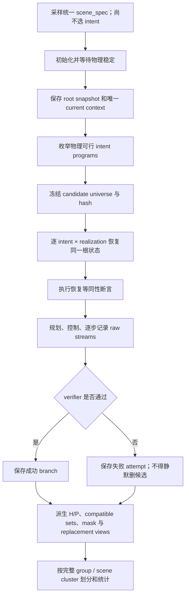

# 未来动作条件意图数据构造：fvl05 服务器实施方法

> 状态：研究与实施草案，尚未开始数据生成  
> 日期：2026-08-09  
> 当前边界：本文件只完成资料核对、数据设计和服务器执行顺序；没有启动 RoboTwin、没有占用 GPU、没有修改正在重建的环境、没有创建正式数据集。

## 0. 先说结论

本项目需要的不是“从 RoboTwin 官方 50 个任务里各抽一些普通 episode”，而是一个新的、受控的多未来分支生成器：

```text
同一份 current observation + current robot state
├─ intent A ── realization 1 / 2 / 3 ── future actions A
├─ intent B ── realization 1 / 2 / 3 ── future actions B
└─ intent C ── realization 1 / 2 / 3 ── future actions C
```

每个 root group 必须先建立一次统一场景和统一锚点，再从同一个完整仿真状态分叉；不能把三个 stock task 用相同 seed 采到的轨迹事后拼起来。正式数据的默认目标是：

- 每个 root group 至少 `M=3` 个结构化意图；
- 每个意图尽量有 `R>=3` 条成功但路径不同的 realization；
- current context 只保存一次，所有 branch 共同引用；
- 先保存未经压缩的 command、controller target、realized state 与 timestamp；
- intent 是可由仿真器验证的对象—操作—关系—顺序程序，不是自由发挥的心理解释；
- 第一阶段只做 clean/easy 场景；确认未来动作确实提供额外意图信息后，再加入背景、杂物、光照与桌高随机化；
- 先完成 2–5 个 root group 的管线验收，不直接按“30%”规模开跑。

计划中的正式数据根目录是：

```text
/nfs_share/lijunhui/Robotwin2/datasets/future_action_intent_v1/
```

本文件位于笔记仓库；目前没有创建上述数据目录。

---

## 1. 本方案依据什么

### 1.1 当前 Idea 的三份内部材料

本方案只使用 2026-08-09 重新确定的 Idea 主线，不参考已经归档的旧 A2FI／长动作记忆路线：

1. [未来动作条件意图理解：idea 内容分析](../Idea/未来动作条件意图理解_idea内容分析_2026.7.31.md)：研究问题、变量、可证伪顺序和结论边界；
2. [未来动作意图数据集构造方案](../Idea/未来动作意图数据集构造方案_2026.7.31.md)：controlled multi-future group、raw schema、H/P/K、split 与质量 Gate；
3. [RoboTwin 官方 50 任务考察与 30% 构造方案](../Idea/RoboTwin官方50任务考察与30%未来动作数据构造方案_2026.8.6_自写版.md)：任务族、公开数据规模、轨迹长度与文本标注调查。

三份材料的分工是：第一份决定“研究什么”，第二份决定“数据必须满足什么”，第三份提供“在 RoboTwin 中从哪些任务原型开始做”的工程落点。

### 1.2 本次额外核对的一手资料

- [RoboTwin 2.0 论文](https://arxiv.org/abs/2506.18088)：50 个双臂任务、五种 embodiment，以及 clutter、lighting、background、tabletop height、language 五类结构化随机化；
- [RoboTwin 官方数据采集文档](https://robotwin-platform.github.io/doc/usage/collect-data.html)：当前上游的 seed 搜索—成功轨迹重放流程、CuRobo planner、旧／新数据布局差异和 GPU 注意事项；
- [RoboTwin 官方配置文档](https://robotwin-platform.github.io/doc/usage/configurations.html)：`episode_num`、`save_freq`、相机、数据类型和 domain randomization 字段；
- [RoboTwin 官方 50 任务页](https://robotwin-platform.github.io/doc/tasks/index.html)：任务列表、平均长度与不同 embodiment 的成功率入口；
- [固定版本 task_average_len.yml](https://github.com/RoboTwin-Platform/doc/blob/1c7152959ce6c8aff6278d337a221bfdaab81d17/docs/tasks/task_average_len.yml)：第三份材料引用的任务级平均步数来源；
- [RoboTwin Description Gen 文档](https://robotwin-platform.github.io/doc/usage/description.html)：task instruction 与 episode instruction 的生成方式；
- [SAPIEN 2.2 Python API](https://sapien.ucsd.edu/docs/latest/apidoc/sapien.core.html)：`Actor`、`Articulation` 与 `Scene` 的 `pack/unpack` 能力；
- [FAST](https://arxiv.org/abs/2501.09747)：基于 DCT 的动作序列压缩，可作为 Gate A/B 通过后的强压缩基线；
- [π0.5](https://arxiv.org/abs/2504.16054)：高层语义／子任务预测与低层动作联合建模的相关证据，但不能替代本项目的 future-action 机制验证；
- [PRTS](https://arxiv.org/abs/2604.27472)：从离线轨迹学习 state-action 到语言目标的可达性，是相关边界工作，不等同于本项目的 same-current 多未来和 H/P/K 实验。

### 1.3 “最新上游”与“本机实现真值”必须分开

截至 2026-08-09，RoboTwin 在线文档已经采用 XPolicyLab 原生数据布局；本机源码仍固定在：

```text
/nfs_share/lijunhui/Robotwin2/project/RoboTwin
commit c3ddfa8b97d5519efa828b075999bd0006778e5e
```

因此：

- 最新官方文档用于了解上游方向和风险；
- 真正要修改的接口、字段和路径，以环境重建完成后再次审计的本机固定 commit 为准；
- 不在一次数据构造中同时升级 RoboTwin、迁移 XPolicyLab 格式和改造多未来生成器；这些是三个独立变量。

本机固定版本仍使用旧布局：

```text
data/<task_name>/<task_config>/
├─ data/episodeN.hdf5
├─ instructions/episodeN.json
├─ video/episodeN.mp4
├─ _traj_data/episodeN.pkl
├─ scene_info.json
└─ seed.txt
```

而当前上游文档中的自采数据已经是 `data/<task_config>/<task>/<embodiment>/...`。后续实现必须把源码 commit、schema version 和路径布局同时写入元数据，禁止根据文件名猜版本。

---

## 2. 为什么官方现成轨迹不能直接充当目标数据

### 2.1 相同 seed 不等于相同 current

`place_mouse_pad`、`place_object_scale`、`place_object_stand` 等 stock task 会各自初始化场景、采样对象和目标位置。给它们相同 seed，并不能证明三条轨迹拥有完全相同的物理状态、相机图像或随机数状态。

所以不能采用：

```text
stock task A episode seed=7
+ stock task B episode seed=7
+ stock task C episode seed=7
= same-current group   # 错误
```

正确做法是写一个统一 scene family：一次性放入 mouse、pad、scale、stand 和 distractors；冻结这个根场景后，再选择不同 intent program，从根 snapshot 分叉。

### 2.2 本机旧 HDF5 的 `joint_action` 不是已经证明的低层 command

本机固定版本的 `_base_task.py` 在 `take_dense_action` 中把 planner 的 joint position／velocity 交给机器人控制接口，执行 `scene.step()`，然后按 `save_freq` 调用 `_take_picture()`。旧 HDF5 中的 `/joint_action/vector` 来自采样时刻的机器人 joint state，更接近 realized qpos，而不是已经审计清楚的“发给控制器的动作命令”。

这意味着：

- 不能把旧字段改名为 `future_action` 就直接训练；
- 必须在生成器内部同时记录 planner waypoint、controller target 和执行后的真实状态；
- primary future stream 要等一次端到端对齐审计后才能冻结。

相关固定源码：

- [`collect_data.sh`](https://github.com/RoboTwin-Platform/RoboTwin/blob/c3ddfa8b97d5519efa828b075999bd0006778e5e/collect_data.sh)
- [`script/collect_data.py`](https://github.com/RoboTwin-Platform/RoboTwin/blob/c3ddfa8b97d5519efa828b075999bd0006778e5e/script/collect_data.py)
- [`envs/_base_task.py`](https://github.com/RoboTwin-Platform/RoboTwin/blob/c3ddfa8b97d5519efa828b075999bd0006778e5e/envs/_base_task.py)

### 2.3 stock schema 缺少研究所需的关键层级

现有轨迹能提供多相机 RGB、相机参数、joint state、end-effector pose、语言描述和 planner path，但没有原生保存：

- `scene_id / group_id / branch_id / intent_id / realization_id`；
- 完整 root snapshot 和恢复模式；
- candidate universe 及其冻结 hash；
- command／target／realized 三种动作语义；
- 每个动作与图像的显式 `sim_step/timestamp`；
- task tree、每个 H 的 compatible-intent set、comparison cohort 与共享前缀 P；
- 逐步 verifier predicates、失败 planner attempt 和 snapshot 等同性审计。

因此官方数据只适合做格式参考、普通策略训练或外部基线，不能证明本项目的 controlled multi-future 机制。

---

## 3. 目标数据的最小数学单元

第 `i` 个 root group 写成：

$$
\mathcal G_i = \left(x_i,\sigma_i,
\left\{y_{i,j},\left\{A^+_{i,j,r}\right\}_{r=1}^{R_{i,j}}\right\}_{j=1}^{M_i},
\left\{\mathcal Q_{i,c}\right\}_{c=1}^{L_i}\right)
$$

其中：

- `x_i=(o_i,s_i)`：模型能看见的当前多相机图像和白名单机器人状态；
- `σ_i`：生成、恢复和审计用的完整仿真锚点，不进入模型；
- `y_i,j`：第 `j` 个可验证 intent program；
- `A+_i,j,r`：该 intent 的第 `r` 条成功未来动作实现；
- `Q_i,c`：一个明确用途的 comparison cohort，例如严格共享前缀实验或同意图跨路径实验。

必须同时满足两种变化：

```text
不同 intent：same current，future 和语义不同
同一 intent：same current，语义相同，但 planner/path realization 不同
```

第一种排除“当前画面已经泄漏唯一答案”；第二种排除模型只记住 planner 指纹或 branch ID。

### 3.1 H、P、K、R 各自是什么

| 符号 | 含义 | 构造阶段是否直接改变 raw |
|---|---|---:|
| `H` | 从锚点开始可见多少 future raw action，以 steps／seconds／events 同时报 | 否，derived view |
| `P` | 某个 `prefix_controlled` cohort 内严格相同的未来前缀 | 是数据结构属性，但属于 cohort，不属于整个 group |
| `K` | 固定 H/P 后压成多少 token | 否，Gate A/B 后派生 |
| `R` | 同一 intent 的成功 realization 数 | 是采集预算 |

`H` 不是 policy action horizon，`P` 不是“肉眼感觉前半段类似”，`K` 不是原始时间长度，`R` 也不是重复复制同一轨迹。

---

## 4. 建议的生成器结构

建议把生成器拆成六个可单独测试的组件：

| 组件 | 责任 |
|---|---|
| `SceneFamily` | 只采样场景对象、角色、布局、相机与随机化，不先选答案 |
| `IntentProgram` | 结构化定义对象、操作、关系、顺序、约束和终止谓词 |
| `CandidateFreezer` | 在主 planner rollout 前冻结物理可行候选全集并写 hash |
| `AnchorSnapshot` | 保存／恢复根状态，管理 RNG、控制器和等同性审计 |
| `BranchExecutor` | 在相同根状态下规划并执行 intent × realization，完整记录失败 |
| `Verifier` | 用仿真真值验证中间顺序、终态关系和禁止条件 |

总体流程：



### 4.1 场景必须先于 intent

场景采样时只决定“桌上有什么、各自在哪里、哪些对象能被操作”，不先决定某个 branch 的答案。然后根据这一个场景生成全部物理可行的候选程序。

这样可以防止：

- 目标物体的位置、颜色或数量与 intent 固定绑定；
- 某个 intent 总出现在某一相机区域；
- planner 失败后不断重采场景，最终让“容易规划”成为标签；
- 文件夹名、对象实例 ID 或 candidate 顺序暗中编码答案。

### 4.2 task feasibility 与 planner solvability 分账

候选 intent 能否在物理和任务定义上成立，与当前 CuRobo 是否恰好能找到一条路径，不是同一件事。

每个 candidate 先由几何约束、对象能力、任务前置条件和独立 verifier 定义为 `task_feasible=true/false/unknown`。冻结候选集后，才允许主 planner 尝试。planner 的结果另外记录：

```yaml
task_feasible: true
planner_solvable: false
planner_attempts: 8
failure_reason: collision_or_timeout
```

不能因为主 planner 失败，就把这个 intent 从候选集中删掉并假装这个 group 天生只有两个未来。若某 intent 在预注册 attempt budget 内无法得到规定的 R，group 应标为 `incomplete`，进入失败率／选择偏差审计。

### 4.3 realization 如何变化

同一 intent 的不同 realization 保持：

- 相同 root snapshot；
- 相同结构化目标、操作顺序和 verifier；
- 相同模型可见 current context；
- 相同 candidate universe。

只允许改变预注册的执行因素，例如：

- planner seed；
- 合法 grasp pose 候选；
- 左／右臂分工（只有意图语义不依赖手臂时）；
- waypoint 或速度 profile；
- 合法避障路径族。

每次改变都写入 `realization_spec`。不能用轻微数值抖动复制出三条几乎相同的轨迹来冒充 R=3。

---

## 5. 如何得到真正相同的根状态

### 5.1 优先尝试 serialized snapshot，但先验收覆盖范围

SAPIEN 2.2 API 提供 `Actor.pack/unpack`、`Articulation.pack/unpack` 和 `Scene.pack/unpack`，可以作为 snapshot 原型。但 API 存在不等于它已经覆盖：

- Python、NumPy、task-local RNG；
- robot drive target／velocity target；
- 控制器内部计数和 gripper 状态；
- planner 的缓存与随机状态；
- 相机／渲染器状态；
- contact cache、正在进行的约束或 task phase；
- 自定义对象和任务类中的 Python 字段。

因此第一次实现必须维护显式的 `snapshot_registry`，逐项列出“由 Scene pack 覆盖”“由自定义字段覆盖”“不能恢复，只能重建”的内容。不能只保存一个 `scene.pack()` 返回值就宣称状态相同。

### 5.2 三种恢复模式都允许，但必须明确标注

| 模式 | 做法 | 适用情况 |
|---|---|---|
| `serialized` | 从一次初始化后的完整 snapshot 恢复 | API 覆盖和确定性审计通过时优先 |
| `reconstructed` | 由固定 `scene_spec`、对象 pose、机器人状态与 RNG 重新建场景 | snapshot API 不完整但可精确重建时 |
| `canonical_replay` | 从已验证的更早 snapshot 精确重放一条冻结控制前缀到 anchor | 长共享前缀和中途分叉最实用 |

每个 group 保存 `restore_mode`、覆盖字段、软件版本和审计结果。

### 5.3 等同性验收分两层

模型侧要求最强：`current_context` 只生成并保存一份，所有分支通过同一个 `current_context_ref` 引用，所以模型读取到的 bytes 必须一致。

仿真侧在每条 branch 执行前重新检查：

- robot qpos/qvel、gripper、drive target；
- 所有动态 actor 的 pose、linear/angular velocity；
- articulation qpos/qvel 与 root state；
- 相机内外参；
- scene/task/RNG state；
- 在不施加动作时短暂 step 后的漂移；
- 可复现时，恢复后审计 RGB 的 hash。

精确序列化能做到 bitwise equality 就使用 exact compare；若只能做到浮点物理等价，阈值必须在 pilot 前根据 dtype 和引擎行为预注册，不能看完模型结果后放宽。

---

## 6. 如何构造“前半段相同、后半段不同”

只在第 0 帧相同、随后立刻向不同方向运动，无法回答“看到多长 future 才能理解 intent”。主 H/P 实验需要 `prefix_controlled` cohort。

### 6.1 长前缀任务的推荐做法

以三块积木为例，在同一场景中固定 Red、Green、Blue：

```text
root current
  └─ canonical prefix：抓 Green → 放到 Red 上 → 抓起 Blue
       ├─ suffix A：Blue → Green，形成三层塔
       ├─ suffix B：Blue → 左侧目标区
       └─ suffix C：Blue → 右侧目标区
```

实现规则：

1. canonical prefix 的 controller-target 序列只生成一次；
2. 每个 branch 从相同 root 恢复后精确重放这段序列；
3. 在共同的 prefix endpoint 执行状态等同性检查；
4. 再进入三个 suffix；
5. 保存 `P_steps`、`P_seconds`、`P_events` 和 `canonical_prefix_action_hash`；
6. 主 P 曲线中的 P 以数值动作流严格一致为准，不只凭高层描述相同。

“堆两层后停止”和“继续堆三层”可作为辅助边界案例，但正式 M=3 cohort 更推荐三个时长较匹配、都继续动作的 suffix，避免模型只看是否停止或总长度。

### 6.2 P 属于 comparison cohort

同一个 root group 可能同时包含：

- `prefix_controlled`：专门用于严格 H/P 曲线，成员共享冻结前缀；
- `trajectory_invariance`：同一 intent 的自由 planner path，用于检查跨路径语义不变性。

后者的动作前缀通常不完全相同，不能混进前者后算一个平均 P。每个 cohort 独立保存成员、purpose、candidate universe、task tree 和 prefix hash。

### 6.3 每个 H 的标签不是永远 one-hot

当 `H<=P` 时，三个 branch 的可见输入可能完全一样。此时若仍分别强制标签 A/B/C，数据本身就是相互矛盾的。

因此每个 `(cohort, source_branch, H)` 都要从预注册的 observable task tree 生成 compatible-intent set。例如：

```json
{
  "H_steps": 120,
  "compatible_intents": ["stack_blue", "place_blue_left", "place_blue_right"],
  "deterministic_eligible": false
}
```

只有可观察候选集成为单例时，才统计 branch-specific accuracy 和 future replacement 的 prediction-switch。oracle task tree 只用于审计，不进入模型或主标签生成。

---

## 7. Raw 动作、状态与时间怎么保存

### 7.1 推荐的三层动作账本

每个 physics/control step 至少保存：

1. `planner_target`：高层 pose／grasp／waypoint 目标及 planner 输出路径；
2. `controller_command`：真正交给关节／夹爪控制器的 position、velocity、gripper target；
3. `realized_state`：`scene.step()` 后的 qpos、qvel、end-effector pose、gripper opening。

建议的 Aloha 主候选流是左右臂 6 维 joint target 加两个 gripper target，共 14 维 absolute target；但这只是待审计的候选，不在本文中假装已经验证。第一次成功轨迹必须逐步确认 target、command、旧 `joint_action` 与下一状态之间的关系后，才冻结 `primary_future_stream`。

### 7.2 不依赖“平均步数”推断单条轨迹长度

第三份材料引用的固定任务级统计平均为 224.04 steps，任务级范围 85–637；这些数值适合预算，不是单条 episode 的真值。每条 branch 必须实际保存：

```yaml
T_physics_steps: ...
T_controller_steps: ...
T_saved_observations: ...
duration_seconds: ...
```

本机固定版本的 physics timestep 是 `1/250 s = 0.004 s`。`save_freq=15` 的名义观测频率约为 `250/15=16.67 Hz`，但动作函数会在片段边界额外采帧，不能把数组索引直接当均匀时间。每个样本都要保存真实 `sim_step` 和 `timestamp`。

### 7.3 raw 中不做压缩

采集时不做 DCT、FAST、K-query 或事件 token 化。raw 层保留最高可审计的控制分辨率；后续统一从 raw 生成：

- `H_steps / H_seconds / H_events` 前缀；
- fixed-stride／统一频率重采样；
- padding 与 mask；
- DCT／FAST-style；
- learnable K-query；
- event-aware tokens。

这样压缩方法失败时无需重新跑 simulator，也能保证不同 compressor 比较的是相同 branch 和相同 H/P。

### 7.4 推荐 HDF5 字段

```text
/time/sim_step                         [T]
/time/sim_time                         [T]
/time/control_step                     [T]
/action/controller/qpos_target         [T, 12]
/action/controller/qvel_target         [T, 12]
/action/controller/gripper_target      [T, 2]
/action/controller/valid_mask          [T, ...]
/action/planner/segment_id             [T]
/state/robot/qpos                       [T, 14]
/state/robot/qvel                       [T, 14]
/state/robot/endpose                    [T, 2, 8]
/observation/head_rgb                  [T_obs, ...]
/observation/left_wrist_rgb            [T_obs, ...]
/observation/right_wrist_rgb           [T_obs, ...]
/observation/obs_to_control_index       [T_obs]
/truth/object_pose                      [T_truth, N, 7]   # verifier only
/truth/contacts                         [variable]         # verifier only
/truth/predicates                       [T_truth, N_pred]  # verifier only
```

最终 shape 要以实际 Aloha 关节定义审计为准。`truth/*`、未来 RGB 和 planner goal 一律不进入意图模型。

---

## 8. 结构化 intent 与语言标注

### 8.1 结构化 program 是真标签

每个 intent 使用可组合 JSON，而不是只写一个自然语言类别：

```json
{
  "ontology_version": "intent_program_v1",
  "intent_id": "mouse_to_scale",
  "steps": [
    {"op": "grasp", "object": "mouse_0"},
    {"op": "place", "object": "mouse_0", "relation": "on", "target": "scale_0"}
  ],
  "terminal_predicates": [
    {"predicate": "on", "subject": "mouse_0", "object": "scale_0"}
  ],
  "forbidden_predicates": [
    {"predicate": "on", "subject": "mouse_0", "object": "pad_0"}
  ]
}
```

Verifier 检查的不只是最后位置，还可以检查：

- 操作对象和目标对象正确；
- 子任务顺序正确；
- 需要时发生 grasp/contact；
- 最终空间关系成立并保持若干步；
- 无关键物体掉落、穿模或碰倒禁止对象；
- 任务尚未在 root current 中提前成立。

### 8.2 自然语言是派生层

RoboTwin 官方将 task template 与 episode instruction 分开，并提供 seen/unseen 表述生成。这里可以沿用其 paraphrase 思路，但要保持：

- `intent_program.json` 是 simulator-verifiable 主真值；
- `language.json` 是从结构化 program 和当前对象实例派生的多种表述；
- 每条语言都能反向解析到同一 program，并通过模板／人工抽检；
- 机制主实验不把答案式原始 task instruction 放入输入；
- same-group ranking 时，所有 candidate programs 对称可见，正确 candidate 的位置每次随机化。

原始 RoboTwin instruction 可以保留在 `metadata/audit_only`，用于语言对照和普通 policy 实验，但不能泄漏到 future-conditioned intent probe。

---

## 9. 推荐任务族与实现顺序

stock task 只作为技能代码和 verifier 原型。每个正式 family 都要改成“统一场景 + 多个 program”，不能直接合并 stock episode。

| 优先级 | 统一 scene family | M=3 意图 | 主要研究用途 | 难点 |
|---|---|---|---|---|
| S0 | 左／中／右基础放置 | 放左、放中、放右 | 只验收 snapshot、schema、分支和 verifier | 语义太浅，不能当主结果 |
| S1 | mouse + pad + scale + stand | mouse→pad／scale／stand | 最低充分 M=3；检查 future-value、目标 grounding | 三个 stock task 必须统一对象与位置 |
| S2 | alarm clock + bell + stapler | click alarm／bell／stapler | 研究很短 H 是否迅速暴露目标对象 | 路径可能过早分叉，需防位置捷径 |
| S3 | Red + Green + Blue + 三个终点 | 共用长 prefix 后 stack／left／right | H/P 主实验，最符合“前半段同、后半段不同” | canonical replay、顺序 verifier 更复杂 |
| S4 | 三个有颜色和尺寸属性的 blocks | RGB 排序／size 排序／stack | 更深的行为规则理解与组合泛化 | program 和 verifier 最复杂、轨迹长 |
| S5 | bottle + 操作空间 | adjust／shake／horizontal shake | 同一对象、不同操作方式 | 动态 verifier、频率与幅度定义较难 |

建议的实际顺序：

1. S0 只做 1 个临时 smoke group，甚至允许 M=2；不进入论文数据；
2. S1 做首个 M=3 family，2–5 groups、每 intent 先 R=1–2，验收完整管线；
3. S3 做第一个正式 `prefix_controlled` family，建立可解释的 H/P 曲线；
4. Gate A/B 通过后加入 S2，检查短期目标选择；
5. 再加入 S4/S5，扩展到规则、顺序和动态操作；
6. 最后才对通过 Gate 的 family 增加 randomized 版本。

### 9.1 对象数量不能固定成“永远 4 个”

同一 family 内也要采样：

- task-relevant objects 的实例、颜色、尺寸和布局；
- 0、1、2、3… 个 distractor；
- 非目标容器／操作对象；
- 左右位置和 candidate 显示顺序。

但随机化必须在 root scene 建立时完成；同一个 group 的所有 branch 共享这些变量。不能给 branch A 两个 distractor、branch B 三个 distractor。

---

## 10. “30%”到底换算成多少数据

第三份材料固定审计的 Aloha-AgileX clean 参考规模为：

```text
50 tasks × 50 successful episodes = 2,500 branch trajectories
30% × 2,500 = 750 successful branch trajectories
```

这里的 750 只能作为总成功 branch 的规划预算，不能叫 750 个独立 same-current 样本。完整 group 的分支数是：

$$
N_{branch/group}=\sum_{j=1}^{M}R_j
$$

若正式数据采用平衡的 `M=3, R=3`：

```text
每个完整 group = 3 intents × 3 realizations = 9 条成功 branch
750 / 9 = 83 个完整 group + 3 条余量
即 83 groups × 9 = 747 条正式成功 branch
```

若 pilot 只有 `M=3, R=2`，相同 750 branch 可覆盖 125 groups，但它们不满足正式 R>=3 的默认目标。planner 失败、snapshot 审计失败和 verifier 失败是额外 attempt，不计入 750 条成功 branch，却必须完整留日志。

### 10.1 推荐把 750 当上限参考，不立即冻结成最终 N

正确顺序是：

| 阶段 | 建议规模 | 用途 |
|---|---:|---|
| CPU／无渲染 schema 测试 | 合成 fixture | ID、hash、schema、split、派生逻辑 |
| 临时 smoke | 1 group，M 可为 2–3，R=1 | 测启动、保存、恢复和退出 |
| 管线验收 | 2–5 groups，M=3，R=1–2 | Gate G0–G7，不做统计结论 |
| 机制 pilot | 一个最低充分 family，M=3，R=2 | 估计成功率、方差、泄漏和 H 曲线 |
| 正式机制数据 | 默认 R>=3 | 由 group-level power analysis 决定 group 数 |
| 30% 规模参考 | 最多约 750 成功 branches | Gate 通过后的扩展预算，不是开局任务 |

83 groups 是算术上限示例，不是已经决定的最终独立样本量。最终还要根据：

- 各 family planner 成功率和 group attrition；
- group-level 主指标方差与效应量；
- family／布局／对象 OOD 需求；
- 每条轨迹 p50/p95 时长和磁盘占用；
- 是否需要 M>3 或 R>3；

再做功效分析和预算冻结。

### 10.2 clean 与 randomized 的安排

第一阶段只用 clean/easy，因为它最适合隔离：

```text
same current + different future action
是否真的导致 intent prediction 跟随 future 改变？
```

若一开始同时随机背景、灯光、杂物和桌高，失败后无法区分是 future 机制、视觉鲁棒性、snapshot、planner 还是 verifier 的问题。

randomized 只在 raw future-value 和 H/P Gate 通过后加入，并遵守：

- 一个 root group 内的所有 branch 共享相同随机化结果；
- clean 与 randomized 用相同 program ontology 和 schema；
- 不把 randomization seed 作为模型输入；
- 同一 root group 的 clean/randomized 派生近重复若共享 scene identity，不跨 split；
- 先作为鲁棒性／OOD 子集，不替代 clean 主机制实验。

---

## 11. 数据目录与 manifest

建议的最终目录：

```text
/nfs_share/lijunhui/Robotwin2/datasets/future_action_intent_v1/
├─ README.md
├─ dataset_card.md
├─ metadata/
│  ├─ dataset_info.json
│  ├─ action_schema.json
│  ├─ intent_ontology.json
│  ├─ software_versions.json
│  └─ split_manifest.parquet
├─ scene_specs/
│  └─ scene_<scene_id>.json
├─ snapshots/
│  └─ group_<group_id>/...
├─ current_context/
│  └─ group_<group_id>/...
├─ raw/
│  └─ group_<group_id>/
│     ├─ group_manifest.json
│     ├─ branch_<branch_id>.hdf5
│     └─ branch_<branch_id>.json
├─ failures/
│  └─ group_<group_id>/attempt_<attempt_id>.json
├─ derived/
│  ├─ horizon_views_v1/
│  ├─ compatible_sets_v1/
│  ├─ masks_v1/
│  ├─ event_segments_v1/
│  └─ compressed_tokens_<method>_<version>/
└─ audits/
   ├─ snapshot_equality.parquet
   ├─ time_alignment.parquet
   ├─ candidate_freeze.parquet
   ├─ leakage_checks.parquet
   └─ success_verification.parquet
```

所有中间文件、cache 和临时渲染也必须在 `/nfs_share/lijunhui/Robotwin2/{cache,tmp}` 内，不写到 home、系统 `/tmp` 或共享 CUDA 路径。

### 11.1 ID 必须分层

| ID | 含义 |
|---|---|
| `scene_family_id` | 一套任务图和对象角色模板 |
| `scene_id` | 一次具体对象实例与布局规格 |
| `group_id` | 一个严格共享 current 的根锚点 |
| `intent_id` | group 内某个结构化 program |
| `ontology_id` | 可跨 group 复用的全局结构语义 |
| `realization_id` | 同 intent 的一条实现 |
| `branch_id` | 一条具体未来轨迹 |
| `comparison_cohort_id` | H/P 或 invariance 对照成员集合 |
| `view_id` | 从 raw 派生的 H/K/mask/replacement 样本 |

文件路径和数字 ID 本身不能暗示正确 intent。

### 11.2 group manifest 最少包含什么

```json
{
  "schema_version": "future_intent_raw_v1",
  "scene_family_id": "mouse_destinations",
  "scene_id": "scene_000021",
  "group_id": "group_000104",
  "robotwin_commit": "c3ddfa8b97d5519efa828b075999bd0006778e5e",
  "restore_mode": "serialized_or_canonical_replay",
  "base_snapshot_hash": "sha256:...",
  "current_context_ref": "current_context/group_000104",
  "candidate_universe_hash": "sha256:...",
  "candidate_programs": ["mouse_to_pad", "mouse_to_scale", "mouse_to_stand"],
  "branches": ["..."],
  "comparison_cohorts": ["..."],
  "split_cluster_id": "...",
  "generation_config_hash": "sha256:..."
}
```

---

## 12. Split、统计与防泄漏

### 12.1 最小 split 单位是完整 group

同一个 root group 派生出的以下内容必须全部进入同一 split：

- 所有 intents 和 realizations；
- 全部 H、P、K、mask、replacement 和 candidate-order views；
- 同 raw 的各种重采样／压缩版本；
- snapshot、current context、failure attempts 与 audit metadata。

具有近重复布局或同一 `scene_spec` 衍生关系的 group，要按更严格的 `split_cluster_id` 一起划分。不能把同一 current 的 branch A 放 train、branch B 放 test，也不能把 H=20 放 train、H=80 放 test。

### 12.2 有效 N 按 group／scene cluster 计算

一条 raw branch 可以派生几十个 H 和多个 K，这些不是几十个独立样本。主要置信区间和显著性检验按 root group 或更严格的 scene-family cluster 聚类。

`r1/r2` 训练、同 group 的 `r3` 测试只能作为 in-group trajectory-invariance 诊断，不能冒充正式 OOD generalization。planner-OOD 需要完整 held-out groups。

### 12.3 必做的泄漏 probe

- candidate-only：只看候选内容和显示位置；
- metadata-only：只看长度、文件字段、planner ID、seed 等；
- length-only：只看总时长／padding mask；
- no-vision：state + future action；
- no-current：future action only；
- current-only：visual + state；
- shuffled／time-reversed／event-dropped future；
- same-group future replacement，同时把监督 target 切换到 replacement intent；
- candidate permutation consistency。

如果 candidate-only、planner-ID 或 length-only 就能高准确预测 intent，先修数据，不训练更大的模型。

---

## 13. 数据质量 Gate 与停止条件

### Gate 0：定义和 schema

- [ ] 所有 future 都是锚点 `t` 之后的 `a[t:t+H]`；
- [ ] command、target、realized state 分开；
- [ ] H、P、K、R、seconds、events 不混用；
- [ ] structured program、candidate scorer 和模型可见白名单已冻结。

### Gate 1：root snapshot

- [ ] current context 只有一份并被全部 branch 引用；
- [ ] robot、objects、camera、RNG、controller 的恢复审计通过；
- [ ] `restore_mode` 和未覆盖状态明确记录；
- [ ] intent 在 snapshot 完成后才选择。

### Gate 2：多未来和可行性

- [ ] 正式 group 有 M>=3；
- [ ] candidate universe 在主 rollout 前冻结；
- [ ] task feasibility 不由主 planner success 循环定义；
- [ ] 每 intent 的 attempt、成功 R 和失败原因完整；
- [ ] verifier 对 program 的顺序与终态均通过。

### Gate 3：动作和时间

- [ ] target/command/state 逐步对齐测试通过；
- [ ] 每个 stream 有真实 `sim_step/timestamp`；
- [ ] observation 到 control index 的映射无 off-by-one；
- [ ] 轨迹长度、padding 和 mask 可复算。

### Gate 4：H/P 标签

- [ ] prefix-controlled cohort 保存精确成员和 prefix hash；
- [ ] 每个 H 都有 observable compatible set；
- [ ] H<=P 的不可区分样本不强塞相互冲突的 one-hot；
- [ ] oracle tree 只作 audit；
- [ ] replacement 只在 observable singleton 后算 branch-specific switch。

### Gate 5：防泄漏与 split

- [ ] 答案式 task instruction、future RGB、future pose、verifier truth 不进模型；
- [ ] candidate 顺序随机化；
- [ ] group／scene cluster 不跨 split；
- [ ] candidate-only、metadata-only、length-only 接近预注册 prior。

### Gate 6：raw future-value，也就是研究 Gate A

- [ ] `visual/state + correct raw future` 稳定优于 current-only；
- [ ] correct future 优于 shuffled／wrong future；
- [ ] same-group replacement 能使预测按预注册比例切换；
- [ ] same-intent cross-trajectory 不依赖单一路径指纹；
- [ ] 结果来自 shared candidate-conditioned scorer，不是 group-local 分类头。

若 Gate 6 不通过，停止扩量、压缩和 π0.5 接入，优先检查数据、时间对齐、动作语义、标签矛盾和泄漏。

### Gate 7：H/P reveal，也就是研究 Gate B 的前半段

- [ ] H 曲线覆盖 H<P、H=P、H>P；
- [ ] 至少有受控的长 prefix cohort；
- [ ] structural reveal、动作数值 divergence 和模型 reveal 分开报告；
- [ ] time-warp、matched-duration、早期差异删除／低通对照通过。

### Gate 8：K／compression，也就是研究 Gate B 的后半段

只有 Gate 6–7 通过后才按相同 H/P 和数据预算比较：raw、uniform pooling、DCT/FAST-style、K-query、event-aware。连续 token 要报告 dtype、dimension、representation footprint、FLOPs 和延迟；只有真实／可复核码长存在时才称 encoded bitrate。

### Gate 9：policy transfer，也就是研究 Gate C

只有前面成立后才接入 π0.5 或其他 policy。部署 policy 永远不能读取 expert/oracle future；future action 只作为训练期 privileged teacher／auxiliary signal。probe 正结果不能直接写成 rollout 提升。

---

## 14. fvl05 上的资源安全执行纪律

### 14.1 现在明确不执行

当前 RoboTwin 环境正在做迁移后的干净重建，服务器 GPU 上也有其他师兄的任务。因此本轮只写方案，以下操作全部没有做：

- 不运行 `nvidia-smi` 后抢空闲卡；
- 不启动 `test_render.py`、`collect_data.sh` 或 simulator；
- 不安装／升级 Python、CUDA、SAPIEN、CuRobo 或 XPolicyLab；
- 不修改 RoboTwin 源码、配置和已有 smoke artifacts；
- 不下载官方大数据集；
- 不创建正式 dataset output。

### 14.2 将来启动前的硬前置条件

1. 环境重建的实时日志明确记录完成，且本机固定 commit／路径重新验证；
2. 重新检查 RoboTwin working tree 与其他 agent 的工作范围，避免并发写同一源码、环境或数据目录；
3. 只在获准的 host-device context 做一次实时 GPU 健康和利用率检查；
4. 任何已有进程、显存占用或持续高利用率都视为“该卡不可用”，不停止、不迁移、不探测他人任务；
5. 不复用历史 fvl09 GPU 索引，也不复用 2026-08-09 某一时刻的空闲结论；
6. 用 GPU UUID 和日志记录选择结果；运行前后都复核；
7. 先做官方 render，再做有严格 timeout 的单 episode smoke；出现 hang、OIDN、CUDA/Vulkan 异常立即停止，不用并发进程硬顶；
8. smoke 通过后才允许一次只开一个低并发 collector。

当前官方采集文档明确提醒避免 A/H/V 系列 GPU 用于采集和评估；fvl05 恰好是 RTX A6000。历史上本机曾通过最小 CUDA tensor 和官方 `test_render.py`，但尚未在 fvl05 完成新的采集 smoke。这两条证据并不矛盾：A6000 不是在本文中被判定为“一定不能用”，但后续必须采用单卡、单 episode、timeout/watchdog、无空闲即暂停的保守验证，不能直接规模化。

### 14.3 `collect_data.sh` 的 GPU 陷阱

本机固定版本的脚本内部会直接执行：

```bash
export CUDA_VISIBLE_DEVICES=${gpu_id}
```

所以即使外层 shell 已经设置 UUID allowlist，传错 `gpu_id` 仍可能覆盖可见卡选择。未来不能原样拿 stock 脚本开多分支采集；应在审计后的 wrapper 中：

- 明确解析并记录物理 GPU UUID；
- 在实际 Python 进程内核对 `torch.cuda.get_device_name()`／UUID 映射；
- 拒绝超出允许列表的 index；
- 每个 run 建唯一输出目录和 run manifest；
- 超时只终止自己的 collector 进程树，不操作任何其他用户进程。

### 14.4 存储先测 p50/p95，不用旧平均拍脑袋

历史 smoke 的文件大小和官方任务平均 steps 只能粗略参考。正式预算前先用 2–5 groups 测量：

- 每 branch HDF5、RGB、video、truth、snapshot 和 failure log 大小；
- p50/p95 轨迹时长；
- 每成功 branch 的 planner attempt 数；
- 每 group 的总写入量和临时峰值；
- snapshot／缓存清理后的 GPU 与主存峰值。

然后给 750-branch 参考预算乘上失败重试、audit 和 derived view 的安全系数。不要因为个人 NFS 当前空间较大就省略 quota 和完整性检查。

---

## 15. 环境准备好以后，最小执行顺序

### 阶段 A：一条轨迹的事实审计

1. 固定本机 commit、配置、依赖版本和资产 hash；
2. 新生成一条成功 clean 轨迹；
3. 在 `set_arm_joints → scene.step → save` 链上增加只用于审计的 trace；
4. 对齐 planner path、controller target、realized qpos、HDF5 `joint_action` 与 timestamp；
5. 冻结 `primary_future_stream_v1` 和 action schema。

### 阶段 B：一个临时 smoke group

1. 实现最小 snapshot registry；
2. 生成 2–3 个分支，每 intent R=1；
3. current context 单份保存；
4. 自动运行 snapshot equality、time alignment 和 verifier；
5. 故意制造一个失败 branch，确认 failure log 和 incomplete group 正常。

### 阶段 C：S1 的 2–5 个正式格式 root groups

1. 统一 mouse／pad／scale／stand 场景；
2. 每 group M=3、每 intent R=1–2；
3. candidate universe 在 rollout 前冻结；
4. 生成 candidate ranking、future replacement 和 basic H views；
5. 跑 candidate-only、length-only 和 planner-ID probe。

这些 group 只验收 pipeline，不足以做统计性 claim。

### 阶段 D：S3 长共享前缀 pilot

1. 冻结 Green→Red→grasp Blue 的 canonical prefix；
2. 构造 stack／left／right 三个 suffix；
3. 保存严格 P、task tree 和每个 H 的 compatible set；
4. 画 raw future 的 `IntentScore(H | P, cohort)`；
5. 只有 raw future-value 和 reveal 均通过，才设计更大网格。

### 阶段 E：根据 pilot 决定是否扩到 30%

先用 group-level 方差做 power analysis，再决定：

- 需要多少 family；
- 每 family 多少 root groups；
- M 和 R 是否保持 3；
- clean／randomized 比例；
- 750 successful branches 是否足够、过多或结构上不合适。

---

## 16. 本方案当前作出的关键判断

1. **新写统一场景的分支生成器，而不是拼官方 episode。**这是满足 same-current 的必要条件。
2. **先 S1，后 S3。**Mouse 三目标适合低风险验收完整 M=3 管线；长前缀 stack family 才承担核心 H/P 研究。
3. **command／target／realized 全存。**目前不能把旧 `joint_action` 不加审计地当成未来动作命令。
4. **Scene.pack/unpack 只是候选工具。**是否能恢复完整 root 要由 snapshot registry 和恢复测试证明。
5. **结构化 program 是主标签，语言是派生层。**普通 task instruction 默认在机制实验中 mask。
6. **750 是成功 branch 预算，不是独立 N。**`M=3,R=3` 时只有 83 个完整 group（747 branches）。
7. **clean 先行。**randomized 是机制通过后的鲁棒性扩展。
8. **raw 先行。**FAST／DCT、K-query、event tokens 都在 raw future Gate 通过以后再比较。
9. **当前不占 GPU。**环境重建、他人任务和 A6000 官方风险提示都要求后续从受控单 episode smoke 开始。
10. **第一次真正的下一步不是“采 750 条”，而是 2–5 个可审计 root groups。**

---

## 17. 尚待 pilot 回答的问题

- SAPIEN `Scene.pack/unpack` 加自定义 registry 能否使 branch anchor 的物理状态稳定复现，还是必须 canonical replay？
- 本机固定 commit 中，最合适的 primary future stream 是 controller qpos target、其 delta、还是另一个与后续 policy action 更一致的语义？
- stock `save_freq=15` 是否足够定位 intent reveal，还是 raw control 250 Hz 全存、derived 层再降采样更合理？
- S1 的路径是否在 very-short H 就暴露目标位置，导致任务过易？
- S3 在 matched-duration 与去长度捷径后，observable reveal 是否仍晚于 P？
- 每 intent 生成 R=3 时，哪些 planner／grasp 扰动能提供真实路径多样性而不改变语义？
- A6000 上单 episode collector 是否稳定；若官方已知 hang 在当前固定 commit 重现，是否需要换可用硬件而不是继续调参？
- 2–5 groups 的真实 p50/p95 数据量、失败率和 group-level 指标方差是多少？

这些问题都应由小规模、可停止、可审计的 pilot 回答，不能在设计文档里提前写成已验证结论。

